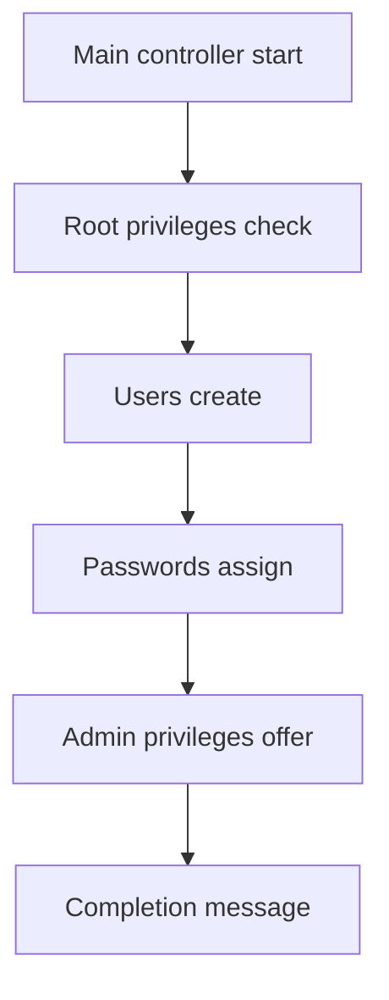

# Modular Linux User Management — Package Overview (Roman Urdu)

## Table of Contents

- [1. Package ka Maqsad](#1-package-ka-maqsad)
- [2. Separate Scripts Kyun?](#2-separate-scripts-kyun)
- [3. Files aur Responsibilities](#3-files-aur-responsibilities)
- [4. Execution Flow](#4-execution-flow)
- [5. Usernames Pass Karna](#5-usernames-pass-karna)
- [6. Exit Status aur Workflow](#6-exit-status-aur-workflow)
- [7. Interactive Decisions](#7-interactive-decisions)
- [8. Security Design](#8-security-design)
- [9. Package Run Karna](#9-package-run-karna)
- [10. Summary](#10-summary)

## 1. Package ka Maqsad

Yeh package teen Linux administration tasks automate karta hai:

1. Local user accounts create karna.
2. Har user ka password optionally set ya reset karna.
3. Har user ko optionally administrative privileges dena.

Main controller tamam steps ko correct order mein chalata hai. Har child script sirf aik specific kaam karti hai.

## 2. Separate Scripts Kyun?

Har kaam ko separate script mein rakhne ke faide:

- Har script ki aik clear responsibility hoti hai.
- Har step ko independently test kiya ja sakta hai.
- Password aur admin privileges jaise sensitive kaam separate rehte hain.
- Error kis step mein aya, yeh asani se pata chalta hai.
- Zaroorat par sirf aik child script bhi run ki ja sakti hai.

Is design ko **separation of concerns** kehte hain.

## 3. Files aur Responsibilities

| Script | Zimmedari | Important Commands |
|---|---|---|
| `00-manage_users.sh` | Pura workflow control karti hai. | `bash`, array, `BASH_SOURCE` |
| `01-create_users.sh` | Accounts aur home directories create karti hai. | `id`, `useradd` |
| `02-assign_passwords.sh` | Password set/reset karne ka option deti hai. | `read`, `case`, `passwd` |
| `03-grant_admin_privileges.sh` | Optional admin group membership deti hai. | `getent`, `id -nG`, `usermod -aG` |

## 4. Execution Flow



Agar koi critical child script nonzero status return kare, controller error print karke ruk jata hai.

## 5. Usernames Pass Karna

Controller usernames ko array mein rakhta hai:

```bash
usernames=("apple" "banana" "mango" "orange" "red_cherry")
```

Phir tamam elements ko separate arguments ki tarah child script ko deta hai:

```bash
bash child_script.sh "${usernames[@]}"
```

Child script mein yeh values is tarah milti hain:

```text
$1 = apple
$2 = banana
$3 = mango
$4 = orange
$5 = red_cherry
```

Tamam arguments process karne ke liye:

```bash
for username in "$@"
```

Quoted `"$@"` har argument ko separate aur safe rakhta hai.

## 6. Exit Status aur Workflow

| Status | Matlab |
|---:|---|
| `0` | Script successfully complete hui. |
| Nonzero | Koi critical operation fail hui. |

Controller ka pattern:

```bash
if ! bash child_script.sh "${usernames[@]}"; then
    echo "Error: child step failed." >&2
    exit 1
fi
```

Is ka matlab hai: child script run karo; agar woh fail ho to `!` result reverse karke `then` block chalaye, error `stderr` par bheje aur controller ko failure status ke saath band kare.

## 7. Interactive Decisions

Password aur privilege scripts questions poochti hain:

```text
Set or reset the password for apple? [y/N]:
Grant administrative privileges to apple? [y/N]:
```

`[y/N]` ka matlab:

- `y` ya `yes`: action approve karein.
- Enter, `n`, ya koi aur jawab: action skip ho ga.

Capital `N` batata hai ke default answer **No** hai.

## 8. Security Design

Package:

- System changes se pehle root privileges check karta hai.
- Plaintext password store nahin karta.
- Username validate karta hai.
- Existing accounts check karta hai.
- Admin group automatically detect karta hai.
- Privilege dene se pehle confirmation leta hai.
- Sudoers file modify nahin karta.
- Unrestricted `NOPASSWD:ALL` rule create nahin karta.

## 9. Package Run Karna

Original scripts ke folder mein jayen:

```bash
cd Linux-User-Management-Modular-Scripts
```

Syntax check karein:

```bash
bash -n ./*.sh
```

Controller run karein:

```bash
sudo bash 00-manage_users.sh
```

Account verify karein:

```bash
id apple
getent passwd apple
ls -ld /home/apple
```

## 10. Summary

| Component | Kaam |
|---|---|
| Controller | Decide karta hai agla step chale ya workflow rukay. |
| Creator | User accounts create karta hai. |
| Password | Password securely assign karta hai. |
| Privileges | Optional admin membership deta hai. |

Yeh package modular hai kyun ke har operation separate hai, magar arguments aur exit statuses ke zariye coordinated hai.
