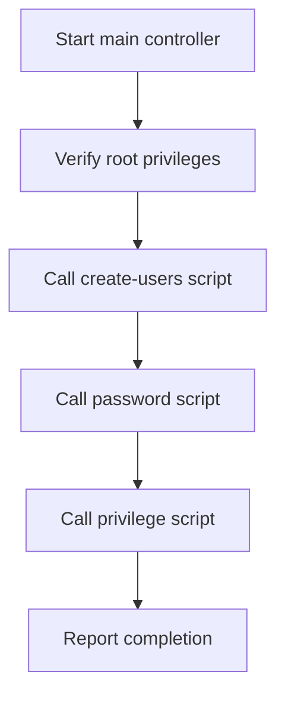

# Modular Linux User Management — Package Overview

## Table of Contents

- [1. Package Purpose](#1-package-purpose)
- [2. Why Separate Scripts?](#2-why-separate-scripts)
- [3. Files and Responsibilities](#3-files-and-responsibilities)
- [4. Execution Flow](#4-execution-flow)
- [5. How Usernames Are Passed](#5-how-usernames-are-passed)
- [6. How Statuses Control the Workflow](#6-how-statuses-control-the-workflow)
- [7. Interactive Decisions](#7-interactive-decisions)
- [8. Security Design](#8-security-design)
- [9. Running the Package](#9-running-the-package)
- [10. Final Summary](#10-final-summary)

---

## 1. Package Purpose

The package automates three separate Linux administration tasks:

1. Create local user accounts.
2. Optionally assign or reset their passwords.
3. Optionally grant administrative privileges.

The main controller coordinates these tasks, while each child script performs one clearly defined job.

---

## 2. Why Separate Scripts?

Separating the tasks provides several benefits:

- Each script has one responsibility.
- Each task can be tested independently.
- Password management remains separate from account creation.
- Privilege changes require a separate, explicit decision.
- A script can be reused without running the complete workflow.
- Errors are easier to locate.

This design follows the principle of **separation of concerns**.

---

## 3. Files and Responsibilities

| Script | Responsibility | Important Commands |
|---|---|---|
| `00-manage_users.sh` | Controls the complete workflow. | `bash`, arrays, `BASH_SOURCE` |
| `01-create_users.sh` | Creates accounts and home directories. | `id`, `useradd` |
| `02-assign_passwords.sh` | Interactively sets or resets passwords. | `read`, `case`, `passwd` |
| `03-grant_admin_privileges.sh` | Optionally grants admin group membership. | `getent`, `id -nG`, `usermod -aG` |

---

## 4. Execution Flow



If a critical child script returns a nonzero status, the controller prints an error and stops. It does not continue blindly to the next stage.

---

## 5. How Usernames Are Passed

The controller defines an array:

```bash
usernames=("apple" "banana" "mango" "orange" "red_cherry")
```

It passes the elements as separate arguments:

```bash
bash child_script.sh "${usernames[@]}"
```

The child script receives them through positional parameters:

```text
$1 = apple
$2 = banana
$3 = mango
$4 = orange
$5 = red_cherry
```

The child processes all received arguments with:

```bash
for username in "$@"
```

Quoted `"$@"` preserves every argument as a separate value.

---

## 6. How Statuses Control the Workflow

Each script follows the standard convention:

| Status | Meaning |
|---:|---|
| `0` | The script completed successfully. |
| Nonzero | A critical operation failed. |

The controller uses:

```bash
if ! bash child_script.sh "${usernames[@]}"; then
    echo "Error: child step failed." >&2
    exit 1
fi
```

Meaning:

> Run the child script. If it returns a nonzero status, print an error and stop the controller.

---

## 7. Interactive Decisions

The password and privilege scripts ask questions such as:

```text
Set or reset the password for apple? [y/N]:
Grant administrative privileges to apple? [y/N]:
```

`[y/N]` means:

- `y` or `yes`: approve the action.
- Enter, `n`, or another answer: use the safe default and skip the action.

The uppercase `N` communicates that “No” is the default.

---

## 8. Security Design

The package intentionally:

- Requires root privileges for system changes.
- Uses `passwd` instead of storing plaintext passwords.
- Validates usernames before account creation.
- Checks whether accounts already exist.
- Detects the platform's normal administrative group.
- Requires confirmation before granting privileges.
- Avoids modifying sudoers files.
- Avoids passwordless unrestricted sudo access.

---

## 9. Running the Package

Extract the original package and enter its directory:

```bash
cd Linux-User-Management-Modular-Scripts
```

Check syntax:

```bash
bash -n ./*.sh
```

Run the main controller:

```bash
sudo bash 00-manage_users.sh
```

Verify a created account:

```bash
id apple
getent passwd apple
ls -ld /home/apple
```

---

## 10. Final Summary

```text
Controller = decides which step runs next
Creator    = creates accounts
Password   = securely assigns passwords
Privileges = optionally grants admin membership
```

The package is modular because each operation is isolated but coordinated through arguments and exit statuses.

