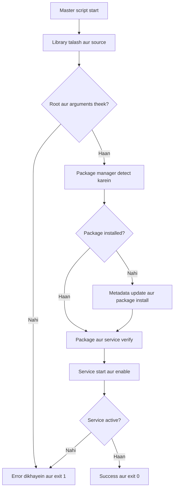

# Bash Modular Package aur Service Manager — Roman Urdu Study Notes

## Table of Contents

1. [Seekhnay ka maqsad](#1-seekhnay-ka-maqsad)
2. [Functions ko alag kyun rakhein?](#2-functions-ko-alag-kyun-rakhein)
3. [Package aur Service ke naam mein farq](#3-package-aur-service-ke-naam-mein-farq)
4. [Project ki structure](#4-project-ki-structure)
5. [Function Library](#5-function-library)
6. [Master Script](#6-master-script)
7. [Dono files mil kar kaisay kaam karti hain?](#7-dono-files-mil-kar-kaisay-kaam-karti-hain)
8. [Program ka Flow](#8-program-ka-flow)
9. [Project banana aur chalana](#9-project-banana-aur-chalana)
10. [Istemaal ki misaalein](#10-istemaal-ki-misaalein)
11. [Aham Commands aur Variables](#11-aham-commands-aur-variables)
12. [Function Return Status](#12-function-return-status)
13. [Testing ka tareeqa](#13-testing-ka-tareeqa)
14. [Aam ghaltiyan](#14-aam-ghaltiyan)
15. [Mustaqbil mein shamil ki janay wali cheezein](#15-mustaqbil-mein-shamil-ki-janay-wali-cheezein)
16. [Khulasa](#16-khulasa)

---

## 1. Seekhnay ka maqsad

Is project mein hum aik reusable Bash program banayein ge jo:

- `apt`, `dnf` ya `yum` ko detect karega.
- Check karega ke required package installed hai ya nahi.
- Package missing ho to usay install karega.
- Related systemd service ki mojoodgi check karega.
- Service inactive ho to usay start karega.
- Service ko system boot par khud start honay ke liye enable karega.
- Aakhir mein package aur service dono ko verify karega.
- Kamyabi par `exit 0` aur nakami par `exit 1` dega.

Yeh project sirf Nginx ke liye nahi hai. Master script package aur service ke naam arguments ke zariye leti hai, is liye isay mukhtalif applications ke liye dobara use kiya ja sakta hai.

> Master script poora workflow control karti hai, jab ke function library reusable kaam provide karti hai.

---

## 2. Functions ko alag kyun rakhein?

Aik choti script mein tamam commands aik hi file mein rakhi ja sakti hain. Lekin script bari honay par reusable functions ko alag file mein rakhna zyada behtar hota hai.

| Faida | Wazahat |
|---|---|
| Reusability | Aik hi function mukhtalif packages aur services ke liye use ho sakta hai. |
| Readability | Master script wazeh steps ki tarah parhi jati hai. |
| Maintenance | Package-management ki tamam logic aik jagah rakhi jati hai. |
| Testing | Har function ko alag test kiya ja sakta hai. |
| Expansion | Naye package manager ki support library mein add ki ja sakti hai. |
| Teamwork | Aik shakhs library aur doosra master script par kaam kar sakta hai. |

Is design ko **modular scripting** kehtay hain.

---

## 3. Package aur Service ke naam mein farq

**Package** woh software hota hai jisay package manager install karta hai.

**Service** woh systemd unit hoti hai jo application ko background mein chalati hai.

In dono ke naam kabhi aik jaisay aur kabhi mukhtalif hotay hain.

| Application | Distribution | Package | Service |
|---|---|---|---|
| Nginx | Debian/Ubuntu | `nginx` | `nginx` |
| SSH Server | Debian/Ubuntu | `openssh-server` | `ssh` |
| SSH Server | RHEL family | `openssh-server` | `sshd` |
| Apache | Debian/Ubuntu | `apache2` | `apache2` |
| Apache | RHEL family | `httpd` | `httpd` |

Isi wajah se master script do arguments leti hai:

```text
sudo ./manage_service.sh PACKAGE SERVICE
```

Misaal:

```bash
sudo ./manage_service.sh openssh-server ssh
```

Is misaal mein:

- `$1` mein `openssh-server` aye ga.
- `$2` mein `ssh` aye ga.

---

## 4. Project ki structure

```text
service-manager/
├── manage_service.sh
└── lib/
    └── service_functions.sh
```

| File | Zimmedari |
|---|---|
| `manage_service.sh` | Input validate karti aur poora workflow control karti hai. |
| `lib/service_functions.sh` | Reusable package aur service functions define karti hai. |

Library file sirf functions define karti hai. Woh khud se package install ya service start nahi karti. Master script library ko load karti hai aur zaroorat ke mutabiq functions call karti hai.

---

## 5. Function Library

`lib/service_functions.sh` banayein:

```bash
#!/bin/bash

# Detect the available package manager.
detect_package_manager()
{
    if command -v apt-get >/dev/null 2>&1 &&
       command -v dpkg >/dev/null 2>&1; then
        package_manager="apt"
    elif command -v dnf >/dev/null 2>&1 &&
         command -v rpm >/dev/null 2>&1; then
        package_manager="dnf"
    elif command -v yum >/dev/null 2>&1 &&
         command -v rpm >/dev/null 2>&1; then
        package_manager="yum"
    else
        echo "Error: no supported package manager was found." >&2
        return 1
    fi
}


# Check whether a package is installed.
is_package_installed()
{
    local package="$1"

    case "$package_manager" in
        apt)
            dpkg -s "$package" >/dev/null 2>&1
            ;;
        dnf|yum)
            rpm -q "$package" >/dev/null 2>&1
            ;;
        *)
            echo "Error: unknown package manager." >&2
            return 1
            ;;
    esac
}


# Refresh package information.
update_package_information()
{
    case "$package_manager" in
        apt)
            apt-get update
            ;;
        dnf)
            dnf makecache
            ;;
        yum)
            yum makecache
            ;;
        *)
            echo "Error: unknown package manager." >&2
            return 1
            ;;
    esac
}


# Install the supplied package.
install_package()
{
    local package="$1"

    case "$package_manager" in
        apt)
            DEBIAN_FRONTEND=noninteractive apt-get install -y -- "$package"
            ;;
        dnf)
            dnf install -y "$package"
            ;;
        yum)
            yum install -y "$package"
            ;;
        *)
            echo "Error: unknown package manager." >&2
            return 1
            ;;
    esac
}


# Check whether a systemd service exists.
service_exists()
{
    local service="$1"

    systemctl cat "$service" >/dev/null 2>&1
}


# Start a service.
start_service()
{
    local service="$1"

    systemctl start "$service"
}


# Enable a service at boot.
enable_service()
{
    local service="$1"

    systemctl enable "$service"
}


# Check whether a service is running.
is_service_active()
{
    local service="$1"

    systemctl is-active --quiet "$service"
}
```

### Library functions ki wazahat

| Function | Kaam | Kamyabi ka Status |
|---|---|---:|
| `detect_package_manager` | `apt`, `dnf` ya `yum` ko detect karta hai. | Supported tools milnay par `0`. |
| `is_package_installed` | Required package ki installation check karta hai. | Package installed honay par `0`. |
| `update_package_information` | Repository metadata ko refresh karta hai. | Update kamyab honay par `0`. |
| `install_package` | Required package install karta hai. | Installation kamyab honay par `0`. |
| `service_exists` | Check karta hai ke systemd service mojood hai ya nahi. | Unit mojood honay par `0`. |
| `start_service` | Service ko start karta hai. | Start kamyab honay par `0`. |
| `enable_service` | Service ko boot par start honay ke liye enable karta hai. | Enable kamyab honay par `0`. |
| `is_service_active` | Service ki current runtime state check karta hai. | Service active honay par `0`. |

### `local` kyun use kiya gaya?

```bash
local package="$1"
```

`local` variable ko sirf current function tak mehdood rakhta hai. Is tarah function ghalti se master script ke isi naam walay variable ko change nahi karta.

### Function mein `return 1` kyun?

```bash
return 1
```

`return` sirf current function ko khatam karta hai aur caller ko status wapas deta hai. Yeh poori master script ko terminate nahi karta.

---

## 6. Master Script

`manage_service.sh` banayein:

```bash
#!/bin/bash

# Title: Generic Package and Service Manager
# Purpose: Install a package and manage its related systemd service.
# Usage: sudo ./manage_service.sh PACKAGE SERVICE

# Find the directory containing this master script.
script_directory="$(cd -- "$(dirname -- "${BASH_SOURCE[0]}")" && pwd)"

# Build the absolute path of the function library.
functions_file="$script_directory/lib/service_functions.sh"

# Stop if the required library cannot be found.
if [[ ! -f "$functions_file" ]]; then
    echo "Error: function library was not found:" >&2
    echo "$functions_file" >&2
    exit 1
fi

# Load the reusable functions into the current shell.
source "$functions_file"


# Require root privileges.
if (( EUID != 0 )); then
    echo "Error: run this script with sudo." >&2
    echo "Usage: sudo $0 PACKAGE SERVICE" >&2
    exit 1
fi


# Require exactly two command-line arguments.
if (( $# != 2 )); then
    echo "Usage: sudo $0 PACKAGE SERVICE" >&2
    echo "Example: sudo $0 nginx nginx" >&2
    exit 1
fi

package="$1"
service="$2"


# Accept only safe package and service name characters.
if [[ ! "$package" =~ ^[a-zA-Z0-9][a-zA-Z0-9+._-]*$ ]]; then
    echo "Error: invalid package name: $package" >&2
    exit 1
fi

if [[ ! "$service" =~ ^[a-zA-Z0-9][a-zA-Z0-9@._-]*$ ]]; then
    echo "Error: invalid service name: $service" >&2
    exit 1
fi


# Detect apt, dnf, or yum.
if ! detect_package_manager; then
    exit 1
fi

echo "Package manager: $package_manager"


# Install the package only when it is missing.
if is_package_installed "$package"; then
    echo "[INSTALLED] $package is already installed."
else
    echo "[MISSING] $package is not installed."
    echo "Updating package information..."

    if ! update_package_information; then
        echo "Error: package information could not be updated." >&2
        exit 1
    fi

    echo "Installing $package..."

    if ! install_package "$package"; then
        echo "Error: $package could not be installed." >&2
        exit 1
    fi

    echo "[SUCCESS] $package was installed."
fi


# Verify the package after a possible installation.
if ! is_package_installed "$package"; then
    echo "Error: package verification failed for $package." >&2
    exit 1
fi


# Verify that the requested systemd unit exists.
if ! service_exists "$service"; then
    echo "Error: systemd service '$service' was not found." >&2
    exit 1
fi


# Start the service only when it is inactive.
if is_service_active "$service"; then
    echo "[ACTIVE] $service is already running."
else
    echo "Starting $service..."

    if ! start_service "$service"; then
        echo "Error: $service could not be started." >&2
        exit 1
    fi
fi


# Try to enable the service at boot.
if enable_service "$service"; then
    echo "[ENABLED] $service is enabled at boot."
else
    echo "Warning: $service could not be enabled at boot." >&2
fi


# Perform the final runtime verification.
if is_service_active "$service"; then
    echo "[SUCCESS] $package is installed and $service is running."
    exit 0
else
    echo "Error: $service is not running." >&2
    exit 1
fi
```

### Script ki directory kyun talash ki gayi?

```bash
script_directory="$(cd -- "$(dirname -- "${BASH_SOURCE[0]}")" && pwd)"
```

Yeh expression us directory ka absolute path hasil karta hai jahan `manage_service.sh` rakhi hui hai. Is tarah master script kisi doosri working directory se chalaye janay par bhi apni library talash kar sakti hai.

Sirf yeh tareeqa kam reliable hai:

```bash
source lib/service_functions.sh
```

Kyun ke yeh relative path us directory se dekha jaye ga jahan user is waqt mojood hai, na ke lazmi tor par us directory se jahan script rakhi hui hai.

### `source` kya karta hai?

```bash
source "$functions_file"
```

`source` library file ko current Bash process mein parhta aur execute karta hai. Is line ke baad master script library mein defined tamam functions ko call kar sakti hai.

---

## 7. Dono files mil kar kaisay kaam karti hain?

Farz karein master script yeh code chalati hai:

```bash
if is_package_installed "$package"; then
    echo "Package is installed."
fi
```

Is ka flow yeh hai:

1. Master script `is_package_installed` function ko call karti hai.
2. `$package` ki value function ke `$1` mein jati hai.
3. Function is value ko apne local `package` variable mein rakhta hai.
4. `$package_manager` ke mutabiq `dpkg` ya `rpm` use hota hai.
5. Package-check command aik exit status deti hai.
6. Function wohi status `if` statement ko wapas deta hai.
7. Status `0` ho to `then` block chalta hai.

Check command ka output chhupa diya gaya hai:

```bash
dpkg -s "$package" >/dev/null 2>&1
```

Master script ko output ki bajaye sirf command status chahiye, kyun ke decision status ki bunyaad par hota hai.

---

## 8. Program ka Flow



Asan alfaaz mein poora sequence:

> Validate → Detect → Check → Update → Install → Verify → Start → Enable → Dobara Verify

---

## 9. Project banana aur chalana

### Step 1: Directories banayein

```bash
mkdir -p service-manager/lib
cd service-manager
```

### Step 2: Files banayein

```bash
touch manage_service.sh lib/service_functions.sh
```

Dono files mein upar diya gaya relevant code add karein.

### Step 3: Sirf master script ko executable banayein

```bash
chmod +x manage_service.sh
```

Library ko executable permission ki zaroorat nahi, kyun ke usay directly execute karnay ke bajaye `source` kiya ja raha hai.

### Step 4: Bash syntax check karein

```bash
bash -n manage_service.sh
bash -n lib/service_functions.sh
```

Agar koi output na aye to aam tor par iska matlab hai ke Bash ko koi syntax error nahi mila.

### Step 5: Master script chalayein

```bash
sudo ./manage_service.sh nginx nginx
```

---

## 10. Istemaal ki misaalein

### Nginx

```bash
sudo ./manage_service.sh nginx nginx
```

### Ubuntu par SSH Server

```bash
sudo ./manage_service.sh openssh-server ssh
```

### RHEL par SSH Server

```bash
sudo ./manage_service.sh openssh-server sshd
```

### Ubuntu par Apache

```bash
sudo ./manage_service.sh apache2 apache2
```

### RHEL par Apache

```bash
sudo ./manage_service.sh httpd httpd
```

### SSH ke baray mein aham ehtiyat

Agar aap remote machine par SSH ke zariye connected hain to SSH service ko change kartay waqt ehtiyat karein. Ghalat configuration ya failed restart aap ka remote connection band kar sakta hai.

---

## 11. Aham Commands aur Variables

| Syntax | Matlab |
|---|---|
| `source file` | File ke functions aur variables ko current shell mein load karta hai. |
| `${BASH_SOURCE[0]}` | Current Bash script file ka path provide karta hai. |
| `dirname PATH` | Path mein se directory wala hissa nikalta hai. |
| `command -v name` | Check karta hai ke command available hai ya nahi. |
| `>/dev/null` | Standard output ko discard karta hai. |
| `2>&1` | Standard error ko standard output wali destination par bhejta hai. |
| `>&2` | `echo` message ko standard error par bhejta hai. |
| `local variable=value` | Function ke andar local variable banata hai. |
| `return 1` | Current function ko khatam karke failure report karta hai. |
| `exit 1` | Poori script khatam karke failure report karta hai. |
| `exit 0` | Poori script khatam karke success report karta hai. |
| `(( EUID != 0 ))` | Check karta hai ke script ke paas root privileges nahi hain. |
| `dpkg -s PACKAGE` | Debian/Ubuntu par package installation check karta hai. |
| `rpm -q PACKAGE` | RHEL-family system par package installation check karta hai. |
| `apt-get update` | APT repository metadata refresh karta hai. |
| `dnf makecache` | DNF repository metadata refresh karta hai. |
| `systemctl cat SERVICE` | Check karta hai ke systemd service unit ko talash kar sakta hai ya nahi. |
| `systemctl start SERVICE` | Service ko abhi start karta hai. |
| `systemctl enable SERVICE` | Service ko boot par start honay ke liye configure karta hai. |
| `systemctl is-active --quiet SERVICE` | Service active honay par success status deta hai. |

---

## 12. Function Return Status

Bash functions bhi commands ki tarah numeric status wapas deti hain:

| Status | Matlab |
|---:|---|
| `0` | Success ya true |
| Nonzero | Failure ya false |

Misaal:

```bash
if is_service_active "$service"; then
    echo "Service is active."
else
    echo "Service is inactive."
fi
```

Function ko `true` ya `false` print karnay ki zaroorat nahi. `if` us ka return status check karta hai.

### `return` aur `exit` mein farq

| Command | Asar |
|---|---|
| `return 1` | Sirf current function se bahar nikalta hai. |
| `exit 1` | Poori script ko terminate karta hai. |

Library functions mein aam tor par `return` use karna behtar hota hai, taa ke master script decide kare ke failure ko kaisay handle karna hai.

---

## 13. Testing ka tareeqa

### Test 1: Syntax validation

```bash
bash -n manage_service.sh
bash -n lib/service_functions.sh
```

### Test 2: Root privileges ke baghair

```bash
./manage_service.sh nginx nginx
echo "$?"
```

Expected result: Error message aur status `1`.

### Test 3: Arguments ke baghair

```bash
sudo ./manage_service.sh
echo "$?"
```

Expected result: Usage instructions aur status `1`.

### Test 4: Ghalat package ya service name

```bash
sudo ./manage_service.sh 'nginx;whoami' nginx
```

Expected result: Validation unsafe package name ko reject kar de gi.

### Test 5: Normal installation

```bash
sudo ./manage_service.sh nginx nginx
echo "$?"
```

Expected result: Package installed, service active aur final status `0`.

### Test 6: Dobara chalayein

```bash
sudo ./manage_service.sh nginx nginx
```

Script ko Nginx dobara install karnay ke bajaye detect karna chahiye ke woh pehlay se installed hai.

### Test 7: Alag se verification

Debian/Ubuntu par:

```bash
dpkg -s nginx
systemctl is-active nginx
systemctl is-enabled nginx
```

RHEL-family system par:

```bash
rpm -q nginx
systemctl is-active nginx
systemctl is-enabled nginx
```

---

## 14. Aam ghaltiyan

### Ghalti 1: Library ko directly chalana

```bash
bash lib/service_functions.sh
```

Yeh command aik temporary Bash process mein functions define karke khatam ho jaye gi. Functions master script ke liye available nahi hon ge.

Sahi tareeqa:

```bash
source "$functions_file"
```

### Ghalti 2: Har library function mein `exit` use karna

`exit` poori master script ko foran terminate kar dega. Reusable functions ko aam tor par `return` use karna chahiye, taa ke caller failure ko handle kar sakay.

### Ghalti 3: Package aur service ke naam hamesha aik jaisay samajhna

Ubuntu SSH ki misaal:

```text
Package: openssh-server
Service: ssh
```

### Ghalti 4: Installation check karnay ke liye `systemctl is-active` use karna

Aik installed service inactive ho sakti hai. Installation ke liye `dpkg -s` ya `rpm -q` aur runtime state ke liye `systemctl is-active` use karein.

### Ghalti 5: Repository update har martaba chalana

Is script mein repository metadata sirf us waqt refresh hota hai jab required package missing ho. Is se har reattempt par ghair-zaroori update nahi hota.

### Ghalti 6: Quotation marks bhool jana

Sahi tareeqa:

```bash
is_package_installed "$package"
```

Quotes unwanted word splitting aur pathname expansion se bachati hain.

### Ghalti 7: Yeh samajhna ke har package service provide karta hai

`curl` aur `wget` commands provide kartay hain lekin aam tor par long-running systemd service nahi banatay. Yeh master script un packages ke liye hai jo systemd unit provide kartay hain.

---

## 15. Mustaqbil mein shamil ki janay wali cheezein

Basic version samajhnay ke baad project mein yeh features add kiye ja saktay hain:

- `install`, `start`, `stop`, `restart` ya `status` action argument.
- `--help` option.
- Changes preview karnay ke liye `--dry-run` mode.
- Timestamp walay log files.
- Array ya input file se kai packages ki installation.
- SUSE package manager ki support.
- Service restart se pehlay configuration validation.
- Failure ki surat mein rollback ya cleanup.
- Bash testing framework ke zariye unit tests.

Tamam advanced features aik hi martaba add na karein. Pehlay basic workflow ko sahi aur wazeh banayein.

---

## 16. Khulasa

Is modular project mein zimmedariyan alag rakhi gayi hain:

- `service_functions.sh` reusable operations rakhti hai.
- `manage_service.sh` input validate karke workflow control karti hai.
- `source` library functions ko master script mein available karta hai.
- Package aur service ke naam alag arguments mein diye jatay hain.
- `return` function ka result caller tak pohanchata hai.
- `exit` poori script ka final result operating system tak pohanchata hai.
- Wazeh error handling jhootay success messages se bachati hai.

Poora flow:

> Library load karein → validate karein → package manager detect karein → package check karein → zaroorat ho to install karein → service verify karein → start aur enable karein → final state verify karein

Yeh structure baray Bash automation projects ke liye aik mazboot aur beginner-friendly bunyaad provide karta hai.
