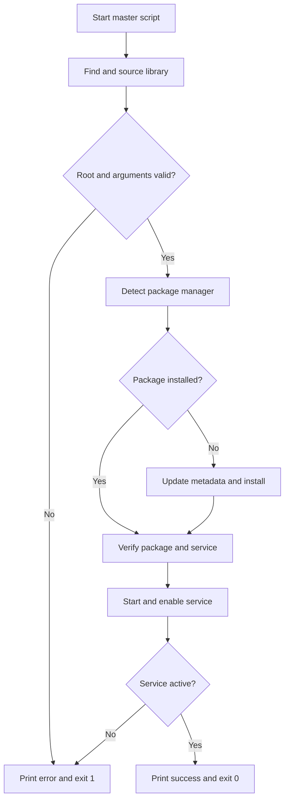

# Bash Modular Package and Service Manager — Study Notes

## Table of Contents

1. [Learning objective](#1-learning-objective)
2. [Why use separate functions?](#2-why-use-separate-functions)
3. [Package name versus service name](#3-package-name-versus-service-name)
4. [Project structure](#4-project-structure)
5. [Function library](#5-function-library)
6. [Master script](#6-master-script)
7. [How the two files work together](#7-how-the-two-files-work-together)
8. [Program flow](#8-program-flow)
9. [Create and run the project](#9-create-and-run-the-project)
10. [Usage examples](#10-usage-examples)
11. [Important commands and variables](#11-important-commands-and-variables)
12. [Function return statuses](#12-function-return-statuses)
13. [Testing procedure](#13-testing-procedure)
14. [Common mistakes](#14-common-mistakes)
15. [Possible future improvements](#15-possible-future-improvements)
16. [Summary](#16-summary)

---

## 1. Learning objective

This project demonstrates how to build a reusable Bash program that can:

- Detect `apt`, `dnf`, or `yum`.
- Check whether a package is installed.
- Install a missing package.
- Confirm that the related systemd service exists.
- Start the service when it is inactive.
- Enable the service at boot.
- Verify the final result.
- Report success with `exit 0` or failure with `exit 1`.

The project is not limited to Nginx. The master script receives a package name and a service name, so it can be reused for several applications.

> The master script controls the workflow, while the function library contains reusable actions.

---

## 2. Why use separate functions?

A small script can contain all its commands in one file. As a script grows, however, separating reusable functions makes it easier to understand, test, maintain, and reuse.

| Benefit | Explanation |
|---|---|
| Reusability | The same function can be called for different packages and services. |
| Readability | The master script reads like a clear sequence of tasks. |
| Maintenance | Package-management logic is kept in one place. |
| Testing | Individual functions can be tested separately. |
| Expansion | Support for another package manager can be added to the library. |
| Teamwork | One person can maintain the library while another uses the master script. |

This design is often called **modular scripting**.

---

## 3. Package name versus service name

A package is the software installed by the package manager. A service is the systemd unit that runs in the background.

Their names are sometimes the same, but not always.

| Application | Distribution family | Package | Service |
|---|---|---|---|
| Nginx | Debian/Ubuntu | `nginx` | `nginx` |
| SSH server | Debian/Ubuntu | `openssh-server` | `ssh` |
| SSH server | RHEL family | `openssh-server` | `sshd` |
| Apache | Debian/Ubuntu | `apache2` | `apache2` |
| Apache | RHEL family | `httpd` | `httpd` |

For this reason, the master script accepts two arguments:

```text
sudo ./manage_service.sh PACKAGE SERVICE
```

For example:

```bash
sudo ./manage_service.sh openssh-server ssh
```

---

## 4. Project structure

```text
service-manager/
├── manage_service.sh
└── lib/
    └── service_functions.sh
```

### File responsibilities

| File | Responsibility |
|---|---|
| `manage_service.sh` | Validates input and controls the complete workflow. |
| `lib/service_functions.sh` | Defines reusable package and service functions. |

The library file defines functions but does not automatically run them. The master script loads the library and calls the required functions.

---

## 5. Function library

Create `lib/service_functions.sh`:

```bash
#!/bin/bash

# Detect the available package manager.
detect_package_manager()
{
    if command -v apt-get >/dev/null 2>&1 &&
       command -v dpkg >/dev/null 2>&1; then
        package_manager="apt"
    elif command -v dnf >/dev/null 2>&1 &&
         command -v rpm >/dev/null 2>&1; then
        package_manager="dnf"
    elif command -v yum >/dev/null 2>&1 &&
         command -v rpm >/dev/null 2>&1; then
        package_manager="yum"
    else
        echo "Error: no supported package manager was found." >&2
        return 1
    fi
}


# Check whether a package is installed.
is_package_installed()
{
    local package="$1"

    case "$package_manager" in
        apt)
            dpkg -s "$package" >/dev/null 2>&1
            ;;
        dnf|yum)
            rpm -q "$package" >/dev/null 2>&1
            ;;
        *)
            echo "Error: unknown package manager." >&2
            return 1
            ;;
    esac
}


# Refresh package information.
update_package_information()
{
    case "$package_manager" in
        apt)
            apt-get update
            ;;
        dnf)
            dnf makecache
            ;;
        yum)
            yum makecache
            ;;
        *)
            echo "Error: unknown package manager." >&2
            return 1
            ;;
    esac
}


# Install the supplied package.
install_package()
{
    local package="$1"

    case "$package_manager" in
        apt)
            DEBIAN_FRONTEND=noninteractive apt-get install -y -- "$package"
            ;;
        dnf)
            dnf install -y "$package"
            ;;
        yum)
            yum install -y "$package"
            ;;
        *)
            echo "Error: unknown package manager." >&2
            return 1
            ;;
    esac
}


# Check whether a systemd service exists.
service_exists()
{
    local service="$1"

    systemctl cat "$service" >/dev/null 2>&1
}


# Start a service.
start_service()
{
    local service="$1"

    systemctl start "$service"
}


# Enable a service at boot.
enable_service()
{
    local service="$1"

    systemctl enable "$service"
}


# Check whether a service is running.
is_service_active()
{
    local service="$1"

    systemctl is-active --quiet "$service"
}
```

### Explanation of the library functions

| Function | Purpose | Success status |
|---|---|---:|
| `detect_package_manager` | Detects `apt`, `dnf`, or `yum`. | `0` when supported tools are found. |
| `is_package_installed` | Checks whether the supplied package is installed. | `0` when installed. |
| `update_package_information` | Refreshes repository metadata. | `0` when the update succeeds. |
| `install_package` | Installs the supplied package. | `0` when installation succeeds. |
| `service_exists` | Checks whether systemd knows the service. | `0` when the unit exists. |
| `start_service` | Starts the supplied service. | `0` when systemd starts it successfully. |
| `enable_service` | Configures the service to start at boot. | `0` when enabling succeeds. |
| `is_service_active` | Checks the current runtime state. | `0` when the service is active. |

### Why use `local`?

```bash
local package="$1"
```

`local` limits the variable to the current function. It prevents the function from accidentally changing a variable with the same name in the master script.

### Why use `return 1` in a function?

```bash
return 1
```

`return` ends the current function and sends a status back to its caller. It does not terminate the entire master script.

---

## 6. Master script

Create `manage_service.sh`:

```bash
#!/bin/bash

# Title: Generic Package and Service Manager
# Purpose: Install a package and manage its related systemd service.
# Usage: sudo ./manage_service.sh PACKAGE SERVICE

# Find the directory containing this master script.
script_directory="$(cd -- "$(dirname -- "${BASH_SOURCE[0]}")" && pwd)"

# Build the absolute path of the function library.
functions_file="$script_directory/lib/service_functions.sh"

# Stop if the required library cannot be found.
if [[ ! -f "$functions_file" ]]; then
    echo "Error: function library was not found:" >&2
    echo "$functions_file" >&2
    exit 1
fi

# Load the reusable functions into the current shell.
source "$functions_file"


# Require root privileges.
if (( EUID != 0 )); then
    echo "Error: run this script with sudo." >&2
    echo "Usage: sudo $0 PACKAGE SERVICE" >&2
    exit 1
fi


# Require exactly two command-line arguments.
if (( $# != 2 )); then
    echo "Usage: sudo $0 PACKAGE SERVICE" >&2
    echo "Example: sudo $0 nginx nginx" >&2
    exit 1
fi

package="$1"
service="$2"


# Accept only safe package and service name characters.
if [[ ! "$package" =~ ^[a-zA-Z0-9][a-zA-Z0-9+._-]*$ ]]; then
    echo "Error: invalid package name: $package" >&2
    exit 1
fi

if [[ ! "$service" =~ ^[a-zA-Z0-9][a-zA-Z0-9@._-]*$ ]]; then
    echo "Error: invalid service name: $service" >&2
    exit 1
fi


# Detect apt, dnf, or yum.
if ! detect_package_manager; then
    exit 1
fi

echo "Package manager: $package_manager"


# Install the package only when it is missing.
if is_package_installed "$package"; then
    echo "[INSTALLED] $package is already installed."
else
    echo "[MISSING] $package is not installed."
    echo "Updating package information..."

    if ! update_package_information; then
        echo "Error: package information could not be updated." >&2
        exit 1
    fi

    echo "Installing $package..."

    if ! install_package "$package"; then
        echo "Error: $package could not be installed." >&2
        exit 1
    fi

    echo "[SUCCESS] $package was installed."
fi


# Verify the package after a possible installation.
if ! is_package_installed "$package"; then
    echo "Error: package verification failed for $package." >&2
    exit 1
fi


# Verify that the requested systemd unit exists.
if ! service_exists "$service"; then
    echo "Error: systemd service '$service' was not found." >&2
    exit 1
fi


# Start the service only when it is inactive.
if is_service_active "$service"; then
    echo "[ACTIVE] $service is already running."
else
    echo "Starting $service..."

    if ! start_service "$service"; then
        echo "Error: $service could not be started." >&2
        exit 1
    fi
fi


# Try to enable the service at boot.
if enable_service "$service"; then
    echo "[ENABLED] $service is enabled at boot."
else
    echo "Warning: $service could not be enabled at boot." >&2
fi


# Perform the final runtime verification.
if is_service_active "$service"; then
    echo "[SUCCESS] $package is installed and $service is running."
    exit 0
else
    echo "Error: $service is not running." >&2
    exit 1
fi
```

### Why locate the script directory?

```bash
script_directory="$(cd -- "$(dirname -- "${BASH_SOURCE[0]}")" && pwd)"
```

This obtains the absolute directory containing `manage_service.sh`. The master script can therefore find its library even when it is launched from another working directory.

Using only this would be less reliable:

```bash
source lib/service_functions.sh
```

That relative path is interpreted from the user's current working directory, which might not be the project directory.

### What does `source` do?

```bash
source "$functions_file"
```

`source` reads and executes the library file in the current Bash process. After that line, the master script can call all functions defined by the library.

---

## 7. How the two files work together

Suppose the master script runs:

```bash
if is_package_installed "$package"; then
    echo "Package is installed."
fi
```

The sequence is:

1. The master script calls `is_package_installed`.
2. The value of `$package` becomes the function's `$1`.
3. The function stores that value in its local `package` variable.
4. It selects `dpkg` or `rpm` based on `$package_manager`.
5. The check command returns an exit status.
6. The function passes that status back to the `if` statement.
7. The `then` block runs only when the status is `0`.

The function prints no normal output because its check is redirected:

```bash
dpkg -s "$package" >/dev/null 2>&1
```

The master script uses the command's status to make its decision.

---

## 8. Program flow



The simplified learning sequence is:

> Validate → Detect → Check → Update → Install → Verify → Start → Enable → Verify again

---

## 9. Create and run the project

### Step 1: Create the directories

```bash
mkdir -p service-manager/lib
cd service-manager
```

### Step 2: Create the files

```bash
touch manage_service.sh lib/service_functions.sh
```

Add the appropriate code to each file.

### Step 3: Make only the master executable

```bash
chmod +x manage_service.sh
```

The library does not need executable permission because it is loaded with `source` rather than executed directly.

### Step 4: Check Bash syntax

```bash
bash -n manage_service.sh
bash -n lib/service_functions.sh
```

No output normally means that Bash found no syntax errors.

### Step 5: Run the master script

```bash
sudo ./manage_service.sh nginx nginx
```

---

## 10. Usage examples

### Nginx

```bash
sudo ./manage_service.sh nginx nginx
```

### SSH server on Ubuntu

```bash
sudo ./manage_service.sh openssh-server ssh
```

### SSH server on RHEL

```bash
sudo ./manage_service.sh openssh-server sshd
```

### Apache on Ubuntu

```bash
sudo ./manage_service.sh apache2 apache2
```

### Apache on RHEL

```bash
sudo ./manage_service.sh httpd httpd
```

### Important safety note about SSH

If you are connected to a remote machine through SSH, be careful when changing the SSH service. A wrong configuration or failed restart can disconnect you from the server.

---

## 11. Important commands and variables

| Syntax | Meaning |
|---|---|
| `source file` | Loads functions and variables from a file into the current shell. |
| `${BASH_SOURCE[0]}` | Holds the path used for the current Bash script file. |
| `dirname PATH` | Returns the directory part of a path. |
| `command -v name` | Checks whether a command is available. |
| `>/dev/null` | Discards standard output. |
| `2>&1` | Sends standard error to the same destination as standard output. |
| `>&2` | Sends an `echo` message to standard error. |
| `local variable=value` | Creates a function-local variable. |
| `return 1` | Ends a function and reports failure. |
| `exit 1` | Ends the entire script and reports failure. |
| `exit 0` | Ends the entire script and reports success. |
| `(( EUID != 0 ))` | Tests whether the script lacks effective root privileges. |
| `dpkg -s PACKAGE` | Checks a package on Debian/Ubuntu systems. |
| `rpm -q PACKAGE` | Checks a package on RHEL-family systems. |
| `apt-get update` | Refreshes APT repository metadata. |
| `dnf makecache` | Refreshes DNF repository metadata. |
| `systemctl cat SERVICE` | Checks whether systemd can locate the service unit. |
| `systemctl start SERVICE` | Starts the service now. |
| `systemctl enable SERVICE` | Configures the service to start during boot. |
| `systemctl is-active --quiet SERVICE` | Returns success when the service is currently active. |

---

## 12. Function return statuses

Bash functions return numeric statuses just like commands:

| Status | Meaning |
|---:|---|
| `0` | Success or true |
| Nonzero | Failure or false |

Example:

```bash
if is_service_active "$service"; then
    echo "Service is active."
else
    echo "Service is inactive."
fi
```

The function does not need to print `true` or `false`. The `if` statement checks its return status.

### `return` versus `exit`

| Command | Effect |
|---|---|
| `return 1` | Leaves only the current function. |
| `exit 1` | Terminates the entire script. |

Library functions normally use `return`, allowing the master script to decide how to handle the failure.

---

## 13. Testing procedure

### Test 1: Syntax validation

```bash
bash -n manage_service.sh
bash -n lib/service_functions.sh
```

### Test 2: Missing privileges

```bash
./manage_service.sh nginx nginx
echo "$?"
```

Expected result: an error message and status `1`.

### Test 3: Missing arguments

```bash
sudo ./manage_service.sh
echo "$?"
```

Expected result: the usage instructions and status `1`.

### Test 4: Invalid package or service name

```bash
sudo ./manage_service.sh 'nginx;whoami' nginx
```

Expected result: the validation rejects the unsafe package name.

### Test 5: Normal installation

```bash
sudo ./manage_service.sh nginx nginx
echo "$?"
```

Expected result: the package is installed, the service is active, and the final status is `0`.

### Test 6: Reattempt

Run the same command again:

```bash
sudo ./manage_service.sh nginx nginx
```

The script should detect that Nginx is already installed instead of reinstalling it.

### Test 7: Verify independently

On Debian/Ubuntu:

```bash
dpkg -s nginx
systemctl is-active nginx
systemctl is-enabled nginx
```

On RHEL-family systems:

```bash
rpm -q nginx
systemctl is-active nginx
systemctl is-enabled nginx
```

---

## 14. Common mistakes

### Mistake 1: Running the library directly

```bash
bash lib/service_functions.sh
```

This merely defines the functions in a temporary Bash process and then exits. It does not make those functions available to the master script.

Correct approach:

```bash
source "$functions_file"
```

### Mistake 2: Using `exit` inside every library function

`exit` would terminate the complete master script immediately. Reusable functions should normally use `return` and allow the caller to handle the failure.

### Mistake 3: Assuming package and service names are always identical

For Ubuntu SSH:

```text
Package: openssh-server
Service: ssh
```

### Mistake 4: Using `systemctl is-active` as an installation check

An installed service can be inactive. Use `dpkg -s` or `rpm -q` to check installation, and use `systemctl is-active` to check runtime state.

### Mistake 5: Running repository updates unnecessarily

The example refreshes repository metadata only when the requested package is missing. This avoids an unnecessary update on every reattempt.

### Mistake 6: Forgetting quotation marks

Use:

```bash
is_package_installed "$package"
```

Quoting prevents unwanted word splitting and pathname expansion.

### Mistake 7: Assuming every package provides a systemd service

Packages such as `curl` and `wget` provide commands but normally do not create long-running services. This master script is intended for packages that provide systemd units.

---

## 15. Possible future improvements

After mastering the basic version, the project could support:

- An `install`, `start`, `stop`, `restart`, or `status` action argument.
- A `--help` option.
- A `--dry-run` mode that previews changes.
- Log files with timestamps.
- Installation of several packages from an array or input file.
- Debian, RHEL, and SUSE package managers.
- Configuration-file validation before restarting a service.
- Rollback or cleanup when a later stage fails.
- Unit tests using a Bash testing framework.

Do not add every advanced feature at once. First make the basic workflow correct and understandable.

---

## 16. Summary

This modular project separates responsibilities:

- `service_functions.sh` contains reusable operations.
- `manage_service.sh` validates input and controls the workflow.
- `source` makes the library functions available to the master script.
- Package and service names are supplied separately.
- `return` communicates function results.
- `exit` communicates the final script result.
- Explicit error handling prevents false success messages.

The complete flow is:

> Load library → validate → detect package manager → check package → install if missing → verify service → start and enable → verify final state

This structure provides a strong beginner-friendly foundation for larger Bash automation projects.
