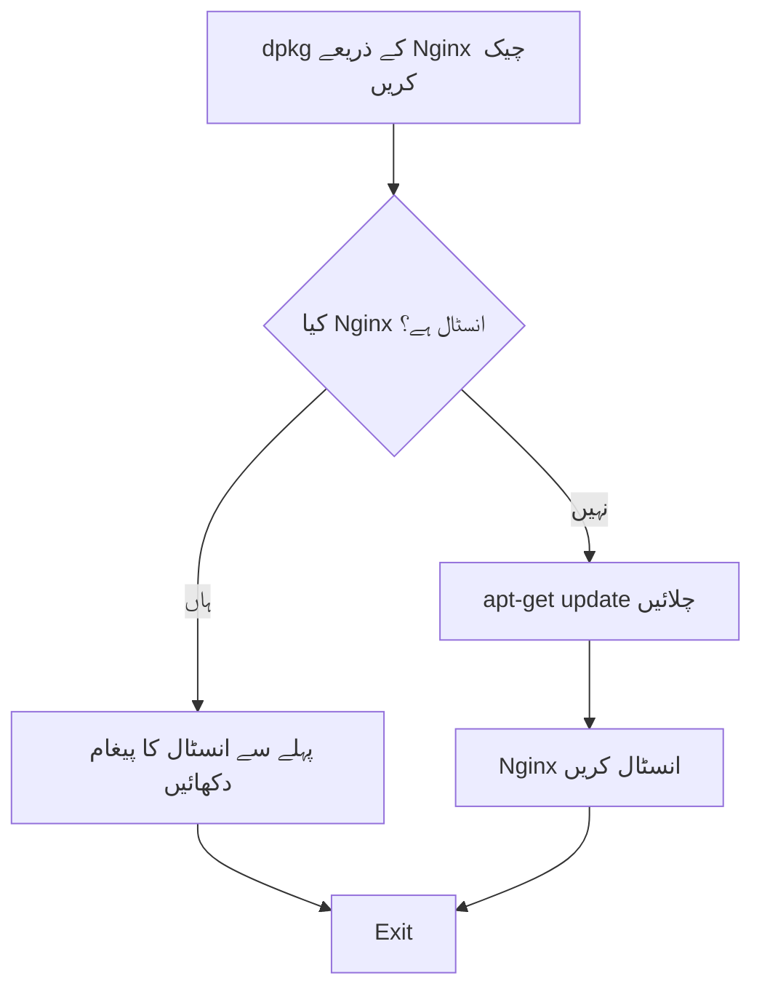
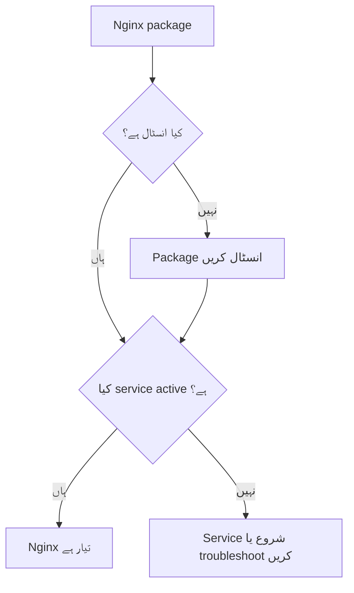
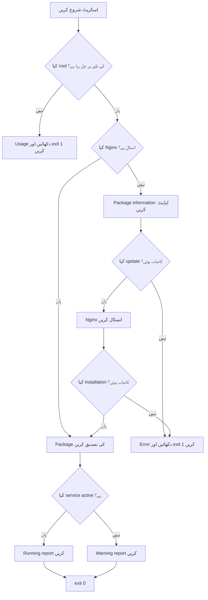

# Bash میں `dpkg` اور `apt-get` کے ذریعے Nginx کی تنصیب — اردو مطالعہ نوٹس

## فہرستِ مضامین

1. [سیکھنے کا مقصد](#1-سیکھنے-کا-مقصد)
2. [اہم فرق](#2-اہم-فرق)
3. [لیول 1 — چیک کریں کہ Nginx انسٹال ہے یا نہیں](#3-لیول-1--چیک-کریں-کہ-nginx-انسٹال-ہے-یا-نہیں)
4. [لیول 2 — Nginx موجود نہ ہو تو انسٹال کریں](#4-لیول-2--nginx-موجود-نہ-ہو-تو-انسٹال-کریں)
5. [لیول 3 — Error Handling شامل کریں](#5-لیول-3--error-handling-شامل-کریں)
6. [لیول 4 — Root Privileges لازمی قرار دیں](#6-لیول-4--root-privileges-لازمی-قرار-دیں)
7. [لیول 5 — Package اور Service کی تصدیق کریں](#7-لیول-5--package-اور-service-کی-تصدیق-کریں)
8. [مکمل تجویز کردہ اسکرپٹ](#8-مکمل-تجویز-کردہ-اسکرپٹ)
9. [کمانڈز کا مختصر حوالہ](#9-کمانڈز-کا-مختصر-حوالہ)
10. [اسکرپٹ کو ٹیسٹ کرنا](#10-اسکرپٹ-کو-ٹیسٹ-کرنا)
11. [عام غلطیاں](#11-عام-غلطیاں)
12. [حتمی خلاصہ](#12-حتمی-خلاصہ)

---

## 1. سیکھنے کا مقصد

ہمارا مقصد ایسا Bash اسکرپٹ بنانا ہے جو:

1. چیک کرے کہ Nginx package انسٹال ہے یا نہیں۔
2. اگر Nginx پہلے سے موجود ہو تو دوبارہ انسٹال نہ کرے۔
3. ضرورت پڑنے پر package information کو اپڈیٹ کرے۔
4. Nginx انسٹال کرے اور installation کا نتیجہ چیک کرے۔
5. Error messages کو `stderr` پر بھیجے۔
6. صحیح exit status واپس کرے۔
7. آخر میں Nginx service کی حالت بھی چیک کرے۔

اس طریقے کا فائدہ یہ ہے کہ اسکرپٹ کو بار بار چلانے سے پہلے سے موجود package دوبارہ انسٹال نہیں ہوتا۔

---

## 2. اہم فرق

یہ کمانڈ صرف چیک کرتی ہے کہ Nginx package انسٹال ہے یا نہیں:

```bash
dpkg -s nginx
```

یہ کمانڈ Nginx کو انسٹال **نہیں** کرتی۔

Nginx کو حقیقت میں انسٹال کرنے والی کمانڈ یہ ہے:

```bash
apt-get install -y nginx
```

| کمانڈ | مقصد |
|---|---|
| `dpkg -s nginx` | چیک کرنا کہ Nginx package انسٹال ہے یا نہیں۔ |
| `apt-get update` | دستیاب packages کی مقامی معلومات کو تازہ کرنا۔ |
| `apt-get install -y nginx` | تصدیق پوچھے بغیر Nginx انسٹال کرنا۔ |
| `systemctl is-active nginx` | چیک کرنا کہ Nginx service اس وقت چل رہی ہے یا نہیں۔ |
| `systemctl is-enabled nginx` | چیک کرنا کہ Nginx boot کے وقت خودکار طور پر شروع ہوگا یا نہیں۔ |

> Package کا انسٹال ہونا اور service کا چلنا دو الگ حالتیں ہیں۔ Nginx انسٹال ہو سکتا ہے لیکن اس کی service بند ہو سکتی ہے۔

---

## 3. لیول 1 — چیک کریں کہ Nginx انسٹال ہے یا نہیں

```bash
#!/bin/bash

# چیک کریں کہ Nginx package انسٹال ہے یا نہیں۔
if dpkg -s nginx >/dev/null 2>&1; then
    echo "The Nginx package is installed."
else
    echo "The Nginx package is not installed."
fi

exit 0
```

### یہ کیسے کام کرتا ہے؟

```bash
dpkg -s nginx
```

`dpkg` ایک exit status واپس کرتا ہے:

| Exit status | مطلب |
|---:|---|
| `0` | Package انسٹال ہے اور اس کی status information مل گئی۔ |
| Nonzero | Package check کامیاب نہیں ہوا؛ عام طور پر package انسٹال نہیں ہوتا۔ |

یہ redirections دونوں output streams کو چھپا دیتی ہیں:

```bash
>/dev/null 2>&1
```

- `>/dev/null`، `stdout` کو `/dev/null` میں بھیجتا ہے۔
- `2>&1`، `stderr` کو بھی `stdout` کی موجودہ منزل پر بھیجتا ہے۔
- کمانڈ کا exit status پھر بھی `if` statement کو ملتا ہے۔

### لیول 1 کی کمی

`else` block صرف پیغام دکھاتا ہے۔ یہ Nginx کو انسٹال نہیں کرتا۔

---

## 4. لیول 2 — Nginx موجود نہ ہو تو انسٹال کریں

```bash
#!/bin/bash

# چیک کریں کہ Nginx پہلے سے انسٹال ہے یا نہیں۔
if dpkg -s nginx >/dev/null 2>&1; then
    echo "The Nginx package is already installed."
else
    echo "The Nginx package is not installed."
    echo "Installing Nginx..."

    sudo apt-get update
    sudo apt-get install -y nginx
fi

exit 0
```

### Flow



### لیول 2 کی کمی

یہ ورژن چیک نہیں کرتا کہ `apt-get update` یا installation ناکام ہوئی یا نہیں۔ اہم کمانڈ fail ہونے کے باوجود اسکرپٹ آخر میں `exit 0` تک پہنچ سکتا ہے۔

---

## 5. لیول 3 — Error Handling شامل کریں

```bash
#!/bin/bash

# چیک کریں کہ Nginx پہلے سے انسٹال ہے یا نہیں۔
if dpkg -s nginx >/dev/null 2>&1; then
    echo "The Nginx package is already installed."
else
    echo "The Nginx package is not installed."
    echo "Updating package information..."

    # Package information اپڈیٹ نہ ہو تو اسکرپٹ روک دیں۔
    if ! sudo apt-get update; then
        echo "Error: package information could not be updated." >&2
        exit 1
    fi

    echo "Installing Nginx..."

    # Nginx انسٹال کریں اور نتیجہ فوراً چیک کریں۔
    if sudo apt-get install -y nginx; then
        echo "Nginx was installed successfully."
    else
        echo "Error: Nginx installation failed." >&2
        exit 1
    fi
fi

exit 0
```

### `if ! command` کیوں استعمال کیا؟

```bash
if ! sudo apt-get update; then
```

`!` کمانڈ کے نتیجے کو الٹ دیتا ہے:

- اگر `apt-get update` کامیاب ہو تو error block نہیں چلے گا۔
- اگر کمانڈ fail ہو تو `then` block چلے گا۔

### `>&2` کیوں استعمال کیا؟

```bash
echo "Error: Nginx installation failed." >&2
```

`>&2` error message کو `stderr` پر بھیجتا ہے۔

---

## 6. لیول 4 — Root Privileges لازمی قرار دیں

Package installation نظام میں تبدیلی کرتی ہے، اس لیے administrative privileges ضروری ہیں۔ ہر کمانڈ کے ساتھ `sudo` لکھنے کے بجائے پورا اسکرپٹ `sudo` کے ساتھ چلانا زیادہ صاف طریقہ ہے۔

```bash
#!/bin/bash

# تصدیق کریں کہ اسکرپٹ root privileges کے ساتھ چل رہا ہے۔
if (( EUID != 0 )); then
    echo "Error: run this script with sudo." >&2
    echo "Usage: sudo $0" >&2
    exit 1
fi
```

### Test کا مطلب

```bash
(( EUID != 0 ))
```

| قدر | مطلب |
|---:|---|
| `EUID=0` | اسکرپٹ root privileges کے ساتھ چل رہا ہے۔ |
| `EUID!=0` | اسکرپٹ root کے طور پر نہیں چل رہا۔ |

اسکرپٹ اس طرح چلائیں:

```bash
sudo ./install_nginx.sh
```

Root check کامیاب ہونے کے بعد اسکرپٹ کے اندر بار بار `sudo` لکھنے کی ضرورت نہیں:

```bash
apt-get update
apt-get install -y nginx
```

---

## 7. لیول 5 — Package اور Service کی تصدیق کریں

Installation کے بعد package اور running service دونوں کو چیک کریں۔

### Package کی تصدیق

```bash
if dpkg -s nginx >/dev/null 2>&1; then
    echo "[PACKAGE] Nginx is installed."
else
    echo "[ERROR] Nginx package verification failed." >&2
    exit 1
fi
```

### Service کی تصدیق

```bash
if systemctl is-active --quiet nginx; then
    echo "[SERVICE] Nginx is running."
else
    echo "[WARNING] Nginx is installed but not running." >&2
fi
```

`--quiet`، `active` یا `inactive` کا output چھپا دیتا ہے۔ `if` statement صرف کمانڈ کا exit status استعمال کرتا ہے۔

### Package اور service کا تعلق



---

## 8. مکمل تجویز کردہ اسکرپٹ

تجویز کردہ filename:

```text
install_nginx.sh
```

```bash
#!/bin/bash

# Title: Nginx Package Installer
# Purpose: Nginx کو صرف اس وقت انسٹال کرنا جب وہ موجود نہ ہو۔
# Usage: sudo ./install_nginx.sh

# تصدیق کریں کہ اسکرپٹ root privileges کے ساتھ چل رہا ہے۔
if (( EUID != 0 )); then
    echo "Error: run this script with sudo." >&2
    echo "Usage: sudo $0" >&2
    exit 1
fi

# Nginx پہلے سے انسٹال ہو تو installation چھوڑ دیں۔
if dpkg -s nginx >/dev/null 2>&1; then
    echo "[INSTALLED] The Nginx package is already installed."
else
    echo "[MISSING] The Nginx package is not installed."
    echo "Updating package information..."

    # Package information اپڈیٹ نہ ہو تو اسکرپٹ روک دیں۔
    if ! apt-get update; then
        echo "Error: package information could not be updated." >&2
        exit 1
    fi

    echo "Installing Nginx..."

    # Nginx انسٹال کریں اور failure کی صورت میں اسکرپٹ روک دیں۔
    if apt-get install -y nginx; then
        echo "[SUCCESS] Nginx was installed successfully."
    else
        echo "Error: Nginx installation failed." >&2
        exit 1
    fi
fi

# تصدیق کریں کہ package اب انسٹال ہے۔
if ! dpkg -s nginx >/dev/null 2>&1; then
    echo "Error: Nginx package verification failed." >&2
    exit 1
fi

echo "[PACKAGE] Nginx is installed."

# موجودہ service state دکھائیں۔
if systemctl is-active --quiet nginx; then
    echo "[SERVICE] Nginx is running."
else
    echo "[WARNING] Nginx is installed but not running." >&2
fi

exit 0
```

### مکمل flow



### کیا inactive service کو failure سمجھنا چاہیے؟

اوپر والے اسکرپٹ میں inactive service کو warning سمجھا گیا ہے کیونکہ اسکرپٹ کا بنیادی مقصد package installation ہے۔

اگر requirement یہ ہو کہ Nginx لازماً چل بھی رہا ہو، تو warning branch کو اس طرح تبدیل کریں:

```bash
echo "Error: Nginx is installed but not running." >&2
exit 1
```

---

## 9. کمانڈز کا مختصر حوالہ

| کمانڈ یا syntax | وضاحت |
|---|---|
| `dpkg -s nginx` | Nginx package کی installed status دکھاتا ہے۔ |
| `>/dev/null` | `stdout` کو ضائع کرتا ہے۔ |
| `2>&1` | `stderr` کو `stdout` کی موجودہ منزل پر بھیجتا ہے۔ |
| `apt-get update` | دستیاب packages کی معلومات تازہ کرتا ہے۔ |
| `apt-get install -y nginx` | Nginx انسٹال کرتا ہے اور confirmation کا جواب خودکار طور پر yes دیتا ہے۔ |
| `(( EUID != 0 ))` | چیک کرتا ہے کہ effective user root نہیں ہے۔ |
| `systemctl is-active --quiet nginx` | خاموشی سے چیک کرتا ہے کہ Nginx چل رہا ہے یا نہیں۔ |
| `systemctl is-enabled nginx` | چیک کرتا ہے کہ Nginx boot پر شروع ہوگا یا نہیں۔ |
| `>&2` | پیغام کو `stderr` پر بھیجتا ہے۔ |
| `exit 0` | اسکرپٹ کو کامیابی کے ساتھ ختم کرتا ہے۔ |
| `exit 1` | اسکرپٹ کو failure status کے ساتھ ختم کرتا ہے۔ |

---

## 10. اسکرپٹ کو ٹیسٹ کرنا

### Executable بنائیں

```bash
chmod +x install_nginx.sh
```

### Bash syntax چیک کریں

```bash
bash -n install_nginx.sh
```

عام طور پر کوئی output نہ آنے کا مطلب ہے کہ Bash کو syntax error نہیں ملا۔

### `sudo` کے بغیر ٹیسٹ کریں

```bash
./install_nginx.sh
```

متوقع نتیجہ:

```text
Error: run this script with sudo.
Usage: sudo ./install_nginx.sh
```

### Administrative privileges کے ساتھ چلائیں

```bash
sudo ./install_nginx.sh
```

### Exit status چیک کریں

```bash
echo "$?"
```

کامیابی کے بعد متوقع نتیجہ:

```text
0
```

### اسکرپٹ دوسری مرتبہ چلائیں

```bash
sudo ./install_nginx.sh
```

دوسری مرتبہ اسکرپٹ کو معلوم ہونا چاہیے کہ Nginx پہلے سے انسٹال ہے، لہٰذا installation چھوڑ دینی چاہیے۔

---

## 11. عام غلطیاں

### غلطی 1: یہ سمجھنا کہ `dpkg -s` package انسٹال کرتا ہے

```bash
dpkg -s nginx
```

یہ کمانڈ صرف package status چیک کرتی ہے۔

### غلطی 2: Missing message دکھانا لیکن installation نہ کرنا

```bash
else
    echo "Nginx is not installed."
fi
```

یہ block صرف condition report کرتا ہے۔ Installation کے لیے `else` block میں مناسب commands شامل کریں۔

### غلطی 3: Command failures کو نظر انداز کرنا

```bash
apt-get update
apt-get install -y nginx
exit 0
```

اہم command fail ہونے کے باوجود یہ code success report کر سکتا ہے۔ ہر اہم result کو `if` یا `!` کے ذریعے چیک کریں۔

### غلطی 4: `systemctl is-active` کو package check سمجھنا

Inactive service کا مطلب یہ لازماً نہیں کہ package موجود نہیں۔ Package کے لیے:

```bash
dpkg -s nginx
```

اور running service کے لیے:

```bash
systemctl is-active nginx
```

استعمال کریں۔

### غلطی 5: `systemctl is-install` استعمال کرنا

یہ درست کمانڈ نہیں:

```bash
systemctl is-install nginx
```

درست سوال کے مطابق درست کمانڈ استعمال کریں:

```bash
dpkg -s nginx                 # کیا package انسٹال ہے؟
systemctl is-active nginx     # کیا service چل رہی ہے؟
systemctl is-enabled nginx    # کیا service boot پر enabled ہے؟
```

---

## 12. حتمی خلاصہ

بنیادی installation logic یہ ہے:

```bash
if dpkg -s nginx >/dev/null 2>&1; then
    echo "The Nginx package is already installed."
else
    apt-get update
    apt-get install -y nginx
fi
```

زیادہ قابلِ اعتماد ورژن میں یہ چیزیں بھی شامل ہونی چاہییں:

- Root privilege check
- Package information update کی failure handling
- Installation failure handling
- `stderr` پر error messages
- Package verification
- Service-state verification
- صحیح success اور failure exit statuses

مکمل flow یاد رکھیں:

> چیک کریں → اپڈیٹ کریں → انسٹال کریں → Package verify کریں → Service verify کریں → صحیح status کے ساتھ exit کریں
