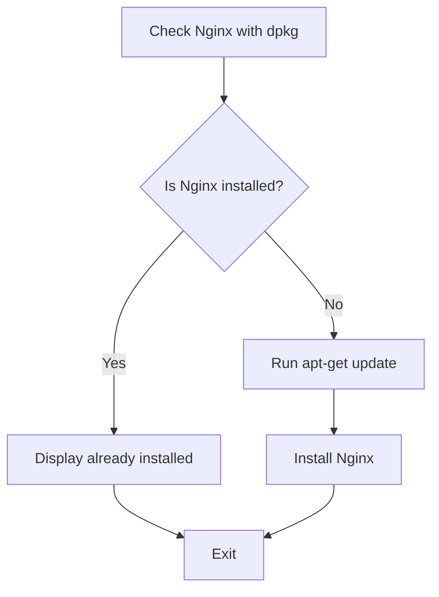
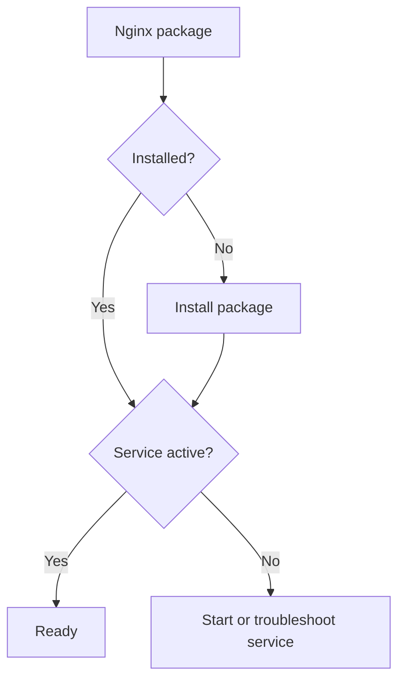
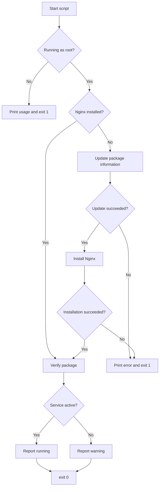

# Bash Nginx Installation with `dpkg` and `apt-get` — Study Notes

## Table of Contents

1. [Learning Objective](#1-learning-objective)
2. [The Important Difference](#2-the-important-difference)
3. [Level 1 — Check Whether Nginx Is Installed](#3-level-1--check-whether-nginx-is-installed)
4. [Level 2 — Install Nginx When Missing](#4-level-2--install-nginx-when-missing)
5. [Level 3 — Add Error Handling](#5-level-3--add-error-handling)
6. [Level 4 — Require Root Privileges](#6-level-4--require-root-privileges)
7. [Level 5 — Verify the Package and Service](#7-level-5--verify-the-package-and-service)
8. [Complete Recommended Script](#8-complete-recommended-script)
9. [Command Reference](#9-command-reference)
10. [Testing the Script](#10-testing-the-script)
11. [Common Mistakes](#11-common-mistakes)
12. [Final Summary](#12-final-summary)

---

## 1. Learning Objective

The goal is to create a Bash script that:

1. Checks whether the Nginx package is installed.
2. Skips installation when Nginx is already present.
3. Updates the package information when installation is required.
4. Installs Nginx and checks whether the installation succeeded.
5. Reports errors through `stderr`.
6. Returns the correct exit status.
7. Optionally verifies whether the Nginx service is running.

This approach is useful because repeated executions do not reinstall a package that is already installed.

---

## 2. The Important Difference

The following command checks the package:

```bash
dpkg -s nginx
```

It does **not** install Nginx.

The following command performs the installation:

```bash
apt-get install -y nginx
```

| Command | Purpose |
|---|---|
| `dpkg -s nginx` | Check whether the Nginx package is installed. |
| `apt-get update` | Refresh the local package information. |
| `apt-get install -y nginx` | Install Nginx without asking for confirmation. |
| `systemctl is-active nginx` | Check whether the Nginx service is running now. |
| `systemctl is-enabled nginx` | Check whether Nginx is configured to start during boot. |

> Package installation and service activity are different conditions. Nginx may be installed but not currently running.

---

## 3. Level 1 — Check Whether Nginx Is Installed

```bash
#!/bin/bash

# Check whether the Nginx package is installed.
if dpkg -s nginx >/dev/null 2>&1; then
    echo "The Nginx package is installed."
else
    echo "The Nginx package is not installed."
fi

exit 0
```

### How it works

```bash
dpkg -s nginx
```

`dpkg` returns an exit status:

| Status | Meaning |
|---:|---|
| `0` | The package is installed and its status information was found. |
| Nonzero | The package check did not succeed. It is normally not installed. |

The redirections hide both normal output and errors:

```bash
>/dev/null 2>&1
```

- `>/dev/null` sends `stdout` to `/dev/null`.
- `2>&1` sends `stderr` to the same destination as `stdout`.
- The command's exit status is still available to the `if` statement.

### Limitation of Level 1

The `else` block only prints a message. It does not install Nginx.

---

## 4. Level 2 — Install Nginx When Missing

```bash
#!/bin/bash

# Check whether Nginx is already installed.
if dpkg -s nginx >/dev/null 2>&1; then
    echo "The Nginx package is already installed."
else
    echo "The Nginx package is not installed."
    echo "Installing Nginx..."

    sudo apt-get update
    sudo apt-get install -y nginx
fi

exit 0
```

### Flow



### Limitation of Level 2

This version does not check whether `apt-get update` or the installation failed. It could reach `exit 0` even after an important failure.

---

## 5. Level 3 — Add Error Handling

```bash
#!/bin/bash

# Check whether Nginx is already installed.
if dpkg -s nginx >/dev/null 2>&1; then
    echo "The Nginx package is already installed."
else
    echo "The Nginx package is not installed."
    echo "Updating package information..."

    # Stop when the package-information update fails.
    if ! sudo apt-get update; then
        echo "Error: package information could not be updated." >&2
        exit 1
    fi

    echo "Installing Nginx..."

    # Install Nginx and check the result directly.
    if sudo apt-get install -y nginx; then
        echo "Nginx was installed successfully."
    else
        echo "Error: Nginx installation failed." >&2
        exit 1
    fi
fi

exit 0
```

### Why use `if ! command`?

```bash
if ! sudo apt-get update; then
```

The `!` reverses the command result:

- If `apt-get update` succeeds, the error block is skipped.
- If it fails, the `then` block runs.

### Why use `>&2`?

```bash
echo "Error: Nginx installation failed." >&2
```

`>&2` sends the message to `stderr`, which is the correct output stream for errors.

---

## 6. Level 4 — Require Root Privileges

Package installation changes the system and requires administrative privileges. Instead of placing `sudo` before every administrative command, the complete script can require the user to start it with `sudo`.

```bash
#!/bin/bash

# Confirm that the script is running with root privileges.
if (( EUID != 0 )); then
    echo "Error: run this script with sudo." >&2
    echo "Usage: sudo $0" >&2
    exit 1
fi
```

### Meaning of the test

```bash
(( EUID != 0 ))
```

| Value | Meaning |
|---:|---|
| `EUID=0` | The script is running with root privileges. |
| `EUID!=0` | The script is not running as root. |

Run the script like this:

```bash
sudo ./install_nginx.sh
```

Once the root check has passed, commands inside the script can be written without repeated `sudo`:

```bash
apt-get update
apt-get install -y nginx
```

---

## 7. Level 5 — Verify the Package and Service

After installation, check both the package and the running service.

### Verify the package

```bash
if dpkg -s nginx >/dev/null 2>&1; then
    echo "[PACKAGE] Nginx is installed."
else
    echo "[ERROR] Nginx package verification failed." >&2
    exit 1
fi
```

### Verify the service

```bash
if systemctl is-active --quiet nginx; then
    echo "[SERVICE] Nginx is running."
else
    echo "[WARNING] Nginx is installed but not running." >&2
fi
```

`--quiet` hides the words `active` or `inactive`. The `if` statement checks only the command's exit status.

### Package versus service



---

## 8. Complete Recommended Script

Suggested filename:

```text
install_nginx.sh
```

Complete script:

```bash
#!/bin/bash

# Title: Nginx Package Installer
# Purpose: Install Nginx only when it is missing.
# Usage: sudo ./install_nginx.sh

# Confirm that the script is running with root privileges.
if (( EUID != 0 )); then
    echo "Error: run this script with sudo." >&2
    echo "Usage: sudo $0" >&2
    exit 1
fi

# Skip installation when the Nginx package is already installed.
if dpkg -s nginx >/dev/null 2>&1; then
    echo "[INSTALLED] The Nginx package is already installed."
else
    echo "[MISSING] The Nginx package is not installed."
    echo "Updating package information..."

    # Stop when the package-information update fails.
    if ! apt-get update; then
        echo "Error: package information could not be updated." >&2
        exit 1
    fi

    echo "Installing Nginx..."

    # Install Nginx and stop if the installation fails.
    if apt-get install -y nginx; then
        echo "[SUCCESS] Nginx was installed successfully."
    else
        echo "Error: Nginx installation failed." >&2
        exit 1
    fi
fi

# Confirm that the package is now installed.
if ! dpkg -s nginx >/dev/null 2>&1; then
    echo "Error: Nginx package verification failed." >&2
    exit 1
fi

echo "[PACKAGE] Nginx is installed."

# Report the current service state.
if systemctl is-active --quiet nginx; then
    echo "[SERVICE] Nginx is running."
else
    echo "[WARNING] Nginx is installed but not running." >&2
fi

exit 0
```

### Complete script flow



### Should an inactive service cause failure?

The example treats an inactive service as a warning because the main purpose is package installation.

If the requirement says that Nginx must also be running, replace the warning branch with:

```bash
echo "Error: Nginx is installed but not running." >&2
exit 1
```

---

## 9. Command Reference

| Command or syntax | Description |
|---|---|
| `dpkg -s nginx` | Display the installed package status. |
| `>/dev/null` | Discard standard output. |
| `2>&1` | Send standard error to standard output's current destination. |
| `apt-get update` | Refresh the available package information. |
| `apt-get install -y nginx` | Install Nginx and automatically answer yes. |
| `(( EUID != 0 ))` | Check whether the effective user is not root. |
| `systemctl is-active --quiet nginx` | Silently check whether Nginx is running. |
| `systemctl is-enabled nginx` | Check whether Nginx starts automatically during boot. |
| `>&2` | Send a message to `stderr`. |
| `exit 0` | End the script successfully. |
| `exit 1` | End the script with a failure status. |

---

## 10. Testing the Script

### Make it executable

```bash
chmod +x install_nginx.sh
```

### Check the Bash syntax

```bash
bash -n install_nginx.sh
```

No output normally means Bash did not find a syntax error.

### Test without `sudo`

```bash
./install_nginx.sh
```

Expected result:

```text
Error: run this script with sudo.
Usage: sudo ./install_nginx.sh
```

### Run with administrative privileges

```bash
sudo ./install_nginx.sh
```

### Check the final exit status

```bash
echo "$?"
```

Expected after success:

```text
0
```

### Run it a second time

```bash
sudo ./install_nginx.sh
```

The second execution should detect that Nginx is already installed and skip the installation.

---

## 11. Common Mistakes

### Mistake 1: Assuming `dpkg -s` installs the package

```bash
dpkg -s nginx
```

This checks package status only.

### Mistake 2: Printing a missing message without installing

```bash
else
    echo "Nginx is not installed."
fi
```

This only reports the condition. Add the required installation commands inside the `else` block.

### Mistake 3: Ignoring command failures

```bash
apt-get update
apt-get install -y nginx
exit 0
```

This may report success even if an important command failed. Check each important result with `if` or `!`.

### Mistake 4: Using `systemctl is-active` as a package check

An inactive service does not necessarily mean the package is missing. Use:

```bash
dpkg -s nginx
```

for the package and:

```bash
systemctl is-active nginx
```

for the running service.

### Mistake 5: Using `systemctl is-install`

This is not a valid command:

```bash
systemctl is-install nginx
```

Use the correct command for the question being asked:

```bash
dpkg -s nginx                 # Is the package installed?
systemctl is-active nginx     # Is the service running?
systemctl is-enabled nginx    # Is it enabled at boot?
```

---

## 12. Final Summary

The main installation logic is:

```bash
if dpkg -s nginx >/dev/null 2>&1; then
    echo "The Nginx package is already installed."
else
    apt-get update
    apt-get install -y nginx
fi
```

The reliable version also includes:

- A root privilege check
- Package-information update failure handling
- Installation failure handling
- `stderr` messages
- Package verification
- Service-state verification
- Correct success and failure exit statuses

Remember the complete flow:

> Check → Update → Install → Verify package → Verify service → Exit correctly
