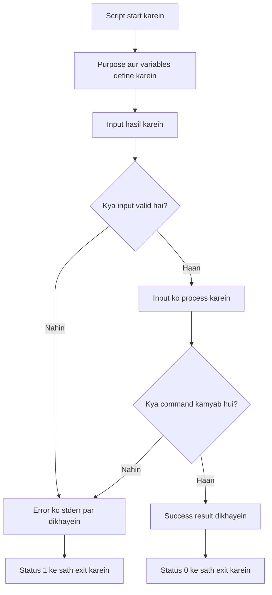
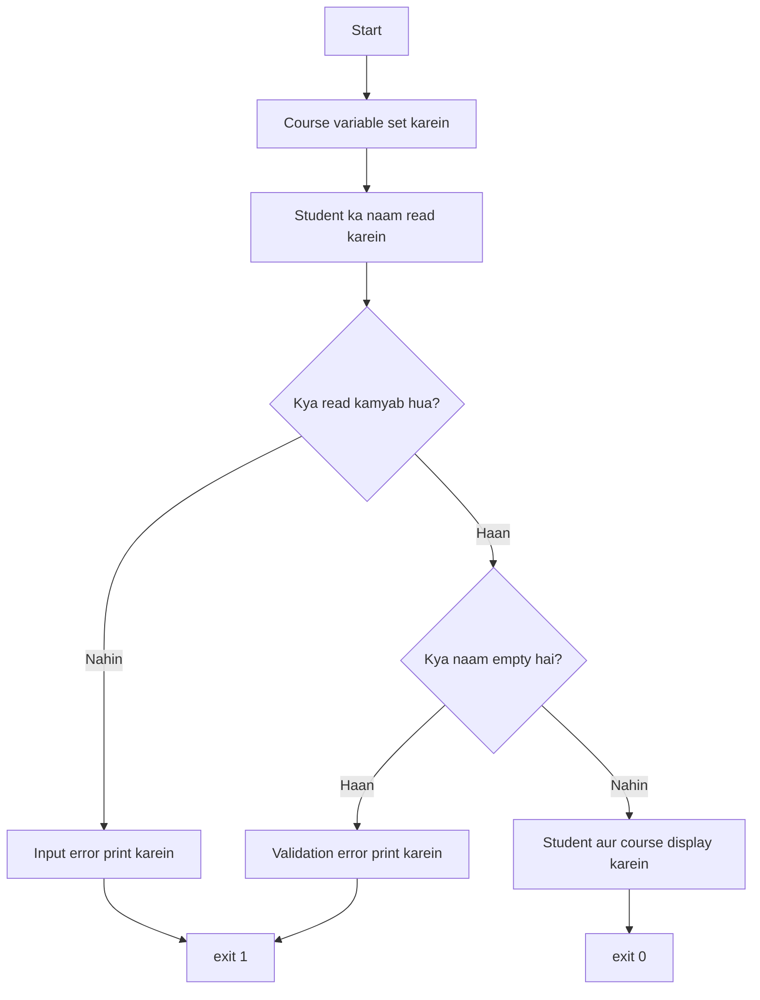
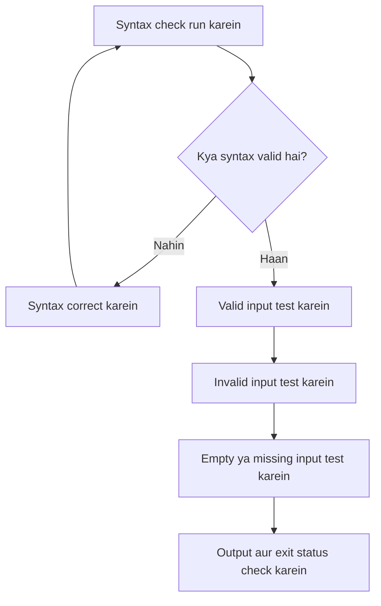

# Bash Script Design aur Flow — Beginner Study Notes (Roman Urdu)

## Table of Contents

1. [Bunyadi Khayal](#1-bunyadi-khayal)
2. [Bash Script ka Basic Flow](#2-bash-script-ka-basic-flow)
3. [Code Likhne se Pehle Sochain](#3-code-likhne-se-pehle-sochain)
4. [Beginner ke Liye Script Structure](#4-beginner-ke-liye-script-structure)
5. [Mukammal Beginner Example](#5-mukammal-beginner-example)
6. [Script ko Chhote Marahil Mein Banayein](#6-script-ko-chhote-marahil-mein-banayein)
7. [Sahi Bash Structure ka Intikhab](#7-sahi-bash-structure-ka-intikhab)
8. [Beginner Coding Guidelines](#8-beginner-coding-guidelines)
9. [Script ko Mehfooz Tareeqay se Test Karna](#9-script-ko-mehfooz-tareeqay-se-test-karna)
10. [Sahi aur Ghalat Input Dono Test Karein](#10-sahi-aur-ghalat-input-dono-test-karein)
11. [Final Beginner Checklist](#11-final-beginner-checklist)
12. [Final Summary](#12-final-summary)

---

## 1. Bunyadi Khayal

Beginner ke taur par har Bash script ko is seedhay sequence ke mutabiq design karein:

> Task samjhein → Input lein → Input validate karein → Kaam perform karein → Result dikhayein → Sahi status ke sath exit karein

Is ka mukhtasar formula yeh hai:

```text
Input → Validation → Processing → Output → Exit
```

Aik jaisa structure follow karne se scripts ko likhna, samajhna, test karna aur troubleshoot karna asaan ho jata hai.

---

## 2. Bash Script ka Basic Flow



### Is flow ka matlab

1. Script ko sahi interpreter ke sath start karein.
2. Script ka purpose aur zaroori variables define karein.
3. Input user, arguments, file ya command se hasil karein.
4. Input ko istemal karne se pehle validate karein.
5. Agar input ghalat ho to script ko safely rok dein.
6. Valid input milne par main task perform karein.
7. Important command ki kamyabi ya nakami check karein.
8. Result ya error saaf alfaaz mein dikhayein.
9. Sahi exit status return karein.

---

## 3. Code Likhne se Pehle Sochain

Vim ya kisi aur editor ko kholne se pehle in sawalon ke jawab likhein:

| Sawal | Example |
|---|---|
| Script ka purpose kya hai? | Multiplication table display karna. |
| Script ko kya input chahiye? | Aik whole number. |
| Input kahan se aaye ga? | `read` ya `$1` se. |
| Kaunsa input valid hai? | Sirf digits. |
| Script kya processing kare gi? | 1 se 10 tak loop chalaye gi. |
| Success par kya dikhana hai? | Mukammal multiplication table. |
| Kya cheez fail ho sakti hai? | Empty ya invalid input. |
| Kaunsa exit status dena hai? | Success ke liye `0`, failure ke liye `1`. |

### Aik simple plan likhein

Misal:

```text
Purpose: Multiplication table display karna.
Input: User se aik number lena.
Validation: Check karna ke input mein sirf digits hain.
Processing: Number ko 1 se 10 tak multiply karna.
Output: Har calculation display karna.
Exit: Success par exit 0 use karna.
```

Yehi plan aap ki script ka structure ban jata hai.

---

## 4. Beginner ke Liye Script Structure

```bash
#!/bin/bash

# Title: Script ka naam
# Purpose: Script kya karti hai, mukhtasar taur par batayein.
# Usage: ./script.sh

# ----------------------------
# 1. Variables
# ----------------------------

# Variables yahan define karein.

# ----------------------------
# 2. Input
# ----------------------------

# User ya command-line arguments se input lein.

# ----------------------------
# 3. Validation
# ----------------------------

# Check karein ke input mojood aur valid hai.

# ----------------------------
# 4. Processing
# ----------------------------

# Main kaam yahan perform karein.

# ----------------------------
# 5. Output
# ----------------------------

# Result display karein.

# ----------------------------
# 6. Successful exit
# ----------------------------

exit 0
```

Har chhoti script ko tamam sections ki zaroorat nahin hoti. Lekin yeh template beginner ko sahi order yaad rakhne mein madad deta hai.

---

## 5. Mukammal Beginner Example

Yeh script student ka naam poochti hai, usay validate karti hai aur student aur course ki information display karti hai.

```bash
#!/bin/bash

# Title: Student Greeting
# Purpose: Student ka naam read aur display karna.
# Usage: ./student_greeting.sh

course="Bash Scripting"  # Course ka naam variable mein store karein.

# User se student ka naam enter karne ko kahein.
if ! read -r -p "Enter student name: " student_name; then
    echo "Error: could not read the input." >&2
    exit 1
fi

# Check karein ke user ne empty value to enter nahin ki.
if [[ -z "$student_name" ]]; then
    echo "Error: student name cannot be empty." >&2
    exit 1
fi

# Validated information display karein.
echo "Student: $student_name"
echo "Course: $course"

# Successful completion report karein.
exit 0
```

### Script ka flow



### Successful run

```text
Enter student name: Khalid
Student: Khalid
Course: Bash Scripting
```

### Empty input

```text
Enter student name:
Error: student name cannot be empty.
```

---

## 6. Script ko Chhote Marahil Mein Banayein

Puri script aik hi martaba likhne ki koshish na karein. Aik section add karein, usay test karein aur phir agla section add karein.

### Stage 1: Simple output dikhayein

```bash
#!/bin/bash

echo "Student Registration"
```

Isay test karein:

```bash
bash student_greeting.sh
```

### Stage 2: Variable add karein

```bash
course="Bash Scripting"

echo "Course: $course"
```

### Stage 3: Input add karein

```bash
read -r -p "Enter student name: " student_name

echo "Student: $student_name"
```

### Stage 4: Validation add karein

```bash
if [[ -z "$student_name" ]]; then
    echo "Error: student name cannot be empty." >&2
    exit 1
fi
```

### Stage 5: Successful exit add karein

```bash
exit 0
```

Is tareeqay se error dhoondhna asaan hota hai kyun ke har naya section agla section add karne se pehle test ho jata hai.

---

## 7. Sahi Bash Structure ka Intikhab

| Requirement | Bash structure | Example |
|---|---|---|
| Information store karna | Variable | `name="Khalid"` |
| Keyboard se input lena | `read` | `read -r name` |
| Command line se input lena | Positional parameters | `$1`, `$2`, `"$@"` |
| Decision lena | `if`, `elif`, `else` | `if [[ -f "$file" ]]; then` |
| Aik value ko choices se match karna | `case` | `case "$action" in` |
| Maloom list par repeat karna | `for` | `for fruit in apple banana` |
| Condition true rehne tak repeat karna | `while` | `while (( count > 0 ))` |
| Commands ko dobara istemal karna | Function | `greet() { ...; }` |
| Success ya failure report karna | `exit` ya `return` | `exit 0`, `return 1` |

---

## 8. Beginner Coding Guidelines

### 8.1 Shebang se start karein

```bash
#!/bin/bash
```

Shebang operating system ko batata hai ke script directly execute hone par Bash interpreter use karna hai.

### 8.2 Script ko document karein

```bash
# Title: File Checker
# Purpose: Check karna ke regular file mojood hai ya nahin.
# Usage: ./file_check.sh FILE
```

Yeh comments foran batate hain ke script kya karti hai aur usay kaise run karna hai.

### 8.3 Meaningful variable names use karein

Achhay names:

```bash
student_name="Khalid"
source_file="abc.txt"
item_number=1
```

Ghair wazeh names se parhez karein:

```bash
x="Khalid"
a="abc.txt"
n=1
```

Meaningful naam dekh kar variable ka purpose samajh aa jata hai.

### 8.4 `=` ke aas paas spaces na dein

Sahi:

```bash
name="Khalid"
```

Ghalat:

```bash
name = "Khalid"
```

`=` ke aas paas spaces dene par Bash `name` ko variable assignment ke bajaye command samajh sakta hai.

### 8.5 Variable expansions ko quote karein

Behtar tareeqa:

```bash
echo "$student_name"
cp -- "$source_file" "$destination"
```

Double quotes spaces ko preserve karte hain aur unwanted word splitting aur pathname expansion se bachate hain.

### 8.6 Processing se pehle validation karein

```bash
if [[ -z "$student_name" ]]; then
    echo "Error: student name cannot be empty." >&2
    exit 1
fi
```

Missing ya invalid data ke sath processing continue na karein.

### 8.7 Error messages ko `stderr` par bhejein

```bash
echo "Error: file does not exist." >&2
```

Normal output `stdout` par jata hai. Error messages ko aam tor par `stderr` par bhejna chahiye.

### 8.8 Sahi exit statuses use karein

```bash
exit 0  # Script kamyabi se mukammal hui.
exit 1  # General failure hui.
```

Agar koi important operation fail ho jaye to script ko success report nahin karna chahiye.

### 8.9 Useful comments likhein

Useful comment:

```bash
# Processing se pehle empty student name reject karein.
if [[ -z "$student_name" ]]; then
```

Kam useful comment:

```bash
# If statement.
if [[ -z "$student_name" ]]; then
```

Comment ko command repeat karne ke bajaye us ka purpose ya reasoning explain karni chahiye.

### 8.10 Indentation aik jaisi rakhein

```bash
if [[ -f "$source_file" ]]; then
    echo "File exists."
else
    echo "File does not exist." >&2
fi
```

Consistent indentation se script ka structure samajhna asaan hota hai.

### 8.11 Pehla version simple rakhein

Beginner ke taur par:

- Aik waqt mein aik problem solve karein.
- Ghair zaroori advanced features add na karein.
- Har section ko mazeed code add karne se pehle test karein.
- Function tab use karein jab block reusable ho ya script lambi ho jaye.

---

## 9. Script ko Mehfooz Tareeqay se Test Karna

### Syntax check karein

```bash
bash -n script.sh
```

Aam tor par koi output na aane ka matlab hai ke Bash ko syntax error nahin mila.

### Script run karein

```bash
bash script.sh
```

Ya script ko executable bana kar directly run karein:

```bash
chmod +x script.sh
./script.sh
```

### Troubleshooting ke waqt execution trace karein

```bash
bash -x script.sh
```

Yeh Bash ke execute kiye jane wale commands aur expanded values ko screen par dikhata hai.

### Exit status check karein

```bash
echo "$?"
```

Aam meanings:

| Status | Matlab |
|---:|---|
| `0` | Success |
| Nonzero | Failure ya koi doosri special condition |

> `$?` ko foran check karein. Agar aap pehle koi aur command run kar dein to pichla status replace ho jata hai.

---

## 10. Sahi aur Ghalat Input Dono Test Karein

Har script mein sirf normal input test na karein. Mukhtalif conditions check karein.

| Test | Example |
|---|---|
| Normal input | `Khalid` |
| Empty input | Kuch type kiye baghair Enter press karein. |
| Spaces wala input | `Muhammad Khalid` |
| Ghalat input | Jahan number chahiye wahan letters enter karein. |
| Missing file | `missing.txt` |
| Existing file | `abc.txt` |

Agar script sahi input ke sath aik martaba chal gayi hai to iska matlab yeh nahin ke script mukammal taur par test ho chuki hai.

### Testing flow



---

## 11. Final Beginner Checklist

Script ko complete samajhne se pehle verify karein:

- [ ] Shebang mojood hai.
- [ ] Title, purpose aur usage documented hain.
- [ ] Variable names meaningful hain.
- [ ] Input safely hasil kiya gaya hai.
- [ ] Processing se pehle input validate kiya gaya hai.
- [ ] Variable expansions quoted hain.
- [ ] Errors `stderr` par bheje gaye hain.
- [ ] Failure paths nonzero exit status use karte hain.
- [ ] Successful completion `exit 0` use karti hai.
- [ ] Indentation consistent hai.
- [ ] Comments important logic explain karte hain.
- [ ] `bash -n script.sh` pass hota hai.
- [ ] Valid aur invalid dono inputs test kiye gaye hain.
- [ ] Final exit status check kiya gaya hai.

---

## 12. Final Summary

Jab bhi Bash script design karein, yeh beginner formula use karein:

```text
1. Task ko samjhein.
2. Aik simple plan likhein.
3. Required input identify karein.
4. Input validate karein.
5. Main processing perform karein.
6. Important commands ke results check karein.
7. Clear output ya errors display karein.
8. Sahi status ke sath exit karein.
9. Success aur failure dono paths test karein.
```

Core flow yeh hai:

> Input → Validation → Processing → Output → Exit

Chhoti working script se start karein, usay test karein aur phir aik waqt mein aik section improve karein.
