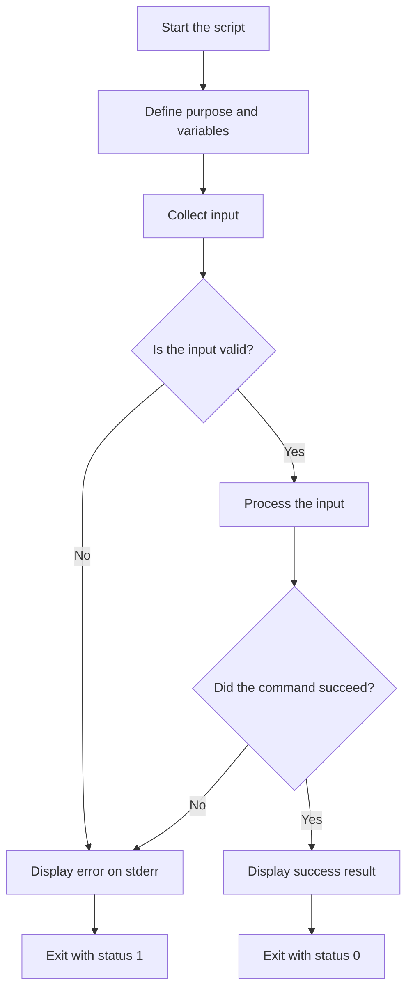
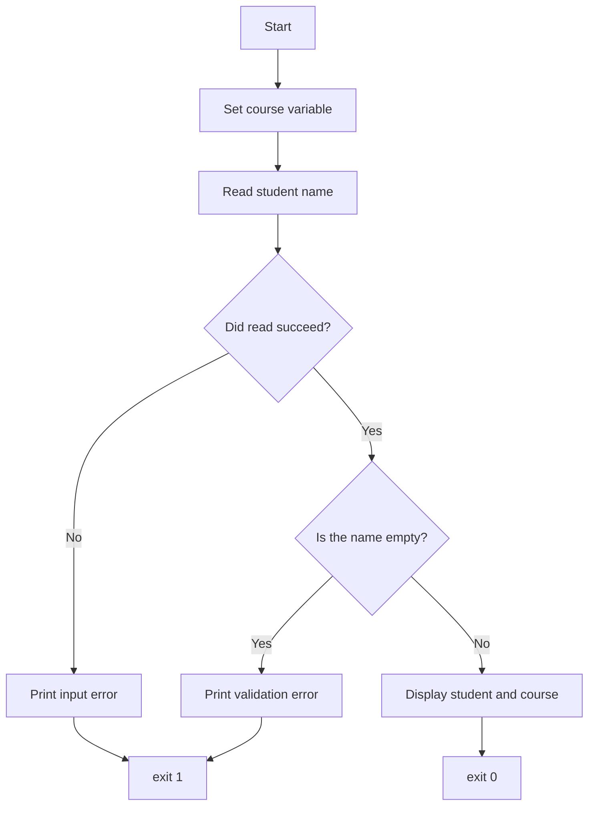
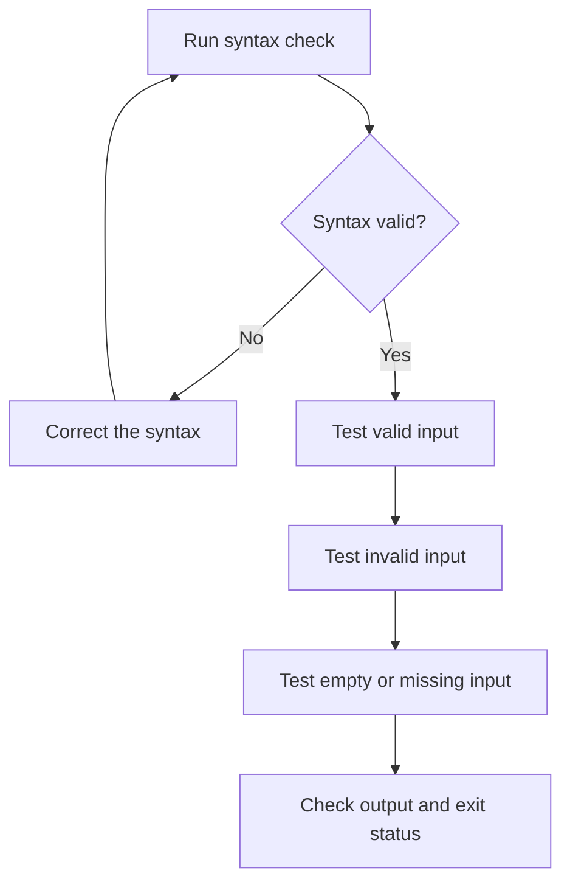

# Bash Script Design and Flow — Beginner Study Notes

## Table of Contents

1. [The Main Idea](#1-the-main-idea)
2. [Basic Script Flow](#2-basic-script-flow)
3. [Think Before Writing Code](#3-think-before-writing-code)
4. [Recommended Beginner Structure](#4-recommended-beginner-structure)
5. [Complete Beginner Example](#5-complete-beginner-example)
6. [Build the Script in Small Stages](#6-build-the-script-in-small-stages)
7. [Choosing the Right Bash Structure](#7-choosing-the-right-bash-structure)
8. [Beginner Coding Guidelines](#8-beginner-coding-guidelines)
9. [Testing the Script Safely](#9-testing-the-script-safely)
10. [Testing Successful and Unsuccessful Input](#10-testing-successful-and-unsuccessful-input)
11. [Final Beginner Checklist](#11-final-beginner-checklist)
12. [Final Summary](#12-final-summary)

---

## 1. The Main Idea

As a beginner, design every Bash script using this simple sequence:

> Understand the task → Collect input → Validate it → Perform the work → Show the result → Exit correctly

A shorter formula is:

```text
Input → Validation → Processing → Output → Exit
```

Following a consistent structure makes scripts easier to write, understand, test, and troubleshoot.

---

## 2. Basic Script Flow



### What this flow means

1. Start the script with the correct interpreter.
2. Define its purpose and required variables.
3. Collect input from the user, arguments, files, or commands.
4. Validate the input before using it.
5. Stop safely if the input is invalid.
6. Perform the main task when the input is valid.
7. Check whether important commands succeeded.
8. Display the result.
9. Return the correct exit status.

---

## 3. Think Before Writing Code

Before opening Vim or another editor, answer these questions:

| Question | Example |
|---|---|
| What is the script's purpose? | Display a multiplication table. |
| What input does it need? | A whole number. |
| Where will the input come from? | `read` or `$1`. |
| What input is valid? | Digits only. |
| What work will it perform? | Loop from 1 to 10. |
| What should success display? | The completed table. |
| What could fail? | Empty or invalid input. |
| What status should it return? | `0` for success or `1` for failure. |

### Write a simple plan

For example:

```text
Purpose: Display a multiplication table.
Input: Ask the user for a number.
Validation: Confirm that the input contains digits only.
Processing: Multiply the number by 1 through 10.
Output: Display each calculation.
Exit: Use exit 0 when successful.
```

This plan becomes the structure of the script.

---

## 4. Recommended Beginner Structure

```bash
#!/bin/bash

# Title: Script Name
# Purpose: Explain what the script does.
# Usage: ./script.sh

# ----------------------------
# 1. Variables
# ----------------------------

# Define variables here.

# ----------------------------
# 2. Input
# ----------------------------

# Read input from the user or command-line arguments.

# ----------------------------
# 3. Validation
# ----------------------------

# Check whether the input is present and valid.

# ----------------------------
# 4. Processing
# ----------------------------

# Perform the main work here.

# ----------------------------
# 5. Output
# ----------------------------

# Display the result.

# ----------------------------
# 6. Successful exit
# ----------------------------

exit 0
```

Not every small script needs every section. However, this template helps beginners remember the correct order.

---

## 5. Complete Beginner Example

This script asks for a student name, validates it, and displays the student and course information.

```bash
#!/bin/bash

# Title: Student Greeting
# Purpose: Read and display a student's name.
# Usage: ./student_greeting.sh

course="Bash Scripting"  # Store the course name.

# Ask the user to enter a student name.
if ! read -r -p "Enter student name: " student_name; then
    echo "Error: could not read the input." >&2
    exit 1
fi

# Check whether the user entered an empty value.
if [[ -z "$student_name" ]]; then
    echo "Error: student name cannot be empty." >&2
    exit 1
fi

# Display the validated information.
echo "Student: $student_name"
echo "Course: $course"

# Report successful completion.
exit 0
```

### Script flow



### Successful run

```text
Enter student name: Khalid
Student: Khalid
Course: Bash Scripting
```

### Empty input

```text
Enter student name:
Error: student name cannot be empty.
```

---

## 6. Build the Script in Small Stages

Do not try to write the entire script at once. Add one section, test it, and then continue.

### Stage 1: Produce simple output

```bash
#!/bin/bash

echo "Student Registration"
```

Test it:

```bash
bash student_greeting.sh
```

### Stage 2: Add a variable

```bash
course="Bash Scripting"

echo "Course: $course"
```

### Stage 3: Add input

```bash
read -r -p "Enter student name: " student_name

echo "Student: $student_name"
```

### Stage 4: Add validation

```bash
if [[ -z "$student_name" ]]; then
    echo "Error: student name cannot be empty." >&2
    exit 1
fi
```

### Stage 5: Add the successful exit

```bash
exit 0
```

This approach makes errors easier to find because each new section is tested before another is added.

---

## 7. Choosing the Right Bash Structure

| Requirement | Bash structure | Example |
|---|---|---|
| Store information | Variable | `name="Khalid"` |
| Accept keyboard input | `read` | `read -r name` |
| Accept command-line input | Positional parameters | `$1`, `$2`, `"$@"` |
| Make a decision | `if`, `elif`, `else` | `if [[ -f "$file" ]]; then` |
| Match one value against choices | `case` | `case "$action" in` |
| Repeat for a known list | `for` | `for fruit in apple banana` |
| Repeat while a condition is true | `while` | `while (( count > 0 ))` |
| Reuse commands | Function | `greet() { ...; }` |
| Report success or failure | `exit` or `return` | `exit 0`, `return 1` |

---

## 8. Beginner Coding Guidelines

### 8.1 Start with the shebang

```bash
#!/bin/bash
```

The shebang tells the operating system to use Bash when the script is executed directly.

### 8.2 Document the script

```bash
# Title: File Checker
# Purpose: Check whether a regular file exists.
# Usage: ./file_check.sh FILE
```

These comments quickly explain what the script does and how to run it.

### 8.3 Use meaningful variable names

Good:

```bash
student_name="Khalid"
source_file="abc.txt"
item_number=1
```

Avoid unclear names:

```bash
x="Khalid"
a="abc.txt"
n=1
```

### 8.4 Do not place spaces around `=`

Correct:

```bash
name="Khalid"
```

Incorrect:

```bash
name = "Khalid"
```

With spaces around `=`, Bash may interpret `name` as a command instead of a variable assignment.

### 8.5 Quote variable expansions

Preferred:

```bash
echo "$student_name"
cp -- "$source_file" "$destination"
```

Quotes preserve spaces and help prevent unwanted word splitting and pathname expansion.

### 8.6 Validate before processing

```bash
if [[ -z "$student_name" ]]; then
    echo "Error: student name cannot be empty." >&2
    exit 1
fi
```

Do not continue processing missing or invalid data.

### 8.7 Send error messages to `stderr`

```bash
echo "Error: file does not exist." >&2
```

Normal output uses `stdout`. Error messages should normally use `stderr`.

### 8.8 Use correct exit statuses

```bash
exit 0  # Successful completion.
exit 1  # General failure.
```

A script should not report success after an important operation has failed.

### 8.9 Add useful comments

Useful:

```bash
# Reject an empty student name before processing it.
if [[ -z "$student_name" ]]; then
```

Less useful:

```bash
# If statement.
if [[ -z "$student_name" ]]; then
```

Comments should explain the purpose or reasoning instead of merely repeating the command.

### 8.10 Keep indentation consistent

```bash
if [[ -f "$source_file" ]]; then
    echo "File exists."
else
    echo "File does not exist." >&2
fi
```

Consistent indentation makes the structure easier to understand.

### 8.11 Keep the first version simple

As a beginner:

- Solve one problem at a time.
- Avoid adding unnecessary advanced features.
- Test each section before adding more code.
- Use functions only when a block needs to be reused or the script becomes lengthy.

---

## 9. Testing the Script Safely

### Check the syntax

```bash
bash -n script.sh
```

No output normally means Bash did not find a syntax error.

### Run the script

```bash
bash script.sh
```

Alternatively, make it executable and run it directly:

```bash
chmod +x script.sh
./script.sh
```

### Trace execution while troubleshooting

```bash
bash -x script.sh
```

This displays commands and expanded values as Bash executes them.

### Check the exit status

```bash
echo "$?"
```

Typical meanings:

| Status | Meaning |
|---:|---|
| `0` | Success |
| Nonzero | Failure or another special condition |

> Check `$?` immediately. Running another command first replaces the previous status.

---

## 10. Testing Successful and Unsuccessful Input

For every script, test more than the normal case.

| Test | Example |
|---|---|
| Normal input | `Khalid` |
| Empty input | Press Enter without typing anything. |
| Input containing spaces | `Muhammad Khalid` |
| Incorrect input | Enter letters where a number is required. |
| Missing file | `missing.txt` |
| Existing file | `abc.txt` |

A script is not fully tested merely because it worked once with correct input.

### Testing flow



---

## 11. Final Beginner Checklist

Before considering the script complete, verify:

- [ ] The shebang is present.
- [ ] The title, purpose, and usage are documented.
- [ ] Variable names are meaningful.
- [ ] Input is collected safely.
- [ ] Input is validated before processing.
- [ ] Variable expansions are quoted.
- [ ] Errors are sent to `stderr`.
- [ ] Failure paths use a nonzero exit status.
- [ ] Successful completion uses `exit 0`.
- [ ] Indentation is consistent.
- [ ] Comments explain important logic.
- [ ] `bash -n script.sh` passes.
- [ ] Both valid and invalid inputs have been tested.
- [ ] The final exit status has been checked.

---

## 12. Final Summary

Use this beginner formula whenever you design a Bash script:

```text
1. Understand the task.
2. Write a simple plan.
3. Identify the required input.
4. Validate the input.
5. Perform the main processing.
6. Check important command results.
7. Display clear output or errors.
8. Exit with the correct status.
9. Test successful and failure paths.
```

The core flow is:

> Input → Validation → Processing → Output → Exit

Start with a small working script, test it, and improve it one section at a time.
