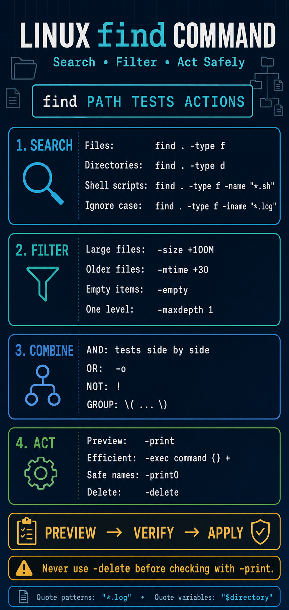

# Linux `find` Command — Complete Learning Package

A complete bilingual learning package for mastering the Linux `find` command from basic filesystem searches to safe shell-script automation.

This package combines detailed study notes, a printable poster, an interactive assessment, a connected hands-on lab, supplied practice data, and verified instructor solutions.

## Live Interactive Quiz

### [Launch the Linux `find` Command 25-MCQ Quiz](https://khalidkhan.me/mcqs/linux/Linux-find-Command-in-Shell-Scripting-25-MCQ-Quiz.html)

## Package Resources

| Resource | Description |
|---|---|
| [English Study Notes](Linux-find-Command-in-Shell-Scripting-Study-Notes.md) | Complete beginner-to-practical explanation of the `find` command |
| [Roman Urdu Study Notes](Linux-find-Command-in-Shell-Scripting-Roman-Urdu-Study-Notes.md) | The same technical content explained in beginner-friendly Roman Urdu |
| [Interactive 25-MCQ Quiz](Linux-find-Command-in-Shell-Scripting-25-MCQ-Quiz.html) | Timed quiz with scoring, explanations, topic breakdown, and shuffled reattempts |
| [Printable Classroom Poster](Linux-find-command-Search-filter-act-safely.png) | Visual reference for searching, filtering, combining tests, and acting safely |
| [Six-Question Student Lab](Lab-Linux-find-Command-6-Question-Flow/Linux-find-Command-6-Question-Flow-Lab.md) | Connected practical workflow using supplied Linux administration data |
| [Lab Setup Script](Lab-Linux-find-Command-6-Question-Flow/setup_find_lab.sh) | Recreates a fresh and safe practice dataset |
| [Complete Solution Guide](Solutions-Linux-find-Command-6-Question-Flow-Lab/Linux-find-Command-6-Question-Flow-Lab-Solutions.md) | Commands, explanations, expected results, and instructor guidance |
| [File-Report Solution](Solutions-Linux-find-Command-6-Question-Flow-Lab/solution-scripts/build-file-report.sh) | Safely processes filenames and creates a size report |
| [Cache-Cleanup Solution](Solutions-Linux-find-Command-6-Question-Flow-Lab/solution-scripts/cleanup-cache.sh) | Guarded dry-run and `--apply` cleanup workflow |

## Poster Preview



## Learning Objectives

After completing this package, students should be able to:

- Explain how `find` walks a directory tree
- Select safe and appropriate starting paths
- Search by filename with `-name` and `-iname`
- Select regular files, directories, and symbolic links
- Control recursion with `-maxdepth` and `-mindepth`
- Filter by size, age, ownership, and empty status
- Combine tests using AND, OR, NOT, and grouped expressions
- Perform actions using `-print`, `-exec`, `-ok`, and `-delete`
- Process filenames containing spaces, tabs, or newlines safely
- Use `find` inside validated Bash scripts
- Follow a preview-first workflow before destructive actions

## Core Syntax

```bash
find STARTING_PATH TESTS ACTIONS
```

Example:

```bash
find /home/khalid -type f -name "*.sh" -print
```

| Part | Purpose |
|---|---|
| `/home/khalid` | Starting path |
| `-type f` | Select regular files |
| `-name "*.sh"` | Match names ending in `.sh` |
| `-print` | Display matching paths |

## Topics Covered

| Topic | Commands and concepts |
|---|---|
| Starting paths | `.`, `..`, `/tmp`, `"$HOME"`, `/` |
| Filename matching | `-name`, `-iname`, quoted wildcards |
| File types | `-type f`, `-type d`, `-type l` |
| Search depth | `-maxdepth`, `-mindepth` |
| File size | `-size +100M`, `-size -1M` |
| File age | `-mtime`, `-mmin`, `-atime`, `-ctime` |
| Ownership | `-user`, `-group`, `-nouser`, `-nogroup` |
| Empty items | `-empty` |
| Logical expressions | Implicit AND, `-o`, `!`, `\(` and `\)` |
| Actions | `-print`, `-exec`, `-ok`, `-delete` |
| Safe processing | `-print0`, `IFS=`, `read -r -d ''` |
| Bash automation | Validation, strict mode, dry runs, reports, and controlled cleanup |

## Interactive Quiz Features

The assessment includes:

- **25 questions** and **100 answer choices**
- **25-minute countdown timer**
- Automatic submission when time expires
- **80% passing score**
- Progress bar and answered-question counter
- Correct and incorrect answer highlighting
- Correct answer and short explanation for every question
- Unanswered-question warning before manual submission
- Topic-by-topic score breakdown
- **Review Missed** mode
- Independent question and answer-choice shuffling on every reattempt
- Responsive dark design for desktop, tablet, and mobile

### Quiz Distribution

| Section | Questions |
|---|---:|
| Foundations | 5 |
| Filters | 6 |
| Expressions | 4 |
| Actions | 5 |
| Safe Scripting | 5 |
| **Total** | **25** |

## Six-Question Flow Lab

The student lab follows one continuous Linux administration scenario:

| Stage | Practical task |
|---:|---|
| 1 | Build a filesystem inventory |
| 2 | Locate scripts, logs, and documents |
| 3 | Audit size, age, and empty items |
| 4 | Build precise logical expressions |
| 5 | Use safe actions and generate a file report |
| 6 | Perform dry-run and controlled cache cleanup |

### Supplied Practice Data

The dataset includes:

- 19 regular files
- 11 directories
- One symbolic link
- Current and archived application logs
- Uppercase `.LOG` and lowercase `.log` extensions
- One sparse file larger than 1 MiB
- Files intentionally older than 30 days
- Empty file and empty directory
- Bash scripts and configuration files
- `.txt`, `.md`, `.conf`, `.tmp`, `.sh`, and log files
- Filenames containing spaces
- A protected `cache/keep.txt` file

## Start the Student Lab

```bash
cd Lab-Linux-find-Command-6-Question-Flow
cd supplied-data/find-lab-data
```

Open the lab instructions from another terminal or Markdown viewer:

```bash
less ../../Linux-find-Command-6-Question-Flow-Lab.md
```

## Recreate the Dataset

The dataset is already supplied. To create a fresh separate copy:

```bash
cd Lab-Linux-find-Command-6-Question-Flow
chmod +x setup_find_lab.sh
bash setup_find_lab.sh ./find-lab-data
```

The setup script refuses to overwrite an existing target and refuses unsafe broad targets.

## Use the Instructor Solutions

Keep solutions separate while students complete the exercise.

To test the solution scripts in a fresh lab-data directory:

```bash
cp -- Solutions-Linux-find-Command-6-Question-Flow-Lab/solution-scripts/*.sh \
    Lab-Linux-find-Command-6-Question-Flow/supplied-data/find-lab-data/

cd Lab-Linux-find-Command-6-Question-Flow/supplied-data/find-lab-data
```

Validate both scripts:

```bash
bash -n build-file-report.sh
bash -n cleanup-cache.sh
```

Create the report:

```bash
bash build-file-report.sh .
```

Run cleanup in dry-run mode:

```bash
bash cleanup-cache.sh cache
```

Apply cleanup only inside disposable lab data:

```bash
bash cleanup-cache.sh cache --apply
```

## Quick Command Reference

| Task | Command |
|---|---|
| Find regular files | `find . -type f` |
| Find directories | `find . -type d` |
| Find symbolic links | `find . -type l` |
| Find shell scripts | `find . -type f -name "*.sh"` |
| Ignore filename case | `find . -type f -iname "*.log"` |
| Search one level | `find . -maxdepth 1 -type f` |
| Find empty files | `find . -type f -empty` |
| Find files larger than 100 MiB | `find . -type f -size +100M` |
| Find files older than 30 days | `find . -type f -mtime +30` |
| Find files modified recently | `find . -type f -mmin -30` |
| Match `.txt` or `.md` | `find . -type f \( -name "*.txt" -o -name "*.md" \)` |
| Exclude `.conf` | `find . -type f ! -name "*.conf"` |
| Run a command efficiently | `find . -type f -exec ls -l -- {} +` |
| Produce null-separated output | `find . -type f -print0` |
| Preview temporary files | `find . -type f -name "*.tmp" -print` |
| Delete selected temporary files | `find . -type f -name "*.tmp" -delete` |

## Safe Filename Processing

Avoid:

```bash
for file in $(find . -type f)
do
    echo "$file"
done
```

Command substitution splits pathnames on whitespace.

Use a null-separated loop:

```bash
while IFS= read -r -d '' file
do
    echo "Processing: $file"
done < <(find . -type f -print0)
```

| Component | Purpose |
|---|---|
| `-print0` | Separates pathnames using a null byte |
| `IFS=` | Prevents unwanted whitespace trimming |
| `read -r` | Prevents backslash interpretation |
| `-d ''` | Reads until the null separator |
| `"$file"` | Preserves the pathname as one argument |

## Destructive-Action Safety

Follow this sequence:

```text
PREVIEW → VERIFY → APPLY
```

Preview:

```bash
find "$target_directory" -type f -name "*.tmp" -print
```

Only after verification:

```bash
find "$target_directory" -type f -name "*.tmp" -delete
```

Safety rules:

1. Validate the starting directory.
2. Quote variables and wildcard patterns.
3. Specify the required file type.
4. Preview the complete result set.
5. Confirm that no important item is selected.
6. Add the destructive action only after verification.

> Never practise destructive searches against `/`, `$HOME`, `/etc`, `/var`, or another real system directory. Use the supplied disposable dataset.

## Recommended Learning Path

1. Read the English study notes.
2. Use the Roman Urdu version where additional clarification is helpful.
3. Keep the poster open as a command reference.
4. Run basic searches inside the supplied dataset.
5. Complete the six questions without checking the solution.
6. Compare commands and scripts with the instructor guide.
7. Correct weak areas and rerun the lab with fresh data.
8. Attempt the 25-question quiz.
9. Review every missed explanation.
10. Reattempt until consistently scoring at least 80%.

## Run the Quiz Locally

No web server or installation is required:

```bash
xdg-open Linux-find-Command-in-Shell-Scripting-25-MCQ-Quiz.html
```

You can also double-click the HTML file in a graphical file manager.

## Performance Guide

| Score | Result | Recommended action |
|---:|---|---|
| 90–100% | Excellent | Continue to production-style inventory and cleanup scripts |
| 80–89% | Pass | Review missed explanations and repeat related commands |
| 60–79% | More practice needed | Revisit filters, expressions, actions, and safe processing |
| Below 60% | Review foundations | Study paths, names, types, and quoting before reattempting |

## Project Structure

```text
find/
├── README.md
├── Linux-find-Command-in-Shell-Scripting-Study-Notes.md
├── Linux-find-Command-in-Shell-Scripting-Roman-Urdu-Study-Notes.md
├── Linux-find-Command-in-Shell-Scripting-25-MCQ-Quiz.html
├── Linux-find-command-Search-filter-act-safely.png
├── Lab-Linux-find-Command-6-Question-Flow/
│   ├── README.md
│   ├── Linux-find-Command-6-Question-Flow-Lab.md
│   ├── setup_find_lab.sh
│   └── supplied-data/find-lab-data/
└── Solutions-Linux-find-Command-6-Question-Flow-Lab/
    ├── README.md
    ├── Linux-find-Command-6-Question-Flow-Lab-Solutions.md
    └── solution-scripts/
        ├── build-file-report.sh
        └── cleanup-cache.sh
```

## Verified Quality

- The ZIP passed its archive integrity test.
- Both solution scripts pass `bash -n`.
- The report script preserves filenames containing spaces.
- The report script excludes its own output file.
- Cleanup dry-run and cancellation delete nothing.
- Confirmed cleanup removes exactly the selected `.tmp` files.
- `cache/keep.txt` remains protected.
- `/` and the home directory are refused as cleanup targets.

## Educational Purpose

This package is suitable for:

- Linux administration students
- Bash and shell-scripting learners
- DevOps beginners
- Classroom instruction and homework
- Technical interview preparation
- Safe filesystem-automation practice

---

Created for practical Linux administration, safe shell scripting, and hands-on learning.
