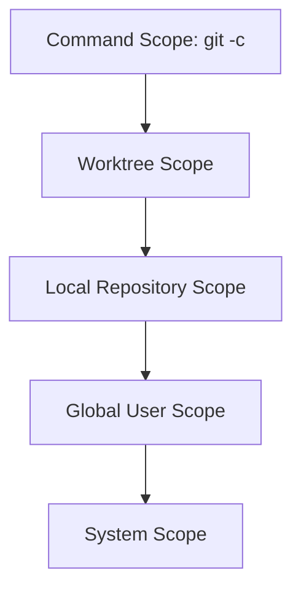

# Git Configuration Levels aur Precedence — Roman Urdu Study Notes

## Is Guide Mein Shamil Commands

```bash
# System-level configuration
git config --system --list

# Current user ki configuration
git config --global --list

# Current repository ki configuration
git config --local --list

# Source aur scope ke sath combined configuration
git config --show-origin --show-scope --list
```

---

## Table of Contents

1. [Learning Objectives](#learning-objectives)
2. [Git Configuration Kya Hai?](#git-configuration-kya-hai)
3. [Configuration Scopes](#configuration-scopes)
4. [Configuration Precedence](#configuration-precedence)
5. [System-Level Configuration](#system-level-configuration)
6. [Global Configuration](#global-configuration)
7. [Local Repository Configuration](#local-repository-configuration)
8. [Source aur Scope ke Sath Combined Configuration](#source-aur-scope-ke-sath-combined-configuration)
9. [Configuration Files ki Common Locations](#configuration-files-ki-common-locations)
10. [Duplicate Values ko Samajhna](#duplicate-values-ko-samajhna)
11. [Effective Values Read Karna](#effective-values-read-karna)
12. [Values Set, Edit aur Remove Karna](#values-set-edit-aur-remove-karna)
13. [Practical Examples](#practical-examples)
14. [Troubleshooting](#troubleshooting)
15. [Practice Lab](#practice-lab)
16. [Interview Questions](#interview-questions)
17. [Quick Reference](#quick-reference)

---

## Learning Objectives

In notes ko complete karne ke baad aap:

- System, global aur local Git configuration explain kar saken ge.
- Har command se affect hone wala configuration scope pehchan saken ge.
- Git configuration ki precedence samajh saken ge.
- Windows, Linux aur macOS par common configuration files locate kar saken ge.
- Samajh saken ge ke `git config --list` duplicate keys kyun dikha sakta hai.
- Har setting ka source file aur scope maloom kar saken ge.
- Kisi individual setting ki effective value read kar saken ge.
- Configuration values ko safely set, edit aur remove kar saken ge.

---

## Git Configuration Kya Hai?

Git configuration un settings ka majmua hai jo Git ke behavior ko control karta hai. Is mein aam tor par ye cheezen store hoti hain:

- Commit author ka name aur email
- New repository ki default initial branch
- Line-ending behavior
- Credential helper
- Merge ya rebase preferences
- Git LFS filters
- Aliases
- Editor selection
- Network behavior

Example:

```bash
git config --global user.name "krmaryum"
git config --global user.email "krmaryum@yahoo.com"
git config --global init.defaultBranch main
```

Git configuration ko mukhtalif **scopes** mein store karta hai. Scope ye tay karta hai ke setting kahan apply hogi.

---

## Configuration Scopes

| Scope | Kahan apply hota hai | Common option |
|---|---|---|
| System | Computer ke har user aur har repository par | `--system` |
| Global | Current operating-system user par | `--global` |
| Local | Sirf current Git repository par | `--local` |
| Worktree | Enabled hone par ek linked worktree par | `--worktree` |
| Command | Sirf ek Git command ke liye | `git -c` |

Beginner ke liye teen sab se important scopes ye hain:

```text
System → Global → Local
```

---

## Configuration Precedence

Jab same key mukhtalif levels par mojood ho, to zyada specific level aam tor par kam specific level ko override karta hai.



### Priority order

```text
Command → Worktree → Local → Global → System
Highest                                      Lowest
```

### Example

System configuration:

```text
init.defaultBranch=master
```

Global configuration:

```text
init.defaultBranch=main
```

Effective value:

```text
main
```

Global ki priority system se zyada hai, is liye global value `main`, system value `master` ko override karti hai.

Agar current repository mein ye local setting bhi ho:

```text
init.defaultBranch=development
```

to us repository ke andar local value `development` effective hogi.

> Local configuration, global ya system file ko change nahi karti. Ye sirf current repository mein unki value ko override karti hai.

---

## System-Level Configuration

### System-level settings display karna

```bash
git config --system --list
```

System-level configuration apply hoti hai:

- Computer ke har operating-system user par
- Computer ki har Git repository par

Git for Windows ki common system settings mein ye shamil ho sakti hain:

```text
http.sslBackend=schannel
credential.helper=manager
core.autocrlf=true
core.fscache=true
core.symlinks=false
init.defaultBranch=master
```

### System-level value set karna

```bash
git config --system <key> <value>
```

Example:

```bash
git config --system core.autocrlf true
```

System configuration change karne ke liye Administrator ya root privileges darkar ho sakti hain.

Windows ke elevated terminal mein:

```bash
git config --system core.longpaths true
```

Linux mein:

```bash
sudo git config --system core.longpaths true
```

> System settings sirf tab change karein jab setting har user par apply karni ho. Personal preferences ke liye global configuration aam tor par zyada safe hai.

---

## Global Configuration

### Global settings display karna

```bash
git config --global --list
```

Global configuration current operating-system user aur us user ki tamam repositories par apply hoti hai.

Typical global settings:

```text
user.name=krmaryum
user.email=krmaryum@yahoo.com
init.defaultBranch=main
core.autocrlf=true
core.longpaths=true
```

### Global values set karna

```bash
git config --global user.name "krmaryum"
git config --global user.email "krmaryum@yahoo.com"
git config --global init.defaultBranch main
```

Global scope ko in personal defaults ke liye use karein:

- Name
- Email
- Default branch
- Editor
- Aliases
- Personal line-ending preference

### Important point

```bash
git config --global --list
```

Ye command system ya local values nahi dikhati. Ye sirf global user configuration read karti hai.

---

## Local Repository Configuration

### Local settings display karna

```bash
git config --local --list
```

Local configuration sirf current repository par apply hoti hai.

Jab aap repository ke andar scope specify kiye baghair `git config` chalate hain, to `--local` default scope hota hai. Is liye ye dono commands repository ke andar same effect rakhti hain:

```bash
git config --local user.email "work@example.com"
git config user.email "work@example.com"
```

### Common use case

Maan lein aap ki personal global identity ye hai:

```bash
git config --global user.name "Muhammad Khalid Khan"
git config --global user.email "krmaryum@yahoo.com"
```

Lekin ek work repository mein different email chahiye:

```bash
cd company-project
git config --local user.email "khalid@company.example"
```

Us repository ke andar local email, global email ko override karegi.

### Important requirement

Local configuration use karne ke liye aap ka Git repository ke andar hona zaroori hai.

Agar repository ke bahar ye command chalayein:

```bash
git config --local --list
```

to Git ye error de sakta hai:

```text
fatal: --local can only be used inside a git repository
```

Apni location verify karein:

```bash
git rev-parse --is-inside-work-tree
git status
```

---

## Source aur Scope ke Sath Combined Configuration

### Basic combined list

```bash
git config --list
```

Ye multiple configuration levels ki applicable settings dikhata hai. Same key multiple levels par defined ho to duplicate jaisi entries nazar aa sakti hain.

### Source file dikhana

```bash
git config --show-origin --list
```

Example:

```text
file:C:/Program Files/Git/etc/gitconfig  init.defaultbranch=master
file:C:/Users/krmar/.gitconfig           init.defaultbranch=main
```

### Scope aur source dono dikhana

```bash
git config --show-origin --show-scope --list
```

Example:

```text
system  file:C:/Program Files/Git/etc/gitconfig  init.defaultbranch=master
global  file:C:/Users/krmar/.gitconfig           init.defaultbranch=main
```

Ye best diagnostic command hai kyun ke ye do sawalon ka jawab deti hai:

1. **Scope:** Setting system, global, local, worktree ya command level par hai?
2. **Origin:** Setting kis file ya command se aayi hai?

### Ye command kab use karein?

- Jab setting ek se zyada martaba nazar aaye.
- Jab Git expected value use na kar raha ho.
- Jab company ya school computer par Git pehle se configured ho.
- Jab maloom karna ho ke setting local hai ya global.
- Jab Git for Windows aur personal `.gitconfig` mein different defaults hon.

---

## Configuration Files ki Common Locations

### Git for Windows

| Scope | Common location |
|---|---|
| System | `C:/Program Files/Git/etc/gitconfig` |
| Global | `C:/Users/<USERNAME>/.gitconfig` |
| Alternative global | `C:/Users/<USERNAME>/.config/git/config` |
| Local | `<repository>/.git/config` |

Git Bash mein global file is tarah nazar aa sakti hai:

```text
~/.gitconfig
```

`~` aap ki Windows home directory ko represent karta hai.

### Linux aur WSL

| Scope | Common location |
|---|---|
| System | `/etc/gitconfig` |
| Global | `~/.gitconfig` |
| Alternative global | `~/.config/git/config` |
| Local | `<repository>/.git/config` |

### macOS

| Scope | Common location |
|---|---|
| System | `/etc/gitconfig` ya Git installation ki system file |
| Global | `~/.gitconfig` ya `~/.config/git/config` |
| Local | `<repository>/.git/config` |

> Exact system path Git ki installation method par depend kar sakta hai. Path guess karne ke bajaye `--show-origin` use karein.

---

## Duplicate Values ko Samajhna

Maan lein ye command:

```bash
git config --list
```

ye output dikhati hai:

```text
init.defaultbranch=master
init.defaultbranch=main
```

Is ka aam matlab hai ke same key different scopes mein defined hai.

Un ke sources check karein:

```bash
git config --show-origin --show-scope --get-all init.defaultBranch
```

Possible output:

```text
system  file:C:/Program Files/Git/etc/gitconfig  master
global  file:C:/Users/krmar/.gitconfig           main
```

Effective value highest-priority applicable scope se aati hai. Is example mein global configuration ki `main` effective hogi.

### Duplicate settings lazmi tor par error nahi hain

Duplicates intentional ho sakti hain:

- Git for Windows system default define karta hai.
- Aap globally apna different personal default define karte hain.
- Koi repository us personal default ko locally override karti hai.

Agar override intentional hai to lower-priority value delete karna zaroori nahi.

---

## Effective Values Read Karna

### Ek effective value read karna

```bash
git config --get <key>
```

Examples:

```bash
git config --get user.name
git config --get user.email
git config --get init.defaultBranch
git config --get core.autocrlf
git config --get credential.helper
```

### Ek value ka origin dikhana

```bash
git config --show-origin --get <key>
```

Example:

```bash
git config --show-origin --get init.defaultBranch
```

### Ek key ki tamam values dikhana

```bash
git config --show-origin --show-scope --get-all <key>
```

Example:

```bash
git config --show-origin --show-scope --get-all core.autocrlf
```

### Sirf ek specific scope se read karna

```bash
git config --system --get init.defaultBranch
git config --global --get init.defaultBranch
git config --local --get init.defaultBranch
```

---

## Values Set, Edit aur Remove Karna

### Value set karna

```bash
# System value
git config --system <key> <value>

# Global value
git config --global <key> <value>

# Local value
git config --local <key> <value>
```

### Configuration files edit karna

```bash
git config --system --edit
git config --global --edit
git config --local --edit
```

### Ek value remove karna

```bash
git config --global --unset <key>
```

Example:

```bash
git config --global --unset http.postBuffer
```

### Ek scope ki tamam matching values remove karna

```bash
git config --global --unset-all <key>
```

### Configuration section rename karna

```bash
git config --global --rename-section <old-section> <new-section>
```

### Pura section remove karna

```bash
git config --global --remove-section <section-name>
```

> Setting remove karne se pehle us ka scope aur source check karein. Global setting remove karne ke baad lower-priority system value effective ho sakti hai; setting lazmi tor par undefined nahi hoti.

### Configuration setting delete karne ka safe workflow

Ye four-step process use karein:

```text
Inspect → Scope Choose Karein → Unset → Verify
```

#### Step 1: Setting inspect karein

```bash
git config --show-origin --show-scope --get-all <key>
```

Example:

```bash
git config --show-origin --show-scope --get-all init.defaultBranch
```

#### Step 2: Sahi scope choose karein

```bash
# System value remove karein
git config --system --unset <key>

# Global value remove karein
git config --global --unset <key>

# Local repository value remove karein
git config --local --unset <key>
```

#### Step 3: Value remove karein

Examples:

```bash
git config --global --unset user.name
git config --global --unset user.email
git config --global --unset core.autocrlf
git config --local --unset user.email
```

System change ke liye Administrator ya root terminal darkar ho sakta hai:

```bash
git config --system --unset init.defaultBranch
```

Linux mein elevated system change:

```bash
sudo git config --system --unset init.defaultBranch
```

#### Step 4: Result verify karein

```bash
git config --show-origin --show-scope --get-all <key>
git config --get <key>
```

Pehli command remaining definitions dikhaye gi. Doosri command woh effective value dikhaye gi jo Git use karega.

### Same key ki multiple values remove karna

Agar ek scope ke andar same key multiple martaba ho to use karein:

```bash
git config --global --unset-all <key>
```

Example:

```bash
git config --global --unset-all core.autocrlf
```

`--unset-all` ehtiyat se use karein, kyun ke ye selected scope ki har matching value remove karta hai.

### Pura section remove karna

Example—globally configured tamam Git aliases remove karna:

```bash
git config --global --remove-section alias
```

Ye sirf ek alias nahi, pura `[alias]` section remove karega.

### Custom HTTP troubleshooting settings remove karna

Ye settings kabhi slow ya failed push troubleshoot karte waqt add ki jati hain:

```text
http.postBuffer=524288000
http.lowSpeedLimit=0
http.lowSpeedTime=999999
http.version=HTTP/1.1
core.compression=0
```

| Setting | Asar |
|---|---|
| `http.postBuffer` | HTTP post buffer ka size change karti hai |
| `http.lowSpeedLimit` | Git ka low-speed threshold control karti hai |
| `http.lowSpeedTime` | Low transfer speed ko Git kitni dair tolerate kare, ye control karti hai |
| `http.version` | Ek specific HTTP protocol version force karti hai |
| `core.compression` | Git compression level control karti hai |

Daily Git work ke liye ye settings aam tor par zaroori nahi. Agar ye temporary troubleshooting ke liye add hui thin aur ab darkar nahi, to global scope se remove karein:

```bash
git config --global --unset http.postBuffer
git config --global --unset http.lowSpeedLimit
git config --global --unset http.lowSpeedTime
git config --global --unset http.version
git config --global --unset core.compression
```

Verify karein:

```bash
git config --global --list
git config --show-origin --show-scope --list
```

> In values ko sirf tab remove karein jab aap Git ko default behavior par wapas lana chahte hon. Agar ye current network problem solve karne ke liye add hui thin, to remove karne se pehle problem diagnose karein.

### Global `main` setting remove karne par kya hoga?

Maan lein configuration mein ye values hain:

```text
system  init.defaultBranch=master
global  init.defaultBranch=main
```

Agar aap chalayein:

```bash
git config --global --unset init.defaultBranch
```

to global `main` remove ho jaye gi. Lower-priority system value ab effective ho sakti hai:

```text
master
```

Agar aap new repositories mein `main` chahte hain to ye setting rakhein ya dobara create karein:

```bash
git config --global init.defaultBranch main
```

Effective result check karein:

```bash
git config --get init.defaultBranch
```

### Complete global configuration ko safely reset karna

Puri global configuration delete karna bohat kam zaroori hota hai. Zyada safe tareeqa ye hai ke file ko backup ke tor par rename kar dein.

Git Bash, Linux ya WSL mein:

```bash
mv ~/.gitconfig ~/.gitconfig.backup
```

Is se file active use se nikal jaye gi, magar recoverable backup mojood rahega.

Essential global settings dobara create karein:

```bash
git config --global user.name "krmaryum"
git config --global user.email "krmaryum@yahoo.com"
git config --global init.defaultBranch main
```

Zaroorat par original configuration restore karein:

```bash
mv ~/.gitconfig.backup ~/.gitconfig
```

Agar Git `~/.config/git/config` use kar raha ho to pehle actual global file identify karein:

```bash
git config --global --show-origin --list
```

### Repository ke liye important warning

Sirf ek local setting remove karne ke liye ye file delete na karein:

```text
.git/config
```

Is file mein remote URLs aur branch-tracking samait important repository information hoti hai. Individual local setting remove karein:

```bash
git config --local --unset <key>
```

---

## Practical Examples

### Example 1: Global `main`, system `master` ko override karti hai

```bash
# System value
git config --system --get init.defaultBranch

# Global value
git config --global --get init.defaultBranch

# Effective value
git config --get init.defaultBranch
```

Agar system output `master` aur global output `main` ho, to effective output `main` hoga.

### Example 2: Repository-specific email

```bash
# Global personal email
git config --global user.email "krmaryum@yahoo.com"

# Work repository ki local email
cd company-project
git config --local user.email "khalid@company.example"

# Effective email check karein
git config --get user.email
```

`company-project` ke andar Git `khalid@company.example` use karega.

### Example 3: Sirf ek command ke liye temporary override

```bash
git -c user.name="Temporary User" -c user.email="temporary@example.com" commit -m "Temporary identity example"
```

`-c` values sirf is command par apply hoti hain aur configuration files permanently modify nahi kartin.

### Example 4: Windows line-ending settings inspect karna

```bash
git config --show-origin --show-scope --get-all core.autocrlf
```

Linux par use hone wali Bash scripts ke liye repository ki `.gitattributes` file LF endings enforce kar sakti hai:

```gitattributes
* text=auto
*.sh text eol=lf
```

---

## Troubleshooting

### Problem: `master` aur `main` dono nazar aa rahe hain

Diagnose karein:

```bash
git config --show-origin --show-scope --get-all init.defaultBranch
git config --get init.defaultBranch
```

Agar global `main`, system `master` ko override kar rahi hai to correction zaroori nahi.

### Problem: `--local` kehta hai ke aap repository ke bahar hain

Check karein:

```bash
pwd
git rev-parse --is-inside-work-tree
```

Repository directory mein jayein:

```bash
cd <repository-directory>
```

### Problem: Git ghalat email use kar raha hai

Tamam email values inspect karein:

```bash
git config --show-origin --show-scope --get-all user.email
```

Phir sahi scope update karein:

```bash
git config --global user.email "personal@example.com"
git config --local user.email "work@example.com"
```

### Problem: Global value remove ho gayi magar doosri value ab bhi hai

Remaining value system ya local configuration se aa sakti hai:

```bash
git config --show-origin --show-scope --get-all <key>
```

### Problem: System configuration change karte waqt permission denied

System configuration ke liye elevated terminal darkar ho sakta hai. Agar setting personal preference hai to global configuration ko tarjeeh dein.

---

## Practice Lab

### Objective

System, global aur local configuration ko observe karein aur precedence safely confirm karein.

### Step 1: System configuration inspect karein

```bash
git config --system --list
```

### Step 2: Global configuration inspect karein

```bash
git config --global --list
```

### Step 3: Practice repository banayein

```bash
mkdir git-config-practice
cd git-config-practice
git init
```

### Step 4: Local configuration inspect karein

```bash
git config --local --list
```

### Step 5: Harmless local test value set karein

```bash
git config --local user.email "practice@example.com"
```

### Step 6: Global aur local email compare karein

```bash
git config --global --get user.email
git config --local --get user.email
git config --get user.email
```

Is repository ke andar effective value ye honi chahiye:

```text
practice@example.com
```

### Step 7: Scope aur origin dikhayein

```bash
git config --show-origin --show-scope --get-all user.email
```

### Step 8: Local override remove karein

```bash
git config --local --unset user.email
```

### Step 9: Effective value dobara check karein

```bash
git config --get user.email
```

Ab Git ko global email par fall back karna chahiye.

---

## Interview Questions

### 1. System, global aur local Git configuration mein kya farq hai?

- System configuration computer ke har user aur repository par apply hoti hai.
- Global configuration current OS user par apply hoti hai.
- Local configuration sirf current repository par apply hoti hai.

### 2. Local aur global mein se kis ki priority zyada hai?

Repository ke andar local configuration ki priority zyada hoti hai.

### 3. `git config --list` same key ko multiple times kyun dikha sakta hai?

Same key system, global ya local jaise multiple scopes par defined ho sakti hai.

### 4. Setting provide karne wali file kaise identify karein?

```bash
git config --show-origin --list
```

### 5. Source aur scope dono kaise display karein?

```bash
git config --show-origin --show-scope --list
```

### 6. Effective default branch kaise display karein?

```bash
git config --get init.defaultBranch
```

### 7. Local repository configuration kahan store hoti hai?

Ye aam tor par repository ki `.git/config` file mein store hoti hai.

### 8. Kya global value remove karne se system value bhi remove ho jati hai?

Nahi. Har scope ki apni configuration hoti hai. Global value remove hone ke baad lower-priority system value effective ho sakti hai.

### 9. Ek global configuration value safely kaise remove karein?

Pehle source inspect karein, global scope se remove karein, phir result verify karein:

```bash
git config --show-origin --show-scope --get-all <key>
git config --global --unset <key>
git config --get <key>
```

### 10. Ek local value remove karne ke liye `.git/config` kyun delete nahi karni chahiye?

Is file mein remotes aur branch tracking samait doosri important repository configuration hoti hai. Is ke bajaye ye command use karein:

```bash
git config --local --unset <key>
```

---

## Quick Reference

| Kaam | Command |
|---|---|
| System settings dikhayein | `git config --system --list` |
| Global settings dikhayein | `git config --global --list` |
| Local settings dikhayein | `git config --local --list` |
| Combined settings dikhayein | `git config --list` |
| Setting sources dikhayein | `git config --show-origin --list` |
| Sources aur scopes dikhayein | `git config --show-origin --show-scope --list` |
| Effective value read karein | `git config --get <key>` |
| Ek key ki har value read karein | `git config --get-all <key>` |
| Global value set karein | `git config --global <key> <value>` |
| Local value set karein | `git config --local <key> <value>` |
| System value remove karein | `git config --system --unset <key>` |
| Global value remove karein | `git config --global --unset <key>` |
| Local value remove karein | `git config --local --unset <key>` |
| Tamam matching global values remove karein | `git config --global --unset-all <key>` |
| Global section remove karein | `git config --global --remove-section <section>` |
| Global file edit karein | `git config --global --edit` |
| Git repository verify karein | `git rev-parse --is-inside-work-tree` |

---

## Final Summary

```text
System = Har user aur har repository
Global = Current operating-system user
Local  = Sirf current repository
```

```text
Local, Global ko override karta hai
Global, System ko override karta hai
```

Sab se useful diagnostic command:

```bash
git config --show-origin --show-scope --list
```

Ye har applicable setting ke sath us ka scope aur source file dikhati hai.
