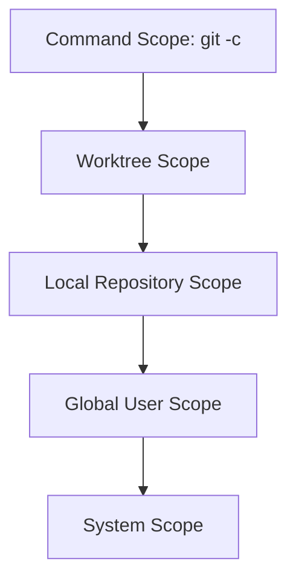

# Git Configuration Levels and Precedence — Study Notes

## Commands Covered

```bash
# System-level configuration
git config --system --list

# Current user's configuration
git config --global --list

# Current repository configuration
git config --local --list

# Combined configuration with source and scope
git config --show-origin --show-scope --list
```

---

## Table of Contents

1. [Learning Objectives](#learning-objectives)
2. [What Is Git Configuration?](#what-is-git-configuration)
3. [Configuration Scopes](#configuration-scopes)
4. [Configuration Precedence](#configuration-precedence)
5. [System-Level Configuration](#system-level-configuration)
6. [Global Configuration](#global-configuration)
7. [Local Repository Configuration](#local-repository-configuration)
8. [Combined Configuration with Source and Scope](#combined-configuration-with-source-and-scope)
9. [Common Configuration File Locations](#common-configuration-file-locations)
10. [Understanding Duplicate Values](#understanding-duplicate-values)
11. [Read Effective Values](#read-effective-values)
12. [Set, Edit, and Remove Values](#set-edit-and-remove-values)
13. [Practical Examples](#practical-examples)
14. [Troubleshooting](#troubleshooting)
15. [Practice Lab](#practice-lab)
16. [Interview Questions](#interview-questions)
17. [Quick Reference](#quick-reference)

---

## Learning Objectives

After completing these notes, you should be able to:

- Explain system, global, and local Git configuration.
- Identify the configuration scope affected by each command.
- Understand Git configuration precedence.
- Locate common Git configuration files on Windows and Linux.
- Explain why `git config --list` may display duplicate keys.
- Identify the source file and scope of every setting.
- Read the effective value of an individual setting.
- Set, edit, and remove configuration values safely.

---

## What Is Git Configuration?

Git configuration controls how Git behaves. It stores settings such as:

- Commit author name and email
- Default initial branch
- Line-ending behavior
- Credential helper
- Merge or rebase preferences
- Git LFS filters
- Aliases
- Editor selection
- Network behavior

Example:

```bash
git config --global user.name "krmaryum"
git config --global user.email "krmaryum@yahoo.com"
git config --global init.defaultBranch main
```

Git stores configuration at different **scopes**. A scope determines where a setting applies.

---

## Configuration Scopes

| Scope | Applies to | Common option |
|---|---|---|
| System | Every user and repository on the computer | `--system` |
| Global | Current operating-system user | `--global` |
| Local | Current Git repository | `--local` |
| Worktree | One linked worktree, when enabled | `--worktree` |
| Command | One Git command invocation | `git -c` |

For normal beginner work, the three most important scopes are:

```text
System → Global → Local
```

---

## Configuration Precedence

When the same key exists at multiple levels, the more specific level normally overrides the less specific level.



### Priority order

```text
Command → Worktree → Local → Global → System
Highest                                      Lowest
```

### Example

System configuration:

```text
init.defaultBranch=master
```

Global configuration:

```text
init.defaultBranch=main
```

Effective value:

```text
main
```

The global value overrides the system value because global configuration has higher priority.

If the current repository has this local setting:

```text
init.defaultBranch=development
```

then the local value takes priority inside that repository.

> A local configuration does not change the global or system file. It only overrides the setting for the current repository.

---

## System-Level Configuration

### Display system-level settings

```bash
git config --system --list
```

System-level configuration applies to:

- Every operating-system user
- Every Git repository on the computer

Common system settings installed by Git for Windows may include:

```text
http.sslBackend=schannel
credential.helper=manager
core.autocrlf=true
core.fscache=true
core.symlinks=false
init.defaultBranch=master
```

### Set a system-level value

```bash
git config --system <key> <value>
```

Example:

```bash
git config --system core.autocrlf true
```

Changing system configuration may require Administrator or root privileges.

Windows example from an elevated terminal:

```bash
git config --system core.longpaths true
```

Linux example:

```bash
sudo git config --system core.longpaths true
```

> Avoid changing system settings unless the setting should apply to every user. Global configuration is usually safer for personal preferences.

---

## Global Configuration

### Display global settings

```bash
git config --global --list
```

Global configuration applies to the current operating-system user and all repositories used by that user.

Typical global settings:

```text
user.name=krmaryum
user.email=krmaryum@yahoo.com
init.defaultBranch=main
core.autocrlf=true
core.longpaths=true
```

### Set global values

```bash
git config --global user.name "krmaryum"
git config --global user.email "krmaryum@yahoo.com"
git config --global init.defaultBranch main
```

Use the global scope for personal defaults such as:

- Name
- Email
- Default branch
- Editor
- Aliases
- Personal line-ending preference

### Important point

```bash
git config --global --list
```

does not show system or local values. It reads only global user configuration.

---

## Local Repository Configuration

### Display local settings

```bash
git config --local --list
```

Local configuration applies only to the current repository.

The `--local` scope is the default when you run `git config` inside a repository without specifying another scope.

These two commands therefore have the same effect inside a repository:

```bash
git config --local user.email "work@example.com"
git config user.email "work@example.com"
```

### Common use case

Suppose your personal global identity is:

```bash
git config --global user.name "Muhammad Khalid Khan"
git config --global user.email "krmaryum@yahoo.com"
```

One work repository needs a different email:

```bash
cd company-project
git config --local user.email "khalid@company.example"
```

Inside that repository, the local email overrides the global email.

### Important requirement

You must be inside a Git repository to use local configuration.

If you run:

```bash
git config --local --list
```

outside a repository, Git may report:

```text
fatal: --local can only be used inside a git repository
```

Verify your location:

```bash
git rev-parse --is-inside-work-tree
git status
```

---

## Combined Configuration with Source and Scope

### Basic combined list

```bash
git config --list
```

This displays applicable settings from multiple configuration levels. Because multiple levels may define the same key, duplicate-looking entries can appear.

### Show the source file

```bash
git config --show-origin --list
```

Example:

```text
file:C:/Program Files/Git/etc/gitconfig  init.defaultbranch=master
file:C:/Users/krmar/.gitconfig           init.defaultbranch=main
```

### Show both scope and source

```bash
git config --show-origin --show-scope --list
```

Example:

```text
system  file:C:/Program Files/Git/etc/gitconfig  init.defaultbranch=master
global  file:C:/Users/krmar/.gitconfig           init.defaultbranch=main
```

This is the best diagnostic command because it answers two questions:

1. **Scope:** Is the setting system, global, local, worktree, or command-level?
2. **Origin:** Which file or command supplied the setting?

### Why this command is important

Use it when:

- A setting appears more than once.
- Git is not using the value you expected.
- A company or school computer has preconfigured Git settings.
- You want to identify whether a setting is local or global.
- Git for Windows and your personal `.gitconfig` contain different defaults.

---

## Common Configuration File Locations

### Git for Windows

| Scope | Common location |
|---|---|
| System | `C:/Program Files/Git/etc/gitconfig` |
| Global | `C:/Users/<USERNAME>/.gitconfig` |
| Alternative global | `C:/Users/<USERNAME>/.config/git/config` |
| Local | `<repository>/.git/config` |

In Git Bash, the global file may appear as:

```text
~/.gitconfig
```

The `~` represents your Windows home directory.

### Linux and WSL

| Scope | Common location |
|---|---|
| System | `/etc/gitconfig` |
| Global | `~/.gitconfig` |
| Alternative global | `~/.config/git/config` |
| Local | `<repository>/.git/config` |

### macOS

| Scope | Common location |
|---|---|
| System | `/etc/gitconfig` or the Git installation's system file |
| Global | `~/.gitconfig` or `~/.config/git/config` |
| Local | `<repository>/.git/config` |

> The exact system path can depend on how Git was installed. Use `--show-origin` instead of assuming a path.

---

## Understanding Duplicate Values

Suppose this command:

```bash
git config --list
```

shows:

```text
init.defaultbranch=master
init.defaultbranch=main
```

This normally means different scopes define the same key.

Find their sources:

```bash
git config --show-origin --show-scope --get-all init.defaultBranch
```

Possible output:

```text
system  file:C:/Program Files/Git/etc/gitconfig  master
global  file:C:/Users/krmar/.gitconfig           main
```

The effective value is normally the value from the highest-priority applicable scope—in this example, `main` from global configuration.

### Duplicate settings are not automatically errors

Duplicates may be intentional:

- Git for Windows defines a system default.
- You define a different personal default globally.
- A repository overrides your personal default locally.

You do not have to delete the lower-priority value if the override is intentional.

---

## Read Effective Values

### Read one effective value

```bash
git config --get <key>
```

Examples:

```bash
git config --get user.name
git config --get user.email
git config --get init.defaultBranch
git config --get core.autocrlf
git config --get credential.helper
```

### Show the origin of one value

```bash
git config --show-origin --get <key>
```

Example:

```bash
git config --show-origin --get init.defaultBranch
```

### Show all values for one key

```bash
git config --show-origin --show-scope --get-all <key>
```

Example:

```bash
git config --show-origin --show-scope --get-all core.autocrlf
```

### Read from one specific scope

```bash
git config --system --get init.defaultBranch
git config --global --get init.defaultBranch
git config --local --get init.defaultBranch
```

---

## Set, Edit, and Remove Values

### Set a system value

```bash
git config --system <key> <value>
```

### Set a global value

```bash
git config --global <key> <value>
```

### Set a local value

```bash
git config --local <key> <value>
```

### Edit configuration files

```bash
git config --system --edit
git config --global --edit
git config --local --edit
```

### Remove one value

```bash
git config --global --unset <key>
```

Example:

```bash
git config --global --unset http.postBuffer
```

### Remove all matching values at a scope

```bash
git config --global --unset-all <key>
```

### Rename a configuration section

```bash
git config --global --rename-section <old-section> <new-section>
```

### Remove an entire section

```bash
git config --global --remove-section <section-name>
```

> Before removing a setting, inspect its scope and source. Removing a global setting exposes the lower-priority system value; it does not necessarily leave the setting undefined.

### Safe workflow for deleting a configuration setting

Use this four-step process:

```text
Inspect → Choose Scope → Unset → Verify
```

#### Step 1: Inspect the setting

```bash
git config --show-origin --show-scope --get-all <key>
```

Example:

```bash
git config --show-origin --show-scope --get-all init.defaultBranch
```

#### Step 2: Choose the correct scope

Remove a system value:

```bash
git config --system --unset <key>
```

Remove a global value:

```bash
git config --global --unset <key>
```

Remove a local repository value:

```bash
git config --local --unset <key>
```

#### Step 3: Remove the value

Examples:

```bash
git config --global --unset user.name
git config --global --unset user.email
git config --global --unset core.autocrlf
git config --local --unset user.email
```

System changes may require an Administrator or root terminal:

```bash
git config --system --unset init.defaultBranch
```

On Linux, an elevated system change may use:

```bash
sudo git config --system --unset init.defaultBranch
```

#### Step 4: Verify the result

```bash
git config --show-origin --show-scope --get-all <key>
git config --get <key>
```

The first command displays any remaining definitions. The second displays the effective value that Git will use.

### Remove multiple values of the same key

If the same key appears multiple times within one scope, use:

```bash
git config --global --unset-all <key>
```

Example:

```bash
git config --global --unset-all core.autocrlf
```

Use `--unset-all` carefully because it removes every matching value from the selected scope.

### Remove an entire section

Example—remove every globally configured Git alias:

```bash
git config --global --remove-section alias
```

This removes the complete `[alias]` section, not only one alias.

### Remove custom HTTP troubleshooting settings

The following settings are sometimes added while troubleshooting slow or failed pushes:

```text
http.postBuffer=524288000
http.lowSpeedLimit=0
http.lowSpeedTime=999999
http.version=HTTP/1.1
core.compression=0
```

Their general effects are:

| Setting | Effect |
|---|---|
| `http.postBuffer` | Changes the HTTP post buffer size |
| `http.lowSpeedLimit` | Controls Git's low-speed threshold |
| `http.lowSpeedTime` | Controls how long Git tolerates low transfer speed |
| `http.version` | Forces a particular HTTP protocol version |
| `core.compression` | Controls Git compression level |

These settings are not normally required for everyday Git work. If they were temporary troubleshooting changes and are no longer needed, remove them from the global scope:

```bash
git config --global --unset http.postBuffer
git config --global --unset http.lowSpeedLimit
git config --global --unset http.lowSpeedTime
git config --global --unset http.version
git config --global --unset core.compression
```

Verify:

```bash
git config --global --list
git config --show-origin --show-scope --list
```

> Remove these values only when you intentionally want Git to return to its default behavior. If they were added to solve a current network problem, diagnose that problem before removing them.

### What happens if the global `main` setting is removed?

Suppose the configuration contains:

```text
system  init.defaultBranch=master
global  init.defaultBranch=main
```

If you run:

```bash
git config --global --unset init.defaultBranch
```

the global `main` value disappears. The lower-priority system value may then become effective:

```text
master
```

If you want new repositories to use `main`, keep or recreate this setting:

```bash
git config --global init.defaultBranch main
```

Check the effective result:

```bash
git config --get init.defaultBranch
```

### Reset the complete global configuration safely

Deleting the entire global configuration is rarely necessary. A safer approach is to rename it as a backup.

In Git Bash, Linux, or WSL:

```bash
mv ~/.gitconfig ~/.gitconfig.backup
```

This removes the file from active use but keeps a recoverable copy.

Recreate the essential global settings:

```bash
git config --global user.name "krmaryum"
git config --global user.email "krmaryum@yahoo.com"
git config --global init.defaultBranch main
```

Restore the original configuration if necessary:

```bash
mv ~/.gitconfig.backup ~/.gitconfig
```

If Git uses `~/.config/git/config` instead, identify the actual global file first:

```bash
git config --global --show-origin --list
```

### Important repository warning

Do not delete this file merely to remove one local setting:

```text
.git/config
```

It contains important repository information, including remotes and branch-tracking configuration. Remove individual local settings instead:

```bash
git config --local --unset <key>
```

---

## Practical Examples

### Example 1: Global `main` overrides system `master`

System value:

```bash
git config --system --get init.defaultBranch
```

Output:

```text
master
```

Global value:

```bash
git config --global --get init.defaultBranch
```

Output:

```text
main
```

Effective value:

```bash
git config --get init.defaultBranch
```

Output:

```text
main
```

### Example 2: Repository-specific email

Global email:

```bash
git config --global user.email "krmaryum@yahoo.com"
```

Local work email:

```bash
cd company-project
git config --local user.email "khalid@company.example"
```

Check the effective email:

```bash
git config --get user.email
```

Inside `company-project`, Git uses:

```text
khalid@company.example
```

### Example 3: One-command temporary override

```bash
git -c user.name="Temporary User" -c user.email="temporary@example.com" commit -m "Temporary identity example"
```

The `-c` values apply only to that command and do not permanently modify the configuration files.

### Example 4: Inspect Windows line-ending settings

```bash
git config --show-origin --show-scope --get-all core.autocrlf
```

For Bash scripts used on Linux, a repository `.gitattributes` file can enforce LF endings:

```gitattributes
* text=auto
*.sh text eol=lf
```

---

## Troubleshooting

### Problem: Both `master` and `main` appear

Diagnose:

```bash
git config --show-origin --show-scope --get-all init.defaultBranch
git config --get init.defaultBranch
```

If global `main` overrides system `master`, no correction is required.

### Problem: `--local` reports that you are outside a repository

Check:

```bash
pwd
git rev-parse --is-inside-work-tree
```

Enter the repository or initialize a new one intentionally:

```bash
cd <repository-directory>
```

### Problem: Git uses the wrong email

Inspect every email value:

```bash
git config --show-origin --show-scope --get-all user.email
```

Correct the appropriate scope:

```bash
git config --global user.email "personal@example.com"
git config --local user.email "work@example.com"
```

### Problem: A global value was removed but another value remains

The remaining value may come from system or local configuration.

```bash
git config --show-origin --show-scope --get-all <key>
```

### Problem: Permission denied while changing system configuration

System configuration may require an elevated terminal. Prefer global configuration if the setting is a personal preference.

---

## Practice Lab

### Objective

Observe system, global, and local configuration and confirm precedence safely.

### Step 1: Inspect system configuration

```bash
git config --system --list
```

### Step 2: Inspect global configuration

```bash
git config --global --list
```

### Step 3: Create a practice repository

```bash
mkdir git-config-practice
cd git-config-practice
git init
```

### Step 4: Inspect local configuration

```bash
git config --local --list
```

### Step 5: Set a harmless local test value

```bash
git config --local user.email "practice@example.com"
```

### Step 6: Compare global and local email

```bash
git config --global --get user.email
git config --local --get user.email
git config --get user.email
```

The effective value inside this repository should be:

```text
practice@example.com
```

### Step 7: Show scope and origin

```bash
git config --show-origin --show-scope --get-all user.email
```

### Step 8: Remove the local override

```bash
git config --local --unset user.email
```

### Step 9: Check the effective value again

```bash
git config --get user.email
```

Git should now fall back to the global email.

---

## Interview Questions

### 1. What is the difference between system, global, and local Git configuration?

- System configuration applies to every user and repository on the computer.
- Global configuration applies to the current OS user.
- Local configuration applies only to the current repository.

### 2. Which configuration level normally has higher priority: local or global?

Local configuration has higher priority inside the repository.

### 3. Why can `git config --list` show the same key more than once?

The same key may be defined at multiple scopes, such as system and global.

### 4. How do you identify the file that supplied a Git setting?

```bash
git config --show-origin --list
```

### 5. How do you display both the source and scope?

```bash
git config --show-origin --show-scope --list
```

### 6. How do you display the effective default branch?

```bash
git config --get init.defaultBranch
```

### 7. Where is local repository configuration stored?

It is normally stored in the repository's `.git/config` file.

### 8. Does removing a global value also remove the system value?

No. Each scope has its own configuration. After removing the global value, a lower-priority system value may become effective.

### 9. How do you safely remove one global configuration value?

First inspect its source, remove it from the global scope, and verify the effective result:

```bash
git config --show-origin --show-scope --get-all <key>
git config --global --unset <key>
git config --get <key>
```

### 10. Why should you not delete `.git/config` to remove one local value?

The file contains other important repository configuration, including remotes and branch tracking. Use `git config --local --unset <key>` instead.

---

## Quick Reference

| Task | Command |
|---|---|
| Show system settings | `git config --system --list` |
| Show global settings | `git config --global --list` |
| Show local settings | `git config --local --list` |
| Show combined settings | `git config --list` |
| Show setting sources | `git config --show-origin --list` |
| Show sources and scopes | `git config --show-origin --show-scope --list` |
| Read an effective value | `git config --get <key>` |
| Read every value for a key | `git config --get-all <key>` |
| Set a global value | `git config --global <key> <value>` |
| Set a local value | `git config --local <key> <value>` |
| Remove a system value | `git config --system --unset <key>` |
| Remove a global value | `git config --global --unset <key>` |
| Remove a local value | `git config --local --unset <key>` |
| Remove every matching global value | `git config --global --unset-all <key>` |
| Remove a global section | `git config --global --remove-section <section>` |
| Edit the global file | `git config --global --edit` |
| Verify a Git repository | `git rev-parse --is-inside-work-tree` |

---

## Final Summary

```text
System = Every user and repository
Global = Current operating-system user
Local  = Current repository only
```

```text
Local overrides Global
Global overrides System
```

The most useful diagnostic command is:

```bash
git config --show-origin --show-scope --list
```

It shows every applicable setting together with the scope and file that supplied it.
