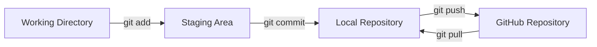

# Git Installation and GitHub Configuration — Complete Study Notes

## Table of Contents

1. [Learning Objectives](#learning-objectives)
2. [What Is Version Control?](#what-is-version-control)
3. [What Is Git?](#what-is-git)
4. [Git vs. GitHub](#git-vs-github)
5. [How Git Works](#how-git-works)
6. [Installing Git](#installing-git)
7. [First-Time Git Configuration](#first-time-git-configuration)
8. [GitHub Account Setup](#github-account-setup)
9. [GitHub Authentication](#github-authentication)
10. [Create Your First Local Repository](#create-your-first-local-repository)
11. [Upload a Local Repository to GitHub](#upload-a-local-repository-to-github)
12. [Clone an Existing Repository](#clone-an-existing-repository)
13. [Daily Git Workflow](#daily-git-workflow)
14. [Important Git Terms](#important-git-terms)
15. [Using `.gitignore`](#using-gitignore)
16. [Basic Branching](#basic-branching)
17. [Common Errors and Solutions](#common-errors-and-solutions)
18. [Command Cheat Sheet](#command-cheat-sheet)
19. [Practice Activity](#practice-activity)
20. [Quick Revision](#quick-revision)

---

## Learning Objectives

After completing these notes, you should be able to:

- Explain Git, GitHub, and version control.
- Install Git on Windows, Linux, WSL, and macOS.
- Configure a Git username, email address, and default branch.
- Create and initialize a local Git repository.
- Understand the working directory, staging area, and repository.
- Create commits and inspect project history.
- Connect a local repository to GitHub.
- Clone, pull, and push a repository.
- Use a `.gitignore` file.
- Diagnose common beginner Git errors.

---

## What Is Version Control?

**Version control** is a system that records changes made to files over time.

It helps you:

- See what changed.
- Identify who made a change.
- Restore an earlier version.
- Work on new features without damaging stable work.
- Collaborate with other people.
- Maintain a history of a project.

### Example

Without version control, people may create files like these:

```text
project-final.txt
project-final-new.txt
project-final-new-2.txt
project-really-final.txt
```

Git replaces this confusing approach with an organized history of **commits**.

---

## What Is Git?

**Git is a distributed version control system.** It tracks changes to files and stores the history of a project.

Git was created by **Linus Torvalds in 2005** for Linux kernel development.

### Important clarification

Git does **not officially stand for “Global Information Tracker.”** That phrase is a humorous backronym. The correct professional definition is:

> Git is a distributed version control system.

### Why is Git called distributed?

Every developer can have a complete copy of the repository, including its history, on their own computer. Most Git operations can therefore be performed locally.

### What Git can do

- Track changes to files.
- Save project snapshots.
- Compare old and new versions.
- Create separate branches.
- Combine work with merging.
- Restore earlier versions.
- exchange work with remote repositories.

---

## Git vs. GitHub

| Git | GitHub |
|---|---|
| Software installed on a computer | Online platform and hosting service |
| Tracks changes locally | Stores Git repositories online |
| Can work without internet access | Usually requires internet access |
| Uses commands such as `add` and `commit` | Provides pull requests, issues, Actions, and collaboration |
| Maintains a local repository | Maintains a remote repository |
| Open-source version-control system | A service built around Git |

### Simple analogy

- **Git** is the version-control engine.
- **GitHub** is an online home for Git repositories.

> Git and GitHub are related, but they are not the same thing.

---

## How Git Works



### 1. Working directory

This is the project folder in which you create, edit, or delete files.

### 2. Staging area

The staging area contains the changes selected for the next commit.

```bash
git add filename
```

### 3. Local repository

The local repository contains the commits saved on your computer.

```bash
git commit -m "Add project README"
```

### 4. Remote repository

The remote repository is the online copy hosted on GitHub or another Git server.

```bash
git push
```

---

## Installing Git

### Windows 10 or Windows 11

1. Visit the [official Git for Windows download page](https://git-scm.com/download/win).
2. Download and run the installer.
3. Keep the recommended default settings unless your environment requires something different.
4. If asked about the PATH, select **Git from the command line and also from third-party software**.
5. Finish the installation.
6. Open **Git Bash**.

Verify the installation:

```bash
git --version
```

You can also install Git from PowerShell with Windows Package Manager:

```powershell
winget install --id Git.Git -e
```

### Ubuntu, Debian, or WSL Ubuntu

```bash
sudo apt update
sudo apt install git -y
git --version
```

### RHEL, AlmaLinux, Rocky Linux, or Fedora

```bash
sudo dnf install git -y
git --version
```

### macOS

Run:

```bash
git --version
```

If Git is unavailable, macOS may offer to install the Xcode Command Line Tools. Homebrew users can also run:

```bash
brew install git
```

---

## First-Time Git Configuration

Git must know the identity associated with your commits.

### Configure your name

```bash
git config --global user.name "Muhammad Khalid Khan"
```

### Configure your email

Use an email address verified in your GitHub account:

```bash
git config --global user.email "your-email@example.com"
```

Your Git email does not have to be your GitHub username. GitHub associates a commit with your profile when its email matches a verified email on your account.

### Set `main` as the default branch

```bash
git config --global init.defaultBranch main
```

### Review the configuration

```bash
git config --global --list
```

Check individual values:

```bash
git config --global user.name
git config --global user.email
git config --global init.defaultBranch
```

### What does `--global` mean?

`--global` applies the setting to every Git repository used by your current operating-system account.

To use a different identity in one repository, enter that repository and omit `--global`:

```bash
cd project-name
git config user.name "Different Name"
git config user.email "different@example.com"
```

### Configuration levels

| Level | Example | Scope |
|---|---|---|
| System | `git config --system` | Every user on the computer |
| Global | `git config --global` | Current operating-system user |
| Local | `git config` | Current repository only |

Local settings override global settings, and global settings override system settings.

---

## GitHub Account Setup

1. Open [GitHub](https://github.com).
2. Create an account.
3. Verify your email address.
4. Enable two-factor authentication.
5. Choose a professional username.
6. Add a profile picture and short biography.

---

## GitHub Authentication

Git identity and GitHub authentication are different:

- `user.name` and `user.email` identify your commits.
- Authentication proves that your account is allowed to access a GitHub repository.

GitHub does not accept a normal account password for command-line Git operations. Common authentication options are:

1. HTTPS with Git Credential Manager
2. GitHub CLI
3. SSH keys
4. A personal access token when required

### Recommended beginner method: HTTPS

An HTTPS repository address looks like this:

```text
https://github.com/USERNAME/REPOSITORY.git
```

Git for Windows normally includes Git Credential Manager. On the first push, a browser may open and ask you to sign in to GitHub and authorize access.

If Git directly asks for a password, do not enter your regular GitHub password. Use an approved credential manager or a personal access token.

### Optional method: GitHub CLI

After installing GitHub CLI, authenticate with:

```bash
gh auth login
```

Follow the prompts and choose HTTPS or SSH.

### Optional method: SSH

Generate an Ed25519 SSH key:

```bash
ssh-keygen -t ed25519 -C "your-email@example.com"
```

[For More Information Click here](./md/SSH-Keygen-Ed25519-Study-Notes.md)

Start the SSH agent and add the private key on Linux or Git Bash:

```bash
eval "$(ssh-agent -s)"
ssh-add ~/.ssh/id_ed25519
```

[For More Information Click here](./md/SSH-Agent-and-SSH-Study-Notes.md)

Display the public key:

```bash
cat ~/.ssh/id_ed25519.pub
```

Copy the public key and add it under:

```text
GitHub → Settings → SSH and GPG keys → New SSH key
```

Test the connection:

```bash
ssh -T git@github.com
```

An SSH remote looks like this:

```text
git@github.com:USERNAME/REPOSITORY.git
```

> Never share your private key. Only the public key ending in `.pub` should be added to GitHub.

---

## Create Your First Local Repository

### Step 1: Create and enter a directory

```bash
mkdir git-practice
cd git-practice
```

### Step 2: Create a file

```bash
echo "# Git Practice" > README.md
```

### Step 3: Initialize Git

```bash
git init
```

Git creates a hidden `.git` directory that stores repository information and history.

### Step 4: Check the status

```bash
git status
```

At this stage, `README.md` is an **untracked file**.

### Step 5: Add the file to the staging area

```bash
git add README.md
```

To stage all changes in the current directory:

```bash
git add .
```

### Step 6: Create the first commit

```bash
git commit -m "Add initial README"
```

### Step 7: View the history

```bash
git log
```

For a compact view:

```bash
git log --oneline
```

---

## Upload a Local Repository to GitHub

### Step 1: Create an empty GitHub repository

On GitHub:

1. Select **New repository**.
2. Enter a repository name such as `git-practice`.
3. Choose Public or Private.
4. Do not add a README, `.gitignore`, or license for this particular workflow.
5. Select **Create repository**.

Keeping it empty prevents unnecessary history conflicts because the local project already has its first commit.

### Step 2: Connect the local repository

```bash
git remote add origin https://github.com/USERNAME/git-practice.git
```

Example:

```bash
git remote add origin https://github.com/krmaryum/git-practice.git
```

Here:

- `remote` manages remote repositories.
- `add` creates a new remote connection.
- `origin` is the conventional name for the primary remote.
- The URL identifies the GitHub repository.

Verify the remote:

```bash
git remote -v
```

### Step 3: Confirm the branch name

```bash
git branch -M main
```

### Step 4: Push the repository

```bash
git push -u origin main
```

The `-u` option connects the local `main` branch with the remote `main` branch. Future pushes normally require only:

```bash
git push
```

---

## Clone an Existing Repository

If a repository already exists on GitHub, download it with `git clone`:

```bash
git clone https://github.com/USERNAME/REPOSITORY.git
cd REPOSITORY
```

Example:

```bash
git clone https://github.com/krmaryum/linux-practice-lab.git
cd linux-practice-lab
```

Cloning downloads:

- Project files
- Commit history
- Branch information
- Remote configuration

Do not normally run `git init` after cloning because the cloned directory is already a Git repository.

---

## Daily Git Workflow

After editing your project, use this workflow:

```bash
git status
git diff
git add .
git commit -m "Describe the change clearly"
git pull
git push
```

| Command | Purpose |
|---|---|
| `git status` | Shows untracked, modified, and staged files |
| `git diff` | Shows unstaged changes |
| `git add .` | Stages changes in the current directory |
| `git commit -m "message"` | Saves a local snapshot |
| `git pull` | Downloads and integrates remote changes |
| `git push` | Uploads local commits to the remote repository |

### Good commit messages

```bash
git commit -m "Add user creation script"
git commit -m "Fix input validation"
git commit -m "Update installation instructions"
```

Avoid unclear messages such as:

```bash
git commit -m "changes"
git commit -m "update"
git commit -m "final"
```

---

## Important Git Terms

| Term | Meaning |
|---|---|
| Repository | A project tracked by Git |
| Commit | A saved snapshot of staged changes |
| Branch | An independent line of development |
| `main` | A common name for the default branch |
| Working directory | The project files currently being edited |
| Staging area | Changes selected for the next commit |
| Local repository | Repository and history on your computer |
| Remote repository | Repository stored on GitHub or another server |
| `origin` | Conventional name for the primary remote |
| Clone | Download a complete repository |
| Push | Upload local commits to a remote repository |
| Pull | Fetch and integrate remote changes |
| Fetch | Download remote data without integrating it immediately |
| Merge | Combine histories or branches |
| Conflict | Competing changes that Git cannot combine automatically |
| `.gitignore` | A file that lists content Git should ignore |

---

## Using `.gitignore`

A `.gitignore` file tells Git which untracked files or directories should not be included in commits.

Example:

```gitignore
# Log files
*.log

# Environment files and secrets
.env

# Temporary files
*.tmp

# Editor settings
.vscode/

# Dependency directory
node_modules/

# Large video files
videos/*.mp4
```

### Important limitation

`.gitignore` does not automatically stop tracking a file that was already added to Git.

Stop tracking an existing file while keeping the local copy:

```bash
git rm --cached filename
```

Stop tracking a directory while keeping it locally:

```bash
git rm -r --cached directory-name
```

Then commit the change:

```bash
git commit -m "Stop tracking ignored files"
```

### Never commit secrets

Do not commit:

- Passwords
- Personal access tokens
- SSH private keys
- AWS access keys
- Database credentials
- Secret `.env` files

---

## Basic Branching

A branch allows you to work independently without immediately changing `main`.

### List branches

```bash
git branch
```

### Create and switch to a branch

```bash
git switch -c add-documentation
```

Make changes and commit them:

```bash
git add .
git commit -m "Add documentation"
```

Return to `main`:

```bash
git switch main
```

Merge the work:

```bash
git merge add-documentation
```

Delete the merged local branch if it is no longer required:

```bash
git branch -d add-documentation
```

---

## Common Errors and Solutions

### Error: `Author identity unknown`

Git does not know your name or email.

```bash
git config --global user.name "Muhammad Khalid Khan"
git config --global user.email "your-email@example.com"
```

### Error: `not a git repository`

You are in the wrong directory, or the directory has not been initialized.

```bash
pwd
ls
git status
```

If it is a new local project:

```bash
git init
```

If you cloned the project, first enter its directory:

```bash
cd repository-name
```

### Error: `remote origin already exists`

Inspect the current remote:

```bash
git remote -v
```

Change its URL:

```bash
git remote set-url origin https://github.com/USERNAME/REPOSITORY.git
```

### Error: `src refspec main does not match any`

This often means there is no commit yet or the local branch has a different name.

```bash
git status
git add .
git commit -m "Initial commit"
git branch -M main
git push -u origin main
```

### GitHub rejects your password

GitHub account passwords are not accepted for command-line Git operations. Use Git Credential Manager, GitHub CLI, SSH, or a personal access token.

### Push rejected because the remote has newer work

Download and integrate the remote commits first:

```bash
git pull --rebase origin main
git push
```

If Git reports a conflict, resolve the conflicting files carefully before continuing.

### A large file was staged accidentally

Remove it from the staging area without deleting the local file:

```bash
git restore --staged path/to/large-file
```

Add an appropriate pattern to `.gitignore` afterward.

---

## Command Cheat Sheet

### Installation and configuration

```bash
git --version
git config --global user.name "Your Name"
git config --global user.email "you@example.com"
git config --global init.defaultBranch main
git config --global --list
```

### Create or obtain a repository

```bash
git init
git clone REPOSITORY-URL
```

### Inspect changes

```bash
git status
git diff
git diff --staged
```

### Stage and commit

```bash
git add filename
git add .
git commit -m "Commit message"
```

### View history

```bash
git log
git log --oneline
git log --oneline --graph --all
```

### Remote repositories

```bash
git remote -v
git remote add origin REPOSITORY-URL
git remote set-url origin REPOSITORY-URL
git push -u origin main
git push
git pull
git fetch
```

### Branches

```bash
git branch
git switch -c branch-name
git switch main
git merge branch-name
git branch -d branch-name
```

### Safe undo commands

```bash
# Unstage a file but keep its changes
git restore --staged filename

# Discard unstaged changes in a file—use carefully
git restore filename

# Create a new commit that reverses an existing commit
git revert COMMIT-ID
```

---

## Practice Activity

### Objective

Create a local project, track it with Git, and upload it to GitHub.

### Instructions

1. Create a directory named `git-practice-lab`.
2. Create `README.md` and `notes.txt`.
3. Initialize the directory as a Git repository.
4. Check the repository status.
5. Stage both files.
6. Create a commit with a meaningful message.
7. Create an empty GitHub repository named `git-practice-lab`.
8. Add GitHub as the `origin` remote.
9. Push the `main` branch.
10. Modify `notes.txt`, commit the change, and push again.

### Suggested commands

```bash
mkdir git-practice-lab
cd git-practice-lab

echo "# Git Practice Lab" > README.md
echo "My first Git notes" > notes.txt

git init
git status
git add .
git commit -m "Create initial practice files"

git branch -M main
git remote add origin https://github.com/USERNAME/git-practice-lab.git
git push -u origin main

echo "Git tracks changes to files." >> notes.txt
git status
git diff
git add notes.txt
git commit -m "Expand Git notes"
git push
```

### Verification

```bash
git status
git remote -v
git log --oneline
```

Expected final status:

```text
nothing to commit, working tree clean
```

---

## Quick Revision

### Complete first-time setup

```bash
git --version
git config --global user.name "Your Name"
git config --global user.email "you@example.com"
git config --global init.defaultBranch main
```

### Complete first repository sequence

```bash
mkdir my-project
cd my-project
git init
echo "# My Project" > README.md
git add README.md
git commit -m "Add initial README"
git branch -M main
git remote add origin https://github.com/USERNAME/my-project.git
git push -u origin main
```

### Normal daily cycle

```text
Edit → Check → Stage → Commit → Pull → Push
```

```bash
git status
git diff
git add .
git commit -m "Describe the change"
git pull
git push
```

---

## Official References

- [Installing Git — Git SCM](https://git-scm.com/book/en/v2/Getting-Started-Installing-Git)
- [Set up Git — GitHub Docs](https://docs.github.com/en/get-started/git-basics/set-up-git)
- [About authentication to GitHub](https://docs.github.com/en/authentication/keeping-your-account-and-data-secure/about-authentication-to-github)
- [Connecting to GitHub with SSH](https://docs.github.com/en/authentication/connecting-to-github-with-ssh)
- [Adding locally hosted code to GitHub](https://docs.github.com/en/migrations/importing-source-code/using-the-command-line-to-import-source-code/adding-locally-hosted-code-to-github)
- [Managing remote repositories](https://docs.github.com/en/get-started/git-basics/managing-remote-repositories)

---

**Study Tip:** Run each command yourself in a small practice repository. Git becomes much easier when you connect each command to the change it makes in the working directory, staging area, local repository, or remote repository.
