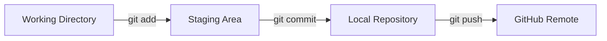

# Git aur GitHub Commands — Complete Roman Urdu Study Guide

> Beginner se Intermediate level tak practical notes, safe commands, examples, troubleshooting aur quick reference.

## Example Details

Is guide mein practical examples ke liye ye details use ki gayi hain:

```text
GitHub username: kcommit
Repository name: shell-scripting
Default branch: main
```

Apne system par `kcommit` ko apne asal GitHub username se replace karein.

---

## Table of Contents

1. [Git aur GitHub Mein Farq](#1-git-aur-github-mein-farq)
2. [Git Install aur Verify Karna](#2-git-install-aur-verify-karna)
3. [Git Identity Configure Karna](#3-git-identity-configure-karna)
4. [Git Configuration Levels](#4-git-configuration-levels)
5. [Repository Create ya Clone Karna](#5-repository-create-ya-clone-karna)
6. [Daily Git Workflow](#6-daily-git-workflow)
7. [Files Track aur Untrack Karna](#7-files-track-aur-untrack-karna)
8. [Remote Repository Management](#8-remote-repository-management)
9. [Push, Fetch aur Pull](#9-push-fetch-aur-pull)
10. [Branching aur Merging](#10-branching-aur-merging)
11. [History, Diff aur Inspection](#11-history-diff-aur-inspection)
12. [Changes Undo Karna](#12-changes-undo-karna)
13. [Git Stash](#13-git-stash)
14. [Rebase aur Cherry-Pick](#14-rebase-aur-cherry-pick)
15. [Git Tags](#15-git-tags)
16. [Git Bisect](#16-git-bisect)
17. [SSH se GitHub Configure Karna](#17-ssh-se-github-configure-karna)
18. [HTTPS se GitHub Use Karna](#18-https-se-github-use-karna)
19. [Pull Request Workflow](#19-pull-request-workflow)
20. [Fork aur Upstream Workflow](#20-fork-aur-upstream-workflow)
21. [Git Aliases](#21-git-aliases)
22. [GitHub Actions Basic Workflow](#22-github-actions-basic-workflow)
23. [.gitignore aur .gitattributes](#23-gitignore-aur-gitattributes)
24. [Common Problems aur Solutions](#24-common-problems-aur-solutions)
25. [Complete Practice Lab](#25-complete-practice-lab)
26. [Interview Questions](#26-interview-questions)
27. [Quick Cheat Sheet](#27-quick-cheat-sheet)

---

## 1. Git aur GitHub Mein Farq

### Git kya hai?

Git ek **distributed version control system** hai. Ye files aur code mein hone wali tabdeeliyon ka record rakhta hai.

Git ki madad se aap:

- File history dekh sakte hain.
- Changes compare kar sakte hain.
- Purani state par wapas ja sakte hain.
- Branch bana kar alag feature par kaam kar sakte hain.
- Team ke changes merge kar sakte hain.

> Git ka official full form nahi hai. `Global Information Tracker` iska official naam ya full form nahi.

### GitHub kya hai?

GitHub ek online platform hai jo Git repositories ko host karta hai. Ye collaboration ke liye Pull Requests, Issues, Actions aur code review jaisi facilities deta hai.

| Git | GitHub |
|---|---|
| Local version control tool | Online repository-hosting platform |
| Computer par install hota hai | Browser aur network se access hota hai |
| Commits, branches aur merges manage karta hai | Pull Requests, Issues aur Actions provide karta hai |
| Internet ke baghair bhi kaam karta hai | Remote collaboration ke liye internet chahiye |

### Basic workflow



---

## 2. Git Install aur Verify Karna

### Windows

Git for Windows installer install karein, phir Git Bash open karein.

Installation verify karein:

```bash
git --version
```

### Ubuntu ya Debian

```bash
sudo apt update
sudo apt install git -y
git --version
```

### RHEL, Rocky Linux ya AlmaLinux

```bash
sudo dnf install git -y
git --version
```

### macOS

```bash
xcode-select --install
git --version
```

---

## 3. Git Identity Configure Karna

Git har commit ke sath author ka name aur email record karta hai.

```bash
git config --global user.name "Muhammad Khalid Khan"
git config --global user.email "your-email@example.com"
git config --global init.defaultBranch main
```

Configuration check karein:

```bash
git config --global --list
```

Individual values check karein:

```bash
git config --global --get user.name
git config --global --get user.email
git config --global --get init.defaultBranch
```

> Git commit email ko GitHub account ke verified email ke sath match karna behtar hai, taa ke commits aap ke GitHub profile se associate hon.

---

## 4. Git Configuration Levels

| Scope | Kahan apply hota hai | Command |
|---|---|---|
| System | Computer ke tamam users aur repositories | `git config --system --list` |
| Global | Current OS user ki tamam repositories | `git config --global --list` |
| Local | Sirf current repository | `git config --local --list` |

### Precedence

```text
Local > Global > System
```

Zyada specific scope, lower scope ki same setting ko override karta hai.

Source aur scope ke sath tamam applicable settings dekhein:

```bash
git config --show-origin --show-scope --list
```

Ek key ki tamam definitions dekhein:

```bash
git config --show-origin --show-scope --get-all init.defaultBranch
```

### Configuration delete karna

Pehle source inspect karein, phir correct scope se value remove karein:

```bash
git config --show-origin --show-scope --get-all <key>
git config --global --unset <key>
git config --show-origin --show-scope --get-all <key>
```

Scope ke mutabiq:

```bash
git config --system --unset <key>
git config --global --unset <key>
git config --local --unset <key>
```

Same scope mein key multiple martaba ho to:

```bash
git config --global --unset-all <key>
```

> Sirf ek setting remove karne ke liye `.git/config` delete na karein. Is mein remotes aur branch-tracking ki important information bhi hoti hai.

---

## 5. Repository Create ya Clone Karna

### New local repository create karna

```bash
mkdir shell-scripting
cd shell-scripting
git init
```

`git init` current directory mein hidden `.git` directory create karta hai. Isi directory mein Git ka metadata aur history store hoti hai.

Status check karein:

```bash
git status
```

### Existing GitHub repository clone karna

HTTPS:

```bash
git clone https://github.com/kcommit/shell-scripting.git
```

SSH:

```bash
git clone git@github.com:kcommit/shell-scripting.git
```

Clone karne se remote repository ki files, branches aur commit history local computer par download hoti hain.

---

## 6. Daily Git Workflow

Rozana ka basic workflow:

```bash
git status
git add <file>
git commit -m "Describe the change"
git pull --rebase origin main
git push origin main
```

### Step 1: Status check karein

```bash
git status
```

Ye batata hai:

- Kaun si files modified hain.
- Kaun si files untracked hain.
- Kaun si changes staged hain.
- Current branch ka naam kya hai.

Short output:

```bash
git status --short
```

### Step 2: Changes stage karein

Ek file:

```bash
git add script.sh
```

Current directory ki tamam changes:

```bash
git add .
```

Tracked files ki modified aur deleted changes:

```bash
git add -u
```

Interactive staging:

```bash
git add -p
```

### Step 3: Commit create karein

```bash
git commit -m "Add backup script"
```

Achha commit message short, clear aur action-oriented hona chahiye.

Examples:

```text
Add user creation script
Fix file permission check
Update installation instructions
Remove obsolete network setting
```

---

## 7. Files Track aur Untrack Karna

### Tracked file remove karna

File working directory aur Git dono se delete hoti hai:

```bash
git rm old-script.sh
git commit -m "Remove obsolete script"
```

### File ko computer par rakh kar Git se untrack karna

```bash
git rm --cached <file>
```

Example:

```bash
git rm --cached .env
echo '.env' >> .gitignore
git add .gitignore
git commit -m "Stop tracking environment file"
```

Directory ko recursively untrack karna:

```bash
git rm -r --cached videos/
```

### `git rm` aur `git rm --cached` ka farq

| Command | Working directory | Git tracking |
|---|---|---|
| `git rm file` | File delete hoti hai | Tracking remove hoti hai |
| `git rm --cached file` | File rehti hai | Tracking remove hoti hai |

> Agar sensitive file pehle GitHub par push ho chuki hai to sirf `git rm --cached` usay old commit history se remove nahi karta. Secret ko foran revoke/rotate karein aur zaroorat par history-cleaning procedure use karein.

---

## 8. Remote Repository Management

### Remotes list karna

```bash
git remote -v
```

`origin` aam tor par cloned ya primary remote repository ka default naam hota hai.

### Remote add karna

HTTPS:

```bash
git remote add origin https://github.com/kcommit/shell-scripting.git
```

SSH:

```bash
git remote add origin git@github.com:kcommit/shell-scripting.git
```

### Remote URL check karna

```bash
git remote get-url origin
```

### Remote URL change karna

```bash
git remote set-url origin git@github.com:kcommit/shell-scripting.git
```

### Remote rename ya remove karna

```bash
git remote rename origin github
git remote remove github
```

---

## 9. Push, Fetch aur Pull

### First push aur upstream set karna

```bash
git push -u origin main
```

`-u` local `main` ko remote `origin/main` ke sath track karwata hai. Is ke baad aam tor par sirf ye kaafi hota hai:

```bash
git push
```

### Fetch

```bash
git fetch origin
```

`fetch` remote changes download karta hai lekin current branch mein automatically merge nahi karta.

### Pull

```bash
git pull origin main
```

Default behavior mein `pull` aam tor par `fetch` ke baad merge karta hai.

Rebase ke sath pull:

```bash
git pull --rebase origin main
```

### Difference

| Command | Download | Current branch change |
|---|---|---|
| `git fetch` | Haan | Nahi |
| `git pull` | Haan | Haan, merge ya configured strategy ke zariye |
| `git push` | Upload | Remote branch update karta hai |

---

## 10. Branching aur Merging

### Branches list karna

```bash
git branch
git branch --all
```

### New branch create karna

```bash
git branch feature-login
```

### Branch switch karna

Modern command:

```bash
git switch feature-login
```

Create aur switch ek sath:

```bash
git switch -c feature-login
```

Older equivalent:

```bash
git checkout -b feature-login
```

### Branch merge karna

Pehle target branch par jayein, phir source branch merge karein:

```bash
git switch main
git pull origin main
git merge feature-login
```

### Branch delete karna

Safely merged branch delete karein:

```bash
git branch -d feature-login
```

Force delete:

```bash
git branch -D feature-login
```

Remote branch delete:

```bash
git push origin --delete feature-login
```

> `-D` unmerged work bhi delete kar sakta hai. Use karne se pehle `git log feature-login` aur `git status` check karein.

### Merge conflict ka basic workflow

```bash
git status
# Conflicted files manually edit karein
git add <resolved-file>
git commit
```

Merge abort karna ho:

```bash
git merge --abort
```

---

## 11. History, Diff aur Inspection

### Commit history

```bash
git log
git log --oneline
git log --oneline --graph --decorate --all
```

### Unstaged changes

```bash
git diff
```

### Staged changes

```bash
git diff --staged
```

### Working tree ko last commit se compare karna

```bash
git diff HEAD
```

### Specific commit details

```bash
git show <commit-hash>
```

### File ki line-by-line authorship

```bash
git blame <file>
```

`git blame` ye dikhata hai ke har line ko aakhri martaba kis commit aur author ne change kiya.

### Contributors ka summary

```bash
git shortlog -sn
```

### Tracked files list karna

```bash
git ls-files
```

---

## 12. Changes Undo Karna

Undo command choose karte waqt pehle ye identify karein ke change:

1. Working directory mein hai?
2. Staging area mein hai?
3. Local commit ban chuka hai?
4. Remote par push bhi ho chuka hai?

### Staged file ko unstage karna

Recommended command:

```bash
git restore --staged <file>
```

Older command:

```bash
git reset <file>
```

File ki working-directory changes rehti hain.

### Uncommitted working-directory changes discard karna

```bash
git restore <file>
```

> Ye local changes discard karta hai. Agar changes chahiye hon to pehle copy ya stash karein.

### Last commit message edit karna

```bash
git commit --amend -m "Correct commit message"
```

Last commit mein bhooli hui file add karna:

```bash
git add forgotten-file.sh
git commit --amend --no-edit
```

### Last local commit undo, changes staged rakhein

```bash
git reset --soft HEAD~1
```

### Last local commit undo, changes unstaged rakhein

```bash
git reset HEAD~1
```

### Commit aur local changes dono discard karna

```bash
git reset --hard <commit>
```

> `--hard` destructive hai. Ye uncommitted tracked changes ko permanently discard kar sakta hai.

### Pushed commit safely undo karna

```bash
git revert <commit>
```

`revert` purani history rewrite nahi karta. Ye ulta change apply karne wala new commit banata hai, is liye shared branch par aam tor par safer hai.

### Reset aur revert ka farq

| Command | History | Shared branch ke liye |
|---|---|---|
| `git reset` | Branch pointer/history badal sakta hai | Ehtiyat; private local work ke liye |
| `git revert` | New undo commit banata hai | Aam tor par safe |

---

## 13. Git Stash

Stash incomplete changes ko temporary shelf par rakhta hai taa ke aap branch switch ya urgent work kar saken.

### Tracked changes stash karna

```bash
git stash push -m "Work in progress"
```

Untracked files bhi include karna:

```bash
git stash push -u -m "WIP with new files"
```

### Stashes list karna

```bash
git stash list
```

### Stash inspect karna

```bash
git stash show -p stash@{0}
```

### Stash apply karna

```bash
git stash apply stash@{0}
```

`apply` changes restore karta hai magar stash list se entry remove nahi karta.

### Stash pop karna

```bash
git stash pop
```

`pop` changes restore karta hai aur successful hone par stash entry remove karta hai.

### Stash delete karna

```bash
git stash drop stash@{0}
git stash clear
```

> `git stash clear` tamam stashes delete karta hai. Isay ehtiyat se use karein.

---

## 14. Rebase aur Cherry-Pick

### Rebase kya karta hai?

Rebase current branch ke commits ko new base ke upar dobara apply karta hai. Is se linear history mil sakti hai, magar commit hashes change hote hain.

```bash
git switch feature-login
git fetch origin
git rebase origin/main
```

Conflict resolve karne ke baad:

```bash
git add <resolved-file>
git rebase --continue
```

Rebase cancel karna:

```bash
git rebase --abort
```

Current problematic commit skip karna:

```bash
git rebase --skip
```

> Shared/public branch ki already-pushed history ko rebase karne se team ko problems ho sakti hain. Rebase zyada tar apni private feature branch par karein.

### Interactive rebase

```bash
git rebase -i HEAD~3
```

Is se recent commits ko reorder, squash, edit ya drop kiya ja sakta hai.

### Cherry-pick

```bash
git cherry-pick <commit-hash>
```

Ye kisi specific commit ke changes current branch par new commit ke tor par apply karta hai.

Cherry-pick abort:

```bash
git cherry-pick --abort
```

---

## 15. Git Tags

Tags aam tor par releases mark karne ke liye use hoti hain.

### Lightweight tag

```bash
git tag v1.0.0
```

### Annotated tag

```bash
git tag -a v1.0.0 -m "Release version 1.0.0"
```

Annotated tag mein message, author aur date metadata hota hai, is liye releases ke liye preferred hai.

### Tags list karna

```bash
git tag
git show v1.0.0
```

### Ek tag push karna

```bash
git push origin v1.0.0
```

### Tamam tags push karna

```bash
git push origin --tags
```

### Tag delete karna

```bash
git tag -d v1.0.0
git push origin --delete v1.0.0
```

---

## 16. Git Bisect

`git bisect` binary search ke zariye woh commit dhoondta hai jis ne bug introduce kiya.

```bash
git bisect start
git bisect bad
git bisect good <known-good-commit>
```

Git beech ka commit checkout karega. Har step par application test karein aur result batayein:

```bash
git bisect good
# ya
git bisect bad
```

Bad commit milne ke baad original state par wapas aayein:

```bash
git bisect reset
```

---

## 17. SSH se GitHub Configure Karna

SSH method password ya PAT har push par type kiye baghair secure authentication provide karta hai.

### Step 1: Existing SSH keys check karein

```bash
ls -la ~/.ssh
```

### Step 2: ED25519 key generate karein

```bash
ssh-keygen -t ed25519 -C "your-email@example.com"
```

Command ke parts:

| Part | Matlab |
|---|---|
| `ssh-keygen` | SSH key pair create karne ka program |
| `-t ed25519` | Modern ED25519 algorithm select karta hai |
| `-C` | Key ke sath identifying comment add karta hai |

Default file accept karne par aam tor par ye files banti hain:

```text
~/.ssh/id_ed25519      Private key
~/.ssh/id_ed25519.pub  Public key
```

> Private key `id_ed25519` kabhi share na karein. GitHub par sirf `.pub` public key add hoti hai.

### Step 3: SSH agent start karein

```bash
eval "$(ssh-agent -s)"
```

`ssh-agent` private keys ko memory mein securely manage karta hai. `eval` agent ke output mein diye gaye environment variables current shell par apply karta hai.

### Step 4: Private key agent mein add karein

```bash
ssh-add ~/.ssh/id_ed25519
```

Loaded keys check karein:

```bash
ssh-add -l
```

### Step 5: Public key copy karein

```bash
cat ~/.ssh/id_ed25519.pub
```

Windows Git Bash mein clipboard par copy:

```bash
clip < ~/.ssh/id_ed25519.pub
```

GitHub mein:

```text
Settings → SSH and GPG keys → New SSH key
```

Public key paste karke save karein.

### Step 6: Connection test karein

```bash
ssh -T git@github.com
```

First connection par host authenticity prompt aaye to fingerprint verify karke `yes` enter karein.

### Step 7: SSH remote use karein

```bash
git remote set-url origin git@github.com:kcommit/shell-scripting.git
git remote -v
git push -u origin main
```

---

## 18. HTTPS se GitHub Use Karna

HTTPS remote:

```bash
git remote set-url origin https://github.com/kcommit/shell-scripting.git
```

GitHub account password ko Git command-line authentication ke liye use nahi kiya jata. HTTPS authentication aam tor par Git Credential Manager, browser sign-in ya Personal Access Token se hoti hai.

### Important security correction

PAT ko remote URL mein is tarah embed **na karein**:

```text
https://TOKEN@github.com/username/repository.git
```

Is se token shell history, logs ya configuration mein expose ho sakta hai.

Safe URL rakhein:

```bash
git remote set-url origin https://github.com/kcommit/shell-scripting.git
```

Phir Git Credential Manager ya secure credential prompt use karein.

Windows configuration check:

```bash
git config --global --get credential.helper
```

> Token accidentally expose ho jaye to GitHub settings mein usay foran revoke karein aur new token create karein.

---

## 19. Pull Request Workflow

Pull Request feature branch ke changes ko review aur merge karne ki request hoti hai.

```bash
git switch -c feature/add-backup-script
# Files edit karein
git add .
git commit -m "Add backup script"
git push -u origin feature/add-backup-script
```

Phir GitHub par:

1. Repository open karein.
2. **Pull requests** tab select karein.
3. **New pull request** click karein.
4. Base branch `main` aur compare branch `feature/add-backup-script` select karein.
5. Title aur description likhein.
6. Review ke baad PR merge karein.

Merge ke baad local cleanup:

```bash
git switch main
git pull origin main
git branch -d feature/add-backup-script
```

---

## 20. Fork aur Upstream Workflow

Fork kisi doosre user ki repository ki aap ke GitHub account mein copy hoti hai.

### Step 1: Fork clone karein

```bash
git clone https://github.com/kcommit/shell-scripting.git
cd shell-scripting
```

### Step 2: Original repository ko `upstream` remote banayein

```bash
git remote add upstream https://github.com/original-owner/shell-scripting.git
git remote -v
```

Expected concept:

```text
origin   = Aap ka fork
upstream = Original repository
```

### Step 3: Upstream changes sync karein

```bash
git fetch upstream
git switch main
git merge upstream/main
git push origin main
```

Rebase alternative:

```bash
git fetch upstream
git switch main
git rebase upstream/main
git push origin main
```

### Step 4: Feature branch aur PR

```bash
git switch -c docs/improve-readme
# Changes karein
git add README.md
git commit -m "Improve README instructions"
git push -u origin docs/improve-readme
```

Phir fork se original repository ke liye Pull Request create karein.

---

## 21. Git Aliases

Aliases frequently used commands ke shortcuts hote hain.

```bash
git config --global alias.st status
git config --global alias.co checkout
git config --global alias.br branch
git config --global alias.ci commit
git config --global alias.lg "log --oneline --graph --decorate --all"
```

Use:

```bash
git st
git br
git lg
```

Aliases check karein:

```bash
git config --global --get-regexp '^alias\.'
```

Ek alias remove karein:

```bash
git config --global --unset alias.co
```

Tamam global aliases remove karein:

```bash
git config --global --remove-section alias
```

---

## 22. GitHub Actions Basic Workflow

GitHub Actions testing, building aur deployment automate kar sakta hai.

Workflow file create karein:

```text
.github/workflows/ci.yml
```

Basic shell-script validation example:

```yaml
name: Shell Script CI

on:
  push:
    branches: [main]
  pull_request:
    branches: [main]

permissions:
  contents: read

jobs:
  shellcheck:
    runs-on: ubuntu-latest

    steps:
      - name: Checkout repository
        uses: actions/checkout@v4

      - name: Install ShellCheck
        run: sudo apt-get update && sudo apt-get install -y shellcheck

      - name: Check Bash scripts
        run: find . -type f -name '*.sh' -print0 | xargs -0 -r shellcheck
```

### Workflow explanation

| Part | Kaam |
|---|---|
| `name` | Workflow ka readable naam |
| `on` | Workflow ka trigger |
| `permissions` | Token ko minimum required permission deta hai |
| `jobs` | Automation jobs define karta hai |
| `runs-on` | Runner operating system select karta hai |
| `steps` | Job ke ordered actions aur commands |
| `actions/checkout@v4` | Repository code runner par checkout karta hai |

> YAML indentation bohat important hai. Tabs ke bajaye spaces use karein.

---

## 23. `.gitignore` aur `.gitattributes`

### `.gitignore`

Untracked files ko Git se ignore karne ke patterns rakhta hai.

Example:

```gitignore
# Secrets
.env
*.pem

# Logs
*.log

# Temporary files
tmp/

# Large local videos
videos/
```

Check karein ke file kis rule ki wajah se ignore hui:

```bash
git check-ignore -v <file>
```

> `.gitignore` already tracked file ko automatically untrack nahi karta. Us ke liye `git rm --cached <file>` use karein.

### `.gitattributes`

Cross-platform line endings control karne ke liye:

```gitattributes
* text=auto
*.sh text eol=lf
*.bat text eol=crlf
```

Bash scripts ke liye LF endings Linux aur CI environments mein problems se bachati hain.

---

## 24. Common Problems aur Solutions

### Problem 1: `remote origin already exists`

```bash
git remote -v
git remote set-url origin <correct-url>
```

### Problem 2: Push rejected — remote contains work

```bash
git pull --rebase origin main
git push origin main
```

Conflict aaye to resolve karke:

```bash
git add <resolved-file>
git rebase --continue
```

### Problem 3: Wrong branch name

```bash
git branch --show-current
git branch -M main
git push -u origin main
```

### Problem 4: Wrong email se commit ban gaya

Future commits ke liye:

```bash
git config --global user.email "correct@example.com"
```

Current repository ke liye:

```bash
git config --local user.email "correct@example.com"
```

Last unpushed commit ka author correct karna:

```bash
git commit --amend --reset-author --no-edit
```

### Problem 5: `Permission denied (publickey)`

```bash
eval "$(ssh-agent -s)"
ssh-add ~/.ssh/id_ed25519
ssh-add -l
ssh -T git@github.com
git remote -v
```

Public key GitHub account mein add hona zaroori hai.

### Problem 6: File `.gitignore` mein hai magar phir bhi tracked hai

```bash
git rm --cached <file>
git commit -m "Stop tracking ignored file"
```

Directory ke liye:

```bash
git rm -r --cached <directory>/
```

### Problem 7: CRLF warning

Windows par warning aam tor par line-ending conversion ko indicate karti hai. Bash scripts ke liye `.gitattributes` mein ye rule rakhein:

```gitattributes
*.sh text eol=lf
```

### Problem 8: Large file push reject ho gaya

File ko last unpushed commit se untrack karne ka possible workflow:

```bash
git reset --soft HEAD~1
git rm --cached path/to/large-file
echo 'path/to/large-file' >> .gitignore
git add .gitignore
git commit -m "Remove large file from repository"
git push origin main
```

Binary assets ko repository mein zaroor rakhna ho to Git LFS consider karein.

---

## 25. Complete Practice Lab

### Objective

`shell-scripting` repository create karke daily workflow, branch, merge, remote aur untracking practice karna.

### Part A: Local repository

```bash
mkdir shell-scripting
cd shell-scripting
git init
git branch -M main
```

`README.md` aur script create karein:

```bash
printf '# Shell Scripting\n' > README.md
printf '#!/bin/bash\necho "Hello from Git practice"\n' > hello.sh
chmod +x hello.sh
```

First commit:

```bash
git status
git add README.md hello.sh
git diff --staged
git commit -m "Initialize shell scripting repository"
```

### Part B: Feature branch

```bash
git switch -c feature/system-info
```

`system-info.sh` create karein:

```bash
printf '#!/bin/bash\necho "User: $USER"\necho "Host: $(hostname)"\n' > system-info.sh
chmod +x system-info.sh
git add system-info.sh
git commit -m "Add system information script"
```

Main mein merge karein:

```bash
git switch main
git merge feature/system-info
git branch -d feature/system-info
```

### Part C: `.gitignore` aur `git rm --cached`

```bash
printf 'temporary data\n' > debug.log
git add debug.log
git commit -m "Add temporary debug log"
```

Ab file local system par rakh kar tracking stop karein:

```bash
echo '*.log' >> .gitignore
git rm --cached debug.log
git add .gitignore
git commit -m "Ignore log files"
```

Verify:

```bash
test -f debug.log && echo "File is still local"
git ls-files debug.log
git check-ignore -v debug.log
```

### Part D: GitHub remote

GitHub par empty `shell-scripting` repository create karne ke baad:

```bash
git remote add origin git@github.com:kcommit/shell-scripting.git
git remote -v
git push -u origin main
```

### Part E: Final verification

```bash
git status
git log --oneline --graph --decorate --all
git config --show-origin --show-scope --get-all user.email
```

Expected result:

- Working tree clean ho.
- Commit history visible ho.
- `debug.log` local ho magar tracked na ho.
- `main` remote `origin/main` ko track kar rahi ho.

---

## 26. Interview Questions

### 1. Git aur GitHub mein kya difference hai?

Git distributed version control tool hai; GitHub Git repositories ko host aur collaborate karne ka online platform hai.

### 2. Working directory, staging area aur repository kya hain?

Working directory mein editable files hoti hain, staging area next commit ke selected changes rakhta hai, aur local repository committed history store karti hai.

### 3. `git fetch` aur `git pull` mein kya farq hai?

`fetch` remote updates download karta hai magar current branch mein integrate nahi karta. `pull` download ke baad merge ya configured strategy ke mutabiq integrate karta hai.

### 4. `git rm --cached` kya karta hai?

File ko working directory mein rakhta hai magar Git index se remove karke tracking stop karta hai.

### 5. `git reset` aur `git revert` mein kya farq hai?

`reset` branch pointer aur history ko move kar sakta hai; `revert` old commit ko undo karne ke liye new commit create karta hai.

### 6. `git restore --staged file` kya karta hai?

File ko staging area se remove karta hai magar working-directory changes ko rakhta hai.

### 7. Merge aur rebase mein kya farq hai?

Merge histories ko merge commit ke zariye join kar sakta hai. Rebase commits ko new base ke upar rewrite karta hai aur commit hashes change kar deta hai.

### 8. `origin` aur `upstream` kya hain?

`origin` primary ya cloned remote ka conventional naam hai. Fork workflow mein `upstream` aam tor par original repository ko refer karta hai.

### 9. SSH public aur private key mein kya farq hai?

Public key GitHub par add hoti hai. Private key local aur secret rehti hai aur kabhi share nahi karni chahiye.

### 10. Pull Request ka purpose kya hai?

Changes ko target branch mein merge karne se pehle review, discussion aur automated checks ka workflow provide karna.

### 11. `git stash apply` aur `git stash pop` mein kya difference hai?

`apply` stash restore karke entry rakhta hai; `pop` restore ke baad successful hone par entry remove karta hai.

### 12. Annotated tag kyun preferred hota hai?

Is mein tagger, date aur message metadata hota hai, is liye releases document karne ke liye behtar hai.

---

## 27. Quick Cheat Sheet

### Setup aur configuration

| Kaam | Command |
|---|---|
| Git version | `git --version` |
| Name set | `git config --global user.name "Name"` |
| Email set | `git config --global user.email "email"` |
| Global config | `git config --global --list` |
| Source aur scope | `git config --show-origin --show-scope --list` |
| Global value remove | `git config --global --unset <key>` |

### Repository aur daily work

| Kaam | Command |
|---|---|
| Repository initialize | `git init` |
| Repository clone | `git clone <url>` |
| Status | `git status` |
| File stage | `git add <file>` |
| All changes stage | `git add .` |
| Commit | `git commit -m "message"` |
| History | `git log --oneline` |

### Branches

| Kaam | Command |
|---|---|
| Branch list | `git branch` |
| Create aur switch | `git switch -c <branch>` |
| Switch | `git switch <branch>` |
| Merge | `git merge <branch>` |
| Safe delete | `git branch -d <branch>` |
| Remote delete | `git push origin --delete <branch>` |

### Remote operations

| Kaam | Command |
|---|---|
| Remotes list | `git remote -v` |
| Remote add | `git remote add origin <url>` |
| Remote URL change | `git remote set-url origin <url>` |
| Fetch | `git fetch origin` |
| Pull with rebase | `git pull --rebase origin main` |
| First push | `git push -u origin main` |

### Undo aur cleanup

| Kaam | Command |
|---|---|
| Unstage file | `git restore --staged <file>` |
| Discard file changes | `git restore <file>` |
| Keep file, stop tracking | `git rm --cached <file>` |
| Undo last commit, keep staged | `git reset --soft HEAD~1` |
| Safely undo pushed commit | `git revert <commit>` |
| Abort merge | `git merge --abort` |
| Abort rebase | `git rebase --abort` |

### Advanced

| Kaam | Command |
|---|---|
| Stash with message | `git stash push -m "message"` |
| Stash list | `git stash list` |
| Cherry-pick | `git cherry-pick <commit>` |
| Annotated tag | `git tag -a <tag> -m "message"` |
| Push tags | `git push origin --tags` |
| Start bisect | `git bisect start` |

---

## Final Golden Rules

1. Har important command se pehle `git status` check karein.
2. Commit se pehle `git diff` aur `git diff --staged` dekhein.
3. Small, meaningful commits banayein.
4. `main` par direct work ke bajaye feature branch use karein.
5. Shared history par `reset --hard` aur force push se bachein.
6. Private key, password, PAT, `.env` aur `.pem` files commit na karein.
7. Already tracked ignored file ke liye `git rm --cached` ya directory ke liye `git rm -r --cached` use karein.
8. Remote changes lene se pehle apna local work commit ya stash karein.
9. Commands mein `<branch>`, `<file>` aur `<commit>` placeholders ko actual values se replace karein.
10. Destructive command se pehle backup aur `git log --oneline --all` check karna achhi aadat hai.

```text
Status → Diff → Add → Commit → Pull/Rebase → Push
```

Ye disciplined workflow aksar Git mistakes se bachata hai.
