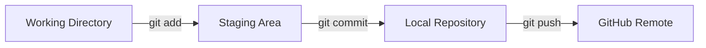

# Git and GitHub Commands — Complete English Study Guide

> A practical beginner-to-intermediate guide covering safe commands, examples, troubleshooting, interview questions, and a hands-on lab.

## Example Details

The examples in this guide use:

```text
GitHub username: kcommit
Repository name: shell-scripting
Default branch: main
```

Replace `kcommit` with your actual GitHub username when practicing.

---

## Table of Contents

1. [Git vs. GitHub](#1-git-vs-github)
2. [Install and Verify Git](#2-install-and-verify-git)
3. [Configure Your Git Identity](#3-configure-your-git-identity)
4. [Git Configuration Levels](#4-git-configuration-levels)
5. [Create or Clone a Repository](#5-create-or-clone-a-repository)
6. [The Daily Git Workflow](#6-the-daily-git-workflow)
7. [Track, Delete, and Untrack Files](#7-track-delete-and-untrack-files)
8. [Manage Remote Repositories](#8-manage-remote-repositories)
9. [Push, Fetch, and Pull](#9-push-fetch-and-pull)
10. [Branching and Merging](#10-branching-and-merging)
11. [History, Differences, and Inspection](#11-history-differences-and-inspection)
12. [Undo Changes Safely](#12-undo-changes-safely)
13. [Temporarily Store Work with Git Stash](#13-temporarily-store-work-with-git-stash)
14. [Rebase and Cherry-Pick](#14-rebase-and-cherry-pick)
15. [Git Tags](#15-git-tags)
16. [Find a Bad Commit with Git Bisect](#16-find-a-bad-commit-with-git-bisect)
17. [Configure GitHub with SSH](#17-configure-github-with-ssh)
18. [Use GitHub with HTTPS](#18-use-github-with-https)
19. [Pull Request Workflow](#19-pull-request-workflow)
20. [Fork and Upstream Workflow](#20-fork-and-upstream-workflow)
21. [Git Aliases](#21-git-aliases)
22. [Basic GitHub Actions Workflow](#22-basic-github-actions-workflow)
23. [Use `.gitignore` and `.gitattributes`](#23-use-gitignore-and-gitattributes)
24. [Common Problems and Solutions](#24-common-problems-and-solutions)
25. [Complete Practice Lab](#25-complete-practice-lab)
26. [Interview Questions](#26-interview-questions)
27. [Quick Command Reference](#27-quick-command-reference)

---

## 1. Git vs. GitHub

### What is Git?

Git is a **distributed version control system**. It records changes to files and allows individuals and teams to manage a project's history.

With Git, you can:

- Record changes as commits.
- Compare different versions of a file.
- Restore an earlier version.
- Develop features on separate branches.
- Merge work from different branches.
- Work locally without an internet connection.

> Git has no official full form. `Global Information Tracker` is not its official name or expansion.

### What is GitHub?

GitHub is an online service that hosts Git repositories. It adds collaboration features such as Pull Requests, Issues, code reviews, releases, and GitHub Actions.

| Git | GitHub |
|---|---|
| Version control software | Online repository-hosting platform |
| Installed on your computer | Accessed through the web, Git, or an API |
| Manages commits, branches, and merges | Provides Pull Requests, Issues, and Actions |
| Works without the internet | Requires a network for remote collaboration |

### Basic data flow



---

## 2. Install and Verify Git

### Windows

Install Git for Windows, open Git Bash, and verify the installation:

```bash
git --version
```

### Ubuntu or Debian

```bash
sudo apt update
sudo apt install git -y
git --version
```

### RHEL, Rocky Linux, or AlmaLinux

```bash
sudo dnf install git -y
git --version
```

### macOS

```bash
xcode-select --install
git --version
```

---

## 3. Configure Your Git Identity

Git records an author's name and email with every commit.

```bash
git config --global user.name "Muhammad Khalid Khan"
git config --global user.email "your-email@example.com"
git config --global init.defaultBranch main
```

Display the global configuration:

```bash
git config --global --list
```

Read individual values:

```bash
git config --global --get user.name
git config --global --get user.email
git config --global --get init.defaultBranch
```

Use an email verified on your GitHub account if you want GitHub to associate your command-line commits with your profile.

---

## 4. Git Configuration Levels

| Scope | Applies to | List command |
|---|---|---|
| System | Every user and repository on the computer | `git config --system --list` |
| Global | The current operating-system user | `git config --global --list` |
| Local | Only the current repository | `git config --local --list` |

### Precedence

```text
Local > Global > System
```

When the same key exists at multiple levels, the more specific applicable scope normally overrides the less specific scope.

Display all applicable settings with their source and scope:

```bash
git config --show-origin --show-scope --list
```

Display every definition of one key:

```bash
git config --show-origin --show-scope --get-all init.defaultBranch
```

### Remove a configuration value

Inspect the setting first, remove it from the correct scope, and verify the result:

```bash
git config --show-origin --show-scope --get-all <key>
git config --global --unset <key>
git config --show-origin --show-scope --get-all <key>
```

Choose the required scope:

```bash
git config --system --unset <key>
git config --global --unset <key>
git config --local --unset <key>
```

If the same key occurs multiple times in one scope:

```bash
git config --global --unset-all <key>
```

> Do not delete `.git/config` merely to remove one local setting. That file can also contain important remote and branch-tracking information.

---

## 5. Create or Clone a Repository

### Create a new local repository

```bash
mkdir shell-scripting
cd shell-scripting
git init
git status
```

`git init` creates a hidden `.git` directory. Git stores the repository's metadata and history there.

### Clone an existing GitHub repository

Using HTTPS:

```bash
git clone https://github.com/kcommit/shell-scripting.git
```

Using SSH:

```bash
git clone git@github.com:kcommit/shell-scripting.git
```

Cloning downloads the repository's files, branches, and commit history and normally creates a remote named `origin`.

---

## 6. The Daily Git Workflow

A common daily sequence is:

```bash
git status
git add <file>
git commit -m "Describe the change"
git pull --rebase origin main
git push origin main
```

### Step 1: Inspect the repository

```bash
git status
git status --short
```

`git status` identifies:

- The current branch.
- Modified files.
- Untracked files.
- Staged changes.
- The relationship with the tracked remote branch.

### Step 2: Stage changes

Stage one file:

```bash
git add script.sh
```

Stage all changes under the current directory:

```bash
git add .
```

Stage modifications and deletions to tracked files:

```bash
git add -u
```

Interactively choose parts of a file:

```bash
git add -p
```

### Step 3: Create a commit

```bash
git commit -m "Add backup script"
```

Good commit messages are short, specific, and action-oriented:

```text
Add user creation script
Fix file permission check
Update installation instructions
Remove obsolete network setting
```

---

## 7. Track, Delete, and Untrack Files

### Delete a tracked file

`git rm` removes the file from both the working directory and Git tracking:

```bash
git rm old-script.sh
git commit -m "Remove obsolete script"
```

### Keep a file locally but stop tracking it

```bash
git rm --cached <file>
```

Example:

```bash
git rm --cached .env
echo '.env' >> .gitignore
git add .gitignore
git commit -m "Stop tracking environment file"
```

Untrack a directory recursively:

```bash
git rm -r --cached videos/
```

### Important difference

| Command | Working-directory copy | Git tracking |
|---|---|---|
| `git rm file` | Deleted | Removed |
| `git rm --cached file` | Preserved | Removed |

> If a secret has already been pushed to GitHub, `git rm --cached` does not remove it from older commits. Revoke or rotate the secret immediately and use an appropriate history-cleaning procedure if necessary.

---

## 8. Manage Remote Repositories

Display configured remotes:

```bash
git remote -v
```

`origin` is the conventional name for the primary or cloned remote repository.

Add an HTTPS remote:

```bash
git remote add origin https://github.com/kcommit/shell-scripting.git
```

Add an SSH remote:

```bash
git remote add origin git@github.com:kcommit/shell-scripting.git
```

Read or change the URL:

```bash
git remote get-url origin
git remote set-url origin git@github.com:kcommit/shell-scripting.git
```

Rename or remove a remote:

```bash
git remote rename origin github
git remote remove github
```

---

## 9. Push, Fetch, and Pull

### First push and upstream tracking

```bash
git push -u origin main
```

`-u` connects local `main` with `origin/main`. Later, a plain `git push` or `git pull` can often use that tracking relationship.

### Fetch

```bash
git fetch origin
```

Fetch downloads remote commits and references without automatically integrating them into the current branch.

### Pull

```bash
git pull origin main
```

Pull downloads changes and then integrates them using the configured strategy, commonly a merge.

Pull with rebase:

```bash
git pull --rebase origin main
```

### Comparison

| Command | Transfers data | Changes the current branch |
|---|---|---|
| `git fetch` | Downloads | No |
| `git pull` | Downloads | Yes, through merge or another configured strategy |
| `git push` | Uploads | Updates the remote branch |

---

## 10. Branching and Merging

List branches:

```bash
git branch
git branch --all
```

Create a branch without switching to it:

```bash
git branch feature-login
```

Switch branches with the modern command:

```bash
git switch feature-login
```

Create and switch in one command:

```bash
git switch -c feature-login
```

Older equivalent:

```bash
git checkout -b feature-login
```

### Merge a feature branch

Switch to the destination branch, update it, and merge the source branch:

```bash
git switch main
git pull origin main
git merge feature-login
```

### Delete branches

Delete a merged local branch safely:

```bash
git branch -d feature-login
```

Force-delete a local branch:

```bash
git branch -D feature-login
```

Delete a remote branch:

```bash
git push origin --delete feature-login
```

> `-D` can delete unmerged work. Inspect the branch and repository status first.

### Resolve a merge conflict

```bash
git status
# Edit each conflicted file and remove conflict markers.
git add <resolved-file>
git commit
```

Abort an unfinished merge:

```bash
git merge --abort
```

---

## 11. History, Differences, and Inspection

### Commit history

```bash
git log
git log --oneline
git log --oneline --graph --decorate --all
```

### Compare changes

Unstaged changes:

```bash
git diff
```

Staged changes:

```bash
git diff --staged
```

All tracked working-tree changes compared with `HEAD`:

```bash
git diff HEAD
```

### Inspect a commit

```bash
git show <commit-hash>
```

### Inspect line authorship

```bash
git blame <file>
```

`git blame` shows the most recent commit and author associated with each line.

### Summarize contributors

```bash
git shortlog -sn
```

### List tracked files

```bash
git ls-files
```

---

## 12. Undo Changes Safely

Before choosing an undo command, determine whether the change is:

1. Only in the working directory.
2. Already staged.
3. In a local commit.
4. Already pushed to a shared remote branch.

### Unstage a file without discarding its edits

Recommended command:

```bash
git restore --staged <file>
```

Older equivalent:

```bash
git reset <file>
```

### Discard uncommitted changes to a file

```bash
git restore <file>
```

> This discards the file's local edits. Copy or stash work that you may need later.

### Edit the latest commit

Change its message:

```bash
git commit --amend -m "Correct commit message"
```

Add a forgotten file while preserving the message:

```bash
git add forgotten-file.sh
git commit --amend --no-edit
```

### Undo the latest local commit but keep changes staged

```bash
git reset --soft HEAD~1
```

### Undo the latest local commit and keep changes unstaged

```bash
git reset HEAD~1
```

### Move to a commit and discard tracked local changes

```bash
git reset --hard <commit>
```

> `--hard` is destructive. It can permanently discard uncommitted tracked changes.

### Safely undo a pushed commit

```bash
git revert <commit>
```

Revert creates a new commit that applies the opposite changes. It does not rewrite existing shared history.

| Command | Effect on history | Typical use |
|---|---|---|
| `git reset` | Can move the branch pointer and rewrite visible history | Private local work |
| `git revert` | Adds a new undo commit | Shared branches |

---

## 13. Temporarily Store Work with Git Stash

Stash temporarily shelves incomplete changes so you can switch branches or handle urgent work.

Stash tracked changes with a description:

```bash
git stash push -m "Work in progress"
```

Include untracked files:

```bash
git stash push -u -m "WIP with new files"
```

List and inspect stashes:

```bash
git stash list
git stash show -p stash@{0}
```

Apply a stash but keep its entry:

```bash
git stash apply stash@{0}
```

Apply the latest stash and remove it after success:

```bash
git stash pop
```

Delete one or all stashes:

```bash
git stash drop stash@{0}
git stash clear
```

> `git stash clear` removes every stash. Use it carefully.

---

## 14. Rebase and Cherry-Pick

### Rebase

Rebase reapplies the current branch's commits on a new base. It can create a linear history, but it changes commit hashes.

```bash
git switch feature-login
git fetch origin
git rebase origin/main
```

After resolving a conflict:

```bash
git add <resolved-file>
git rebase --continue
```

Abort or skip:

```bash
git rebase --abort
git rebase --skip
```

> Avoid rebasing a shared branch after others have based work on its published commits. Rebase is most suitable for cleaning up your own private feature branch.

Interactive rebase:

```bash
git rebase -i HEAD~3
```

This can reorder, squash, edit, or drop recent commits.

### Cherry-pick

```bash
git cherry-pick <commit-hash>
```

Cherry-pick applies the changes from a specific commit to the current branch as a new commit.

Abort an unfinished cherry-pick:

```bash
git cherry-pick --abort
```

---

## 15. Git Tags

Tags commonly identify releases.

Create a lightweight tag:

```bash
git tag v1.0.0
```

Create an annotated tag:

```bash
git tag -a v1.0.0 -m "Release version 1.0.0"
```

Annotated tags contain tagger, date, and message metadata and are usually preferred for releases.

List or inspect tags:

```bash
git tag
git show v1.0.0
```

Push one tag or all tags:

```bash
git push origin v1.0.0
git push origin --tags
```

Delete a local and remote tag:

```bash
git tag -d v1.0.0
git push origin --delete v1.0.0
```

---

## 16. Find a Bad Commit with Git Bisect

`git bisect` uses binary search to locate the commit that introduced a bug.

```bash
git bisect start
git bisect bad
git bisect good <known-good-commit>
```

Git checks out a commit between the known good and bad points. Test the application and report the result:

```bash
git bisect good
# or
git bisect bad
```

Repeat until Git identifies the first bad commit, then restore the original state:

```bash
git bisect reset
```

---

## 17. Configure GitHub with SSH

SSH provides secure authentication without entering a password or token for every push.

### Step 1: Check existing keys

```bash
ls -la ~/.ssh
```

### Step 2: Generate an ED25519 key pair

```bash
ssh-keygen -t ed25519 -C "your-email@example.com"
```

| Part | Meaning |
|---|---|
| `ssh-keygen` | Creates an SSH key pair |
| `-t ed25519` | Selects the modern ED25519 algorithm |
| `-C` | Adds an identifying comment |

Accepting the default path normally creates:

```text
~/.ssh/id_ed25519      Private key
~/.ssh/id_ed25519.pub  Public key
```

> Never share `id_ed25519`. Add only the `.pub` public key to GitHub.

### Step 3: Start the SSH agent

```bash
eval "$(ssh-agent -s)"
```

`ssh-agent` securely manages private keys in memory. `eval` applies the environment variables printed by the agent to the current shell.

### Step 4: Add the private key

```bash
ssh-add ~/.ssh/id_ed25519
ssh-add -l
```

### Step 5: Copy the public key

```bash
cat ~/.ssh/id_ed25519.pub
```

In Windows Git Bash, copy it to the clipboard with:

```bash
clip < ~/.ssh/id_ed25519.pub
```

In GitHub, open:

```text
Settings → SSH and GPG keys → New SSH key
```

Paste and save the public key.

### Step 6: Test authentication

```bash
ssh -T git@github.com
```

On the first connection, verify the displayed host fingerprint before accepting it.

### Step 7: Use the SSH remote

```bash
git remote set-url origin git@github.com:kcommit/shell-scripting.git
git remote -v
git push -u origin main
```

---

## 18. Use GitHub with HTTPS

Set a normal HTTPS URL:

```bash
git remote set-url origin https://github.com/kcommit/shell-scripting.git
```

GitHub account passwords are not used for Git command-line authentication. HTTPS authentication usually uses Git Credential Manager, browser sign-in, or a Personal Access Token.

### Security warning

Do **not** embed a token in the remote URL:

```text
https://TOKEN@github.com/username/repository.git
```

That can expose the token through shell history, logs, process inspection, or Git configuration.

Keep the remote URL clean:

```bash
git remote set-url origin https://github.com/kcommit/shell-scripting.git
```

Then use Git Credential Manager or a secure credential prompt.

Check the configured credential helper:

```bash
git config --global --get credential.helper
```

If a token is accidentally exposed, revoke it immediately and create a replacement only if required.

---

## 19. Pull Request Workflow

A Pull Request proposes that a branch's changes be reviewed and merged into another branch.

```bash
git switch -c feature/add-backup-script
# Edit files.
git add .
git commit -m "Add backup script"
git push -u origin feature/add-backup-script
```

On GitHub:

1. Open the repository.
2. Select **Pull requests**.
3. Select **New pull request**.
4. Use `main` as the base and `feature/add-backup-script` as the compare branch.
5. Write a clear title and description.
6. Review the changes and automated checks.
7. Merge the Pull Request when approved.

After the merge, update and clean up locally:

```bash
git switch main
git pull origin main
git branch -d feature/add-backup-script
```

---

## 20. Fork and Upstream Workflow

A fork is a copy of another user's repository under your GitHub account.

### Step 1: Clone your fork

```bash
git clone https://github.com/kcommit/shell-scripting.git
cd shell-scripting
```

### Step 2: Add the original repository as `upstream`

```bash
git remote add upstream https://github.com/original-owner/shell-scripting.git
git remote -v
```

```text
origin   = Your fork
upstream = The original repository
```

### Step 3: Synchronize with upstream

Merge approach:

```bash
git fetch upstream
git switch main
git merge upstream/main
git push origin main
```

Rebase approach:

```bash
git fetch upstream
git switch main
git rebase upstream/main
git push origin main
```

### Step 4: Contribute through a feature branch

```bash
git switch -c docs/improve-readme
# Edit the file.
git add README.md
git commit -m "Improve README instructions"
git push -u origin docs/improve-readme
```

Create a Pull Request from your fork's feature branch to the original repository.

---

## 21. Git Aliases

Aliases provide shortcuts for frequently used commands.

```bash
git config --global alias.st status
git config --global alias.co checkout
git config --global alias.br branch
git config --global alias.ci commit
git config --global alias.lg "log --oneline --graph --decorate --all"
```

Use them as normal Git subcommands:

```bash
git st
git br
git lg
```

List configured aliases:

```bash
git config --global --get-regexp '^alias\.'
```

Remove one alias:

```bash
git config --global --unset alias.co
```

Remove the complete global alias section:

```bash
git config --global --remove-section alias
```

---

## 22. Basic GitHub Actions Workflow

GitHub Actions can automate testing, building, and deployment.

Create this workflow file:

```text
.github/workflows/ci.yml
```

Example that checks Bash scripts:

```yaml
name: Shell Script CI

on:
  push:
    branches: [main]
  pull_request:
    branches: [main]

permissions:
  contents: read

jobs:
  shellcheck:
    runs-on: ubuntu-latest

    steps:
      - name: Checkout repository
        uses: actions/checkout@v4

      - name: Install ShellCheck
        run: sudo apt-get update && sudo apt-get install -y shellcheck

      - name: Check Bash scripts
        run: find . -type f -name '*.sh' -print0 | xargs -0 -r shellcheck
```

| Section | Purpose |
|---|---|
| `name` | Human-readable workflow name |
| `on` | Events that trigger the workflow |
| `permissions` | Minimum permissions granted to the workflow token |
| `jobs` | Automation jobs |
| `runs-on` | Runner operating system |
| `steps` | Ordered actions and commands |
| `actions/checkout@v4` | Makes repository files available on the runner |

> YAML indentation is significant. Use spaces, not tabs.

---

## 23. Use `.gitignore` and `.gitattributes`

### `.gitignore`

This file contains patterns for untracked files that Git should ignore.

```gitignore
# Secrets
.env
*.pem

# Logs
*.log

# Temporary data
tmp/

# Large local videos
videos/
```

Identify which rule ignores a file:

```bash
git check-ignore -v <file>
```

> `.gitignore` does not automatically untrack an already tracked file. Use `git rm --cached <file>` for that purpose.

### `.gitattributes`

Control cross-platform line endings:

```gitattributes
* text=auto
*.sh text eol=lf
*.bat text eol=crlf
```

LF endings for Bash scripts prevent execution and linting problems on Linux and CI runners.

---

## 24. Common Problems and Solutions

### Problem 1: `remote origin already exists`

Inspect and correct the existing remote:

```bash
git remote -v
git remote set-url origin <correct-url>
```

### Problem 2: Push rejected because the remote contains work

```bash
git pull --rebase origin main
git push origin main
```

If a conflict occurs:

```bash
# Resolve each conflicted file.
git add <resolved-file>
git rebase --continue
```

### Problem 3: Incorrect branch name

```bash
git branch --show-current
git branch -M main
git push -u origin main
```

### Problem 4: Git used the wrong email

Correct future global commits:

```bash
git config --global user.email "correct@example.com"
```

Override the email in only the current repository:

```bash
git config --local user.email "correct@example.com"
```

Correct the author of the latest unpushed commit:

```bash
git commit --amend --reset-author --no-edit
```

### Problem 5: `Permission denied (publickey)`

```bash
eval "$(ssh-agent -s)"
ssh-add ~/.ssh/id_ed25519
ssh-add -l
ssh -T git@github.com
git remote -v
```

Confirm that the matching public key is registered in your GitHub account.

### Problem 6: An ignored file is still tracked

```bash
git rm --cached <file>
git commit -m "Stop tracking ignored file"
```

For a directory:

```bash
git rm -r --cached <directory>/
```

### Problem 7: CRLF warning

On Windows, this usually relates to line-ending conversion. Enforce LF for Bash scripts with:

```gitattributes
*.sh text eol=lf
```

### Problem 8: A large file caused the push to fail

If the file is only in the latest unpushed commit, a possible workflow is:

```bash
git reset --soft HEAD~1
git rm --cached path/to/large-file
echo 'path/to/large-file' >> .gitignore
git add .gitignore
git commit -m "Remove large file from repository"
git push origin main
```

Consider Git LFS when large binary assets genuinely belong in the repository.

---

## 25. Complete Practice Lab

### Objective

Create a `shell-scripting` repository and practice commits, branches, merging, remotes, and `git rm --cached`.

### Part A: Create the local repository

```bash
mkdir shell-scripting
cd shell-scripting
git init
git branch -M main
```

Create a README and script:

```bash
printf '# Shell Scripting\n' > README.md
printf '#!/bin/bash\necho "Hello from Git practice"\n' > hello.sh
chmod +x hello.sh
```

Create the first commit:

```bash
git status
git add README.md hello.sh
git diff --staged
git commit -m "Initialize shell scripting repository"
```

### Part B: Develop on a feature branch

```bash
git switch -c feature/system-info
```

Create `system-info.sh`:

```bash
printf '#!/bin/bash\necho "User: $USER"\necho "Host: $(hostname)"\n' > system-info.sh
chmod +x system-info.sh
git add system-info.sh
git commit -m "Add system information script"
```

Merge it into `main`:

```bash
git switch main
git merge feature/system-info
git branch -d feature/system-info
```

### Part C: Practice `.gitignore` and `git rm --cached`

Track a temporary file first:

```bash
printf 'temporary data\n' > debug.log
git add debug.log
git commit -m "Add temporary debug log"
```

Keep it locally but stop tracking it:

```bash
echo '*.log' >> .gitignore
git rm --cached debug.log
git add .gitignore
git commit -m "Ignore log files"
```

Verify the result:

```bash
test -f debug.log && echo "File is still local"
git ls-files debug.log
git check-ignore -v debug.log
```

### Part D: Connect GitHub

After creating an empty `shell-scripting` repository on GitHub:

```bash
git remote add origin git@github.com:kcommit/shell-scripting.git
git remote -v
git push -u origin main
```

### Part E: Final verification

```bash
git status
git log --oneline --graph --decorate --all
git config --show-origin --show-scope --get-all user.email
```

Expected results:

- The working tree is clean.
- The commit history is visible.
- `debug.log` exists locally but is not tracked.
- Local `main` tracks `origin/main`.

---

## 26. Interview Questions

### 1. What is the difference between Git and GitHub?

Git is distributed version control software. GitHub is an online platform for hosting Git repositories and collaborating on them.

### 2. What are the working directory, staging area, and repository?

The working directory contains editable files, the staging area selects changes for the next commit, and the local repository stores committed history.

### 3. What is the difference between `git fetch` and `git pull`?

Fetch downloads remote updates without integrating them into the current branch. Pull downloads and then integrates them using merge or another configured strategy.

### 4. What does `git rm --cached` do?

It removes a path from Git's index while preserving the working-directory copy.

### 5. What is the difference between `git reset` and `git revert`?

Reset can move a branch pointer and rewrite visible history. Revert preserves history and creates a new commit that undoes an earlier commit.

### 6. What does `git restore --staged file` do?

It removes the file from the staging area without discarding its working-directory edits.

### 7. What is the difference between merge and rebase?

Merge joins histories and may create a merge commit. Rebase rewrites commits on a new base and changes their hashes.

### 8. What are `origin` and `upstream`?

`origin` conventionally identifies the primary or cloned remote. In a fork workflow, `upstream` commonly identifies the original repository.

### 9. What is the difference between an SSH public and private key?

The public key is registered with GitHub. The private key remains secret on the local computer and must never be shared.

### 10. What is the purpose of a Pull Request?

It provides a structured process for reviewing, discussing, testing, and merging proposed changes.

### 11. How do `git stash apply` and `git stash pop` differ?

Apply restores a stash but keeps its entry. Pop restores it and removes the entry after successful application.

### 12. Why are annotated tags preferred for releases?

They store tagger, date, and message metadata in addition to pointing at an object.

---

## 27. Quick Command Reference

### Setup and configuration

| Task | Command |
|---|---|
| Show Git version | `git --version` |
| Set global name | `git config --global user.name "Name"` |
| Set global email | `git config --global user.email "email"` |
| List global configuration | `git config --global --list` |
| Show sources and scopes | `git config --show-origin --show-scope --list` |
| Remove a global value | `git config --global --unset <key>` |

### Repository and daily work

| Task | Command |
|---|---|
| Initialize a repository | `git init` |
| Clone a repository | `git clone <url>` |
| Show status | `git status` |
| Stage one file | `git add <file>` |
| Stage all current-directory changes | `git add .` |
| Create a commit | `git commit -m "message"` |
| Show compact history | `git log --oneline` |

### Branches

| Task | Command |
|---|---|
| List branches | `git branch` |
| Create and switch | `git switch -c <branch>` |
| Switch branches | `git switch <branch>` |
| Merge a branch | `git merge <branch>` |
| Safely delete a local branch | `git branch -d <branch>` |
| Delete a remote branch | `git push origin --delete <branch>` |

### Remote operations

| Task | Command |
|---|---|
| List remotes | `git remote -v` |
| Add a remote | `git remote add origin <url>` |
| Change a remote URL | `git remote set-url origin <url>` |
| Download remote updates | `git fetch origin` |
| Pull with rebase | `git pull --rebase origin main` |
| First push with tracking | `git push -u origin main` |

### Undo and cleanup

| Task | Command |
|---|---|
| Unstage a file | `git restore --staged <file>` |
| Discard a file's edits | `git restore <file>` |
| Keep a file but stop tracking it | `git rm --cached <file>` |
| Undo last commit and keep changes staged | `git reset --soft HEAD~1` |
| Safely undo a pushed commit | `git revert <commit>` |
| Abort a merge | `git merge --abort` |
| Abort a rebase | `git rebase --abort` |

### Advanced commands

| Task | Command |
|---|---|
| Stash with a message | `git stash push -m "message"` |
| List stashes | `git stash list` |
| Apply one commit | `git cherry-pick <commit>` |
| Create an annotated tag | `git tag -a <tag> -m "message"` |
| Push all tags | `git push origin --tags` |
| Start a binary search | `git bisect start` |

---

## Final Golden Rules

1. Run `git status` before important operations.
2. Review `git diff` and `git diff --staged` before committing.
3. Create small commits with meaningful messages.
4. Develop on feature branches instead of directly on `main`.
5. Avoid `reset --hard` and force-pushing shared history.
6. Never commit private keys, passwords, tokens, `.env` files, or `.pem` files.
7. Use `git rm --cached` for a tracked file that should remain locally, or `git rm -r --cached` for a directory.
8. Commit or stash local work before integrating remote changes.
9. Replace placeholders such as `<branch>`, `<file>`, and `<commit>` with actual values.
10. Inspect your history and make a backup before destructive operations.

```text
Status → Diff → Add → Commit → Pull/Rebase → Push
```

This disciplined sequence prevents many common Git mistakes.
