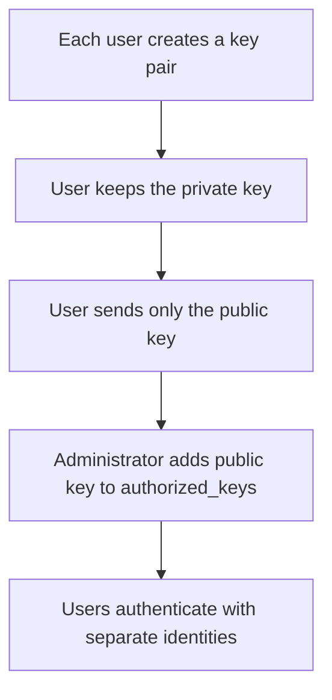

# GitHub Raw File Download and EC2 Private-Key Security — Study Notes

## Learning Objectives

After completing these notes, you should be able to:

- Understand the difference between a GitHub webpage URL and a raw file URL.
- Download a public GitHub file with `curl` or `wget`.
- Apply the correct permissions to an SSH private key.
- Explain why an EC2 `.pem` private key must never be stored in GitHub.
- Replace a compromised SSH key safely.
- Understand why deleting a key from the latest commit is not sufficient.
- Provide safer SSH access to multiple users.

---

## Scenario

Suppose a file appears at this GitHub webpage:

```text
https://github.com/kcommit/shell-scripting/blob/main/bakar-key.pem
```

This is a **GitHub webpage URL**, not the direct file-download URL.

The raw file URL follows this pattern:

```text
https://raw.githubusercontent.com/OWNER/REPOSITORY/BRANCH/PATH
```

For the example above, the raw URL is:

```text
https://raw.githubusercontent.com/kcommit/shell-scripting/main/bakar-key.pem
```

## URL Comparison

| URL type | Purpose |
|---|---|
| `github.com/.../blob/...` | Displays the file inside the GitHub website |
| `raw.githubusercontent.com/...` | Returns the file's raw contents |

Using the `/blob/` URL with `curl` or `wget` normally downloads an HTML webpage rather than the actual file.

---

## Download a Public File with `curl`

### Recommended command

```bash
curl -fL \
  -o bakar-key.pem \
  https://raw.githubusercontent.com/kcommit/shell-scripting/main/bakar-key.pem
```

### Option explanation

| Option | Meaning |
|---|---|
| `-f` | Fails on HTTP errors instead of saving an error page |
| `-L` | Follows HTTP redirects |
| `-o bakar-key.pem` | Saves the response with the specified filename |

### Short form

```bash
curl -fL -o bakar-key.pem https://raw.githubusercontent.com/kcommit/shell-scripting/main/bakar-key.pem
```

---

## Download a Public File with `wget`

```bash
wget \
  -O bakar-key.pem \
  https://raw.githubusercontent.com/kcommit/shell-scripting/main/bakar-key.pem
```

### Option explanation

| Option | Meaning |
|---|---|
| `-O bakar-key.pem` | Saves the download with the specified filename |

### Short form

```bash
wget -O bakar-key.pem https://raw.githubusercontent.com/kcommit/shell-scripting/main/bakar-key.pem
```

---

## Verify the Download

Check that the file exists:

```bash
ls -l bakar-key.pem
```

Check the file type:

```bash
file bakar-key.pem
```

Validate that SSH can read the private key without printing its derived public key:

```bash
ssh-keygen -y -f bakar-key.pem >/dev/null && echo "Readable SSH private key"
```

If the key has a passphrase, `ssh-keygen` may request it.

> Do not display, paste, upload, or share the contents of a private key while troubleshooting.

---

## Set Secure Private-Key Permissions

OpenSSH rejects private keys that are accessible to other users.

Set read-only permission for the owner:

```bash
chmod 400 bakar-key.pem
```

Alternatively, allow the owner to read and write:

```bash
chmod 600 bakar-key.pem
```

Verify:

```bash
ls -l bakar-key.pem
```

Expected examples:

```text
-r--------  1 user user ... bakar-key.pem
```

or:

```text
-rw-------  1 user user ... bakar-key.pem
```

---

## Connect to EC2

```bash
ssh -i bakar-key.pem ubuntu@EC2_PUBLIC_IP
```

Example structure:

```bash
ssh -i bakar-key.pem ubuntu@203.0.113.10
```

Replace the documentation IP with the current public IPv4 address or public DNS name of your EC2 instance.

Common EC2 usernames include:

| Distribution | Common username |
|---|---|
| Ubuntu | `ubuntu` |
| Amazon Linux | `ec2-user` |
| RHEL | `ec2-user` |
| CentOS | `centos` |

The actual username depends on the AMI.

---

## Critical Security Warning

`bakar-key.pem` is an SSH **private key**. It must never be committed to a Git repository or made available through a GitHub URL.

If a private key has been committed—even briefly—treat it as compromised.

An attacker may be able to access the instance when all these conditions are true:

- The EC2 instance is running.
- The associated public key remains in the instance's `~/.ssh/authorized_keys`.
- The Security Group permits SSH access.
- The attacker knows or discovers the public IP address.
- The attacker knows the correct operating-system username.

### Public key vs. private key

| File | May be shared? | Purpose |
|---|---|---|
| Public key, such as `id_ed25519.pub` | Yes | Added to `authorized_keys` or an account |
| Private key, such as `id_ed25519` or `.pem` | No | Proves the user's identity |

> GitHub Secrets are for securely supplying values to GitHub Actions. They are not a private-key distribution system for students or administrators.

---

## Immediate Response to an Exposed EC2 Key

Use this order:

```text
Restrict access → Create replacement → Install public key → Test → Remove old key → Clean Git history → Review logs
```

### 1. Restrict SSH temporarily

In the EC2 Security Group, temporarily limit TCP port 22 to your trusted public IP address instead of allowing the entire internet.

Avoid locking yourself out: confirm that your current source IP and recovery method are available before changing the rule.

### 2. Generate a replacement key locally

On WSL or another trusted local system:

```bash
ssh-keygen -t ed25519 -f ~/.ssh/bakar-new -C "bakar-new-key"
```

This creates:

```text
~/.ssh/bakar-new      Private key—never share
~/.ssh/bakar-new.pub  Public key—safe to install
```

Secure the private key:

```bash
chmod 600 ~/.ssh/bakar-new
```

### 3. Display the new public key

```bash
cat ~/.ssh/bakar-new.pub
```

Copy the complete single-line public key.

### 4. Install the new public key on EC2

While still connected to EC2 with an authorized method:

```bash
nano ~/.ssh/authorized_keys
```

Paste the new public key on a new line, save the file, and set secure permissions:

```bash
chmod 700 ~/.ssh
chmod 600 ~/.ssh/authorized_keys
```

### 5. Test the replacement from a second terminal

Do not close your original working session yet.

```bash
ssh -i ~/.ssh/bakar-new ubuntu@EC2_PUBLIC_IP
```

Confirm that the new key opens a separate successful session.

### 6. Remove the compromised public key

After the new key works, edit:

```bash
nano ~/.ssh/authorized_keys
```

Remove only the old public-key entry. Keep the tested replacement entry.

Test again:

```bash
ssh -i ~/.ssh/bakar-new ubuntu@EC2_PUBLIC_IP
```

### Important AWS detail

Deleting the key-pair record from the EC2 console does **not** remove an already installed public key from an existing instance's `authorized_keys` file.

To revoke access to an existing Linux instance, remove or replace the corresponding public-key entry on that instance.

---

## Remove the Private Key from the Current Repository Version

Inside the repository:

```bash
cd shell-scripting
```

Keep the local file but stop tracking it:

```bash
git rm --cached bakar-key.pem
```

Prevent future commits:

```bash
printf '\n# Private keys\n*.pem\n' >> .gitignore
```

Commit and push the removal:

```bash
git add .gitignore
git commit -m "Remove exposed private key and ignore PEM files"
git push origin main
```

### Why `git rm --cached` is used

| Command | Local file | Git tracking |
|---|---|---|
| `git rm bakar-key.pem` | Deleted | Removed |
| `git rm --cached bakar-key.pem` | Preserved | Removed |

> Removing the file from the latest version does not remove it from older commits.

---

## Remove the File from Git History

Git preserves historical versions. Therefore, the private key may remain downloadable from old commits even after a normal deletion commit.

The general cleanup process is:

1. Replace or revoke the key first.
2. Back up the repository.
3. Coordinate with collaborators.
4. Rewrite history with a supported tool such as `git filter-repo`.
5. Force-push the rewritten branches and tags.
6. Ask collaborators to re-clone or carefully repair their clones.

Example after installing `git-filter-repo`:

```bash
git filter-repo --path bakar-key.pem --invert-paths --force
```

Inspect the rewritten repository carefully before publishing it:

```bash
git log --all -- bakar-key.pem
git status
git remote -v
```

History rewriting may remove the configured remote. Re-add the correct remote only after verifying the repository:

```bash
git remote add origin git@github.com:kcommit/shell-scripting.git
```

Publish the rewritten history only after coordination:

```bash
git push --force --all origin
git push --force --tags origin
```

> Force-pushing rewritten history is disruptive. Do not perform it casually on a shared or production repository. Key rotation is still required because history cleanup cannot prove that nobody copied the exposed key.

GitHub guidance: [Removing sensitive data from a repository](https://docs.github.com/en/authentication/keeping-your-account-and-data-secure/removing-sensitive-data-from-a-repository)

---

## Safer Access for Multiple Students or Team Members

Do not give every person the same EC2 private key.

Use this model:



### Student or team-member command

Each person runs this on their own computer:

```bash
ssh-keygen -t ed25519 -C "student-name"
```

They send only:

```text
~/.ssh/id_ed25519.pub
```

They must never send:

```text
~/.ssh/id_ed25519
```

### Administrator action

The administrator adds each approved public key as a separate line in the correct user's:

```text
~/.ssh/authorized_keys
```

Benefits:

- One person's access can be revoked without changing everyone else's key.
- Private keys remain under individual control.
- Access is easier to audit.
- A compromised user key has a smaller impact.

For stronger administration, consider separate Linux accounts, AWS Systems Manager Session Manager, or short-lived access instead of shared SSH credentials.

AWS reference: [Amazon EC2 key pairs](https://docs.aws.amazon.com/AWSEC2/latest/UserGuide/ec2-key-pairs.html)

---

## Public vs. Private GitHub Repositories

### Public repository

The `raw.githubusercontent.com` URL can normally be downloaded directly with `curl` or `wget`.

### Private repository

An unauthenticated raw request may fail because authorization is required.

If GitHub CLI is installed, authenticate interactively:

```bash
gh auth login
```

Then download a normal, non-sensitive file through the API:

```bash
gh api repos/kcommit/shell-scripting/contents/path/to/file \
  --jq '.content' | base64 --decode > downloaded-file
```

Never place a GitHub token directly inside a URL or shell history.

> A private GitHub repository is still not an appropriate place to distribute reusable EC2 private keys.

---

## Common Mistakes

### Mistake 1: Downloading the `/blob/` URL

Incorrect:

```bash
wget https://github.com/kcommit/shell-scripting/blob/main/example.txt
```

This may save an HTML page.

Correct:

```bash
wget -O example.txt https://raw.githubusercontent.com/kcommit/shell-scripting/main/example.txt
```

### Mistake 2: Forgetting key permissions

Possible error:

```text
WARNING: UNPROTECTED PRIVATE KEY FILE!
```

Fix:

```bash
chmod 400 bakar-key.pem
```

### Mistake 3: Assuming a deletion commit removes history

A deletion commit removes the file from the current version, but older commits still contain it.

### Mistake 4: Deleting the AWS key-pair record only

That does not automatically remove an already installed public key from the running instance.

### Mistake 5: Sharing one private key with everyone

This makes individual access difficult to identify or revoke. Use separate public keys instead.

### Mistake 6: Closing the original session too early

Keep the working SSH session open until the replacement key has been tested successfully in a second terminal.

---

## Quick Reference

| Task | Command |
|---|---|
| Download with `curl` | `curl -fL -o file URL` |
| Download with `wget` | `wget -O file URL` |
| Secure a PEM file | `chmod 400 key.pem` |
| Connect to Ubuntu EC2 | `ssh -i key.pem ubuntu@IP` |
| Generate an ED25519 key | `ssh-keygen -t ed25519 -f ~/.ssh/name` |
| Display a public key | `cat ~/.ssh/name.pub` |
| Stop tracking but keep locally | `git rm --cached key.pem` |
| Ignore PEM files | Add `*.pem` to `.gitignore` |
| View authorized keys | `cat ~/.ssh/authorized_keys` |
| Secure SSH directory | `chmod 700 ~/.ssh` |
| Secure authorized keys | `chmod 600 ~/.ssh/authorized_keys` |

---

## Practice with a Non-Sensitive File

Do not practice by publishing a real private key. Create a harmless text file instead:

```bash
echo "GitHub raw download practice" > download-practice.txt
git add download-practice.txt
git commit -m "Add raw download practice file"
git push origin main
```

Download it with:

```bash
curl -fL \
  -o downloaded-practice.txt \
  https://raw.githubusercontent.com/kcommit/shell-scripting/main/download-practice.txt
```

Verify:

```bash
cat downloaded-practice.txt
```

---

## Final Summary

```text
GitHub webpage URL  → Used in a browser
GitHub raw URL      → Used by curl or wget
Public SSH key      → May be shared
Private SSH key     → Must remain secret
```

The download syntax is straightforward:

```bash
curl -fL -o filename RAW_URL
wget -O filename RAW_URL
```

However, a published EC2 `.pem` private key must be considered compromised. Replace the key, remove the old public key from the instance, clean the repository and its history, review access, and use separate public keys for individual users.
