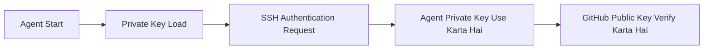

# SSH Agent aur `ssh-add` — Roman Urdu Study Notes

## Commands

```bash
eval "$(ssh-agent -s)"
ssh-add ~/.ssh/id_ed25519
```

Yeh commands SSH agent start karti hain, current terminal ko agent ke saath connect karti hain aur aap ki private Ed25519 key ko agent mein load karti hain.

---

## Learning Objectives

In notes ko parhne ke baad aap:

- `ssh-agent` ka purpose explain kar sakein ge.
- Command substitution aur `eval` ka role samajh sakein ge.
- `ssh-add` se private key load kar sakein ge.
- Agent mein loaded keys check aur remove kar sakein ge.
- GitHub SSH authentication test kar sakein ge.
- Common SSH-agent problems troubleshoot kar sakein ge.

---

## `ssh-agent` Kya Hai?

`ssh-agent` aik background program hai jo private SSH keys ko temporarily memory mein manage karta hai.

Yeh aap ko madad deta hai:

- SSH keys se authentication karne mein.
- Aik hi agent session ke dauran har Git operation par passphrase dobara enter karne se bachne mein.
- `ssh`, `git` aur `scp` jaise programs ko agent se authentication request karne mein.
- Private-key file ko un programs se separate rakhne mein jinhein sirf authentication karwani hoti hai.

SSH agent aap ki private key GitHub par upload nahi karta. Private key aap ke computer par hi rehti hai.

---

## Pehli Command

```bash
eval "$(ssh-agent -s)"
```

Yeh command SSH agent start karti hai aur current shell ko us agent ke saath communicate karne ke liye configure karti hai.

### Command breakdown

| Hissa | Meaning |
|---|---|
| `ssh-agent` | Private SSH keys manage karne wala background program start karta hai |
| `-s` | Shell syntax mein environment-setting commands produce karta hai |
| `$(...)` | Andar wali command run karke us ka output capture karta hai |
| `eval` | Captured output ko current shell mein execute karta hai |

### Step 1: `ssh-agent -s`

```bash
ssh-agent -s
```

`-s` option `ssh-agent` ko kehta hai ke Bash aur similar shells ke liye commands print kare.

Output kuch is tarah ho sakta hai:

```bash
SSH_AUTH_SOCK=/tmp/ssh-xxxx/agent.1234; export SSH_AUTH_SOCK;
SSH_AGENT_PID=1234; export SSH_AGENT_PID;
echo Agent pid 1234;
```

Aham environment variables:

| Variable | Purpose |
|---|---|
| `SSH_AUTH_SOCK` | Woh communication socket batata hai jis se shell agent se contact karti hai |
| `SSH_AGENT_PID` | Agent ka process ID rakhta hai |

### Step 2: Command substitution

```bash
$(ssh-agent -s)
```

`$(...)` ko **command substitution** kehte hain. Shell andar wali command run karti hai aur expression ki jagah us ka output rakh deti hai.

### Step 3: `eval`

```bash
eval "$(ssh-agent -s)"
```

`eval`, `ssh-agent` ke print kiye hue environment-setting commands ko current shell mein execute karta hai. Is se `SSH_AUTH_SOCK` jaisi variables current terminal mein available ho jati hain.

Agar environment configure na ho to `ssh-add` ko pata nahi chale ga ke new agent se communication kaisay karni hai.

Typical output:

```text
Agent pid 1234
```

### Short meaning

> SSH agent start karo aur current terminal session ko us ke saath connect karo.

---

## Doosri Command

```bash
ssh-add ~/.ssh/id_ed25519
```

Yeh command aap ki private Ed25519 key ko running SSH agent mein load karti hai.

### Command breakdown

| Hissa | Meaning |
|---|---|
| `ssh-add` | Private SSH key ko SSH agent mein add karta hai |
| `~` | Current user ki home directory ko represent karta hai |
| `.ssh` | User ki SSH files ki standard directory |
| `id_ed25519` | Ed25519 private key ka default filename |

Linux mein:

```text
~/.ssh/id_ed25519
```

ka actual path kuch is tarah ho sakta hai:

```text
/home/khalid/.ssh/id_ed25519
```

### Passphrase prompt

Agar private key passphrase se protected ho, to yeh prompt aa sakta hai:

```text
Enter passphrase for /home/khalid/.ssh/id_ed25519:
```

Correct passphrase enter karne ke baad agent unlocked key ko apne session ke liye memory mein available rakhta hai.

Successful output:

```text
Identity added: /home/khalid/.ssh/id_ed25519
```

### Short meaning

> Private Ed25519 key ko running SSH agent mein load karo.

---

## Private Key aur Public Key

| File | Type | Istemal |
|---|---|---|
| `~/.ssh/id_ed25519` | Private key | `ssh-agent` mein load hoti hai aur secret rehti hai |
| `~/.ssh/id_ed25519.pub` | Public key | GitHub ya kisi doosre SSH server mein add hoti hai |

`ssh-add` ke saath private key use karein:

```bash
ssh-add ~/.ssh/id_ed25519
```

Public key ko `ssh-add` ke saath use na karein:

```bash
ssh-add ~/.ssh/id_ed25519.pub  # Ghalat
```

> `id_ed25519` private key ko kabhi share, upload ya Git repository mein commit na karein.

---

## Complete Authentication Flow



Public key aap ke GitHub account mein stored hoti hai. Us se match karne wali private key aap ke computer par rehti hai aur SSH agent usay manage karta hai.

---

## Complete Command Workflow

```bash
# SSH agent start karke current shell configure karein
eval "$(ssh-agent -s)"

# Private key agent mein load karein
ssh-add ~/.ssh/id_ed25519

# Agent mein loaded keys list karein
ssh-add -l

# GitHub SSH authentication test karein
ssh -T git@github.com
```

Successful GitHub authentication par message kuch is tarah hoga:

```text
Hi USERNAME! You've successfully authenticated, but GitHub does not provide shell access.
```

“GitHub does not provide shell access” error nahi hai. Is ka matlab hai authentication successful hai, lekin GitHub general interactive server shell provide nahi karta.

---

## Useful `ssh-add` Commands

### Loaded key fingerprints list karein

```bash
ssh-add -l
```

### Loaded public keys show karein

```bash
ssh-add -L
```

Lowercase `-l` fingerprints list karta hai, jab ke uppercase `-L` public keys print karta hai.

### Default private key add karein

```bash
ssh-add ~/.ssh/id_ed25519
```

### Custom-name wali private key add karein

```bash
ssh-add ~/.ssh/id_ed25519_github
```

### Aik key remove karein

```bash
ssh-add -d ~/.ssh/id_ed25519
```

### Tamam loaded keys remove karein

```bash
ssh-add -D
```

Agent se key remove karne par computer se key file delete nahi hoti.

---

## Agent Check Karna

### Agent process ID check karein

```bash
echo "$SSH_AGENT_PID"
```

### Communication socket check karein

```bash
echo "$SSH_AUTH_SOCK"
```

### Agent process check karein

```bash
ps -p "$SSH_AGENT_PID"
```

### Loaded keys list karein

```bash
ssh-add -l
```

Agar agent mein koi key loaded na ho to output aa sakta hai:

```text
The agent has no identities.
```

Apni key add karein:

```bash
ssh-add ~/.ssh/id_ed25519
```

---

## SSH Agent Stop Karna

Current shell se associated agent stop karne ke liye:

```bash
eval "$(ssh-agent -k)"
```

`-k` option environment variables se identify hone wale agent ko terminate karta hai aur current shell se un variables ko remove karne wali commands print karta hai. `eval` un commands ko execute karta hai.

---

## Session Ko Samajhna

Jab aap run karte hain:

```bash
eval "$(ssh-agent -s)"
```

to current terminal us agent ko use karne ke liye configure hota hai. Doosre terminal mein wohi environment variables automatically available hon, yeh zaroori nahi.

Operating system aur configuration ke mutabiq:

- Shell close karne se agent session khatam ya disconnect ho sakta hai.
- New shell mein existing agent se reconnect ya new agent start karna par sakta hai.
- Desktop environment ya system service agent ko automatically manage kar sakti hai.

Ghair-zaroori tor par bohat se agents start na karein. Pehle check karein ke agent already available hai ya nahi:

```bash
ssh-add -l
```

Agar command keys list kare ya `The agent has no identities` kahe, to agent reachable hai. Agar connection error aaye to agent start karein.

---

## Common Errors aur Solutions

### Error: `Could not open a connection to your authentication agent`

Meaning: `ssh-add` current shell se running agent ko contact nahi kar pa raha.

Solution:

```bash
eval "$(ssh-agent -s)"
ssh-add ~/.ssh/id_ed25519
```

### Error: `No such file or directory`

Meaning: Key us path par mojood nahi jo aap ne diya hai.

SSH files list karein:

```bash
ls -la ~/.ssh
```

Phir correct private-key filename add karein:

```bash
ssh-add ~/.ssh/actual-private-key-name
```

### Error: `Permission denied (publickey)`

Possible reasons:

- Private key agent mein loaded nahi.
- Matching public key GitHub mein add nahi hui.
- Wrong SSH key offer ho rahi hai.
- Repository ya GitHub account wrong hai.

Diagnostic commands:

```bash
ssh-add -l
ssh -T git@github.com
git remote -v
```

Detailed SSH diagnostics ke liye:

```bash
ssh -vT git@github.com
```

`-v` verbose connection information show karta hai, jis se pata chal sakta hai ke SSH kaunsi key offer kar raha hai.

### Error: `The agent has no identities`

Agent run ho raha hai lekin us mein koi private key loaded nahi.

```bash
ssh-add ~/.ssh/id_ed25519
```

### `.pub` file load karne ka error

`ssh-add` ko public key nahi, private key chahiye. `.pub` extension ke baghair private key load karein:

```bash
ssh-add ~/.ssh/id_ed25519
```

---

## Security Best Practices

- Private key kabhi share na karein.
- Private key Git mein commit na karein.
- Important keys par strong passphrase lagayein.
- Sirf trusted private keys agent mein add karein.
- Unnecessary keys ko `ssh-add -d` ya `ssh-add -D` se remove karein.
- Unknown ya untrusted command output par `eval` use na karein.
- Linux aur WSL par correct permissions use karein.

Recommended permissions:

```bash
chmod 700 ~/.ssh
chmod 600 ~/.ssh/id_ed25519
chmod 644 ~/.ssh/id_ed25519.pub
```

---

## Interview Questions

### 1. `ssh-agent` kya hai?

Yeh aik background process hai jo authentication ke liye private SSH keys ko memory mein manage karta hai.

### 2. `ssh-agent -s` ke saath `eval` kyun use hota hai?

`ssh-agent -s` agent environment variables set karne wali shell commands print karta hai. `eval` un commands ko current shell mein execute karta hai.

### 3. `$(...)` ka kya matlab hai?

Isay command substitution kehte hain. Shell andar wali command run karke us ka output use karti hai.

### 4. `ssh-add` kya karta hai?

Yeh private SSH key ko running SSH agent mein load karta hai.

### 5. `ssh-add` ko kaunsi file deni chahiye?

Private-key file, jaise `~/.ssh/id_ed25519`; `.pub` file nahi.

### 6. Agent mein loaded keys kaisay list karte hain?

```bash
ssh-add -l
```

### 7. Agent se tamam keys kaisay remove karte hain?

```bash
ssh-add -D
```

### 8. Kya `ssh-add -D` key files delete karta hai?

Nahi. Yeh keys ko sirf agent ki memory se remove karta hai; computer se files delete nahi karta.

---

## Practice Lab

### Objective

SSH agent start karein, Ed25519 private key load karein, agent inspect karein aur GitHub authentication test karein.

### Step 1: Existing keys check karein

```bash
ls -la ~/.ssh
```

### Step 2: Check karein ke agent reachable hai ya nahi

```bash
ssh-add -l
```

### Step 3: Zaroorat par agent start karein

```bash
eval "$(ssh-agent -s)"
```

### Step 4: Private key load karein

```bash
ssh-add ~/.ssh/id_ed25519
```

### Step 5: Confirm karein ke key load ho gayi

```bash
ssh-add -l
```

### Step 6: GitHub authentication test karein

```bash
ssh -T git@github.com
```

### Step 7: Key agent se remove karein

```bash
ssh-add -d ~/.ssh/id_ed25519
```

### Step 8: Removal verify karein

```bash
ssh-add -l
```

---

## Quick Revision

```bash
eval "$(ssh-agent -s)"
```

> SSH agent start karta hai aur current shell ko us agent ke saath communicate karne ke liye configure karta hai.

```bash
ssh-add ~/.ssh/id_ed25519
```

> Private Ed25519 key ko SSH agent mein load karta hai.

### Memory formula

```text
Agent Start → Private Key Load → Key Verify → Connection Test
```

### Essential commands

```bash
eval "$(ssh-agent -s)"
ssh-add ~/.ssh/id_ed25519
ssh-add -l
ssh -T git@github.com
```

---

**Final Security Reminder:** Private key ko agent mein load karein lekin kabhi share na karein. Sirf matching `.pub` public key GitHub mein add karein.
