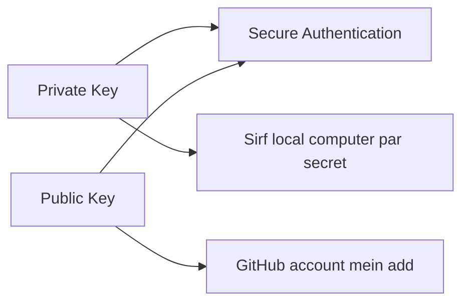

# `ssh-keygen -t ed25519 -C` — Roman Urdu Study Notes

## Command

```bash
ssh-keygen -t ed25519 -C "your-email@example.com"
```

Yeh command aik nayi **SSH key pair** create karti hai. Is key pair ko GitHub ke saath secure authentication ke liye use kiya ja sakta hai.

---

## Learning Objectives

In notes ko complete karne ke baad aap:

- `ssh-keygen` command ka purpose explain kar sakein ge.
- `-t`, `ed25519` aur `-C` options samajh sakein ge.
- Public aur private key mein farq bata sakein ge.
- SSH key ko GitHub account mein add kar sakein ge.
- GitHub SSH connection test kar sakein ge.
- SSH keys ko securely handle kar sakein ge.

---

## SSH Kya Hai?

**SSH** ka full form **Secure Shell** hai. Yeh aik secure protocol hai jo network ke zariye encrypted communication provide karta hai.

GitHub ke context mein SSH ka istemal:

- GitHub ke saath secure authentication ke liye hota hai.
- Bar bar username aur password enter karne ki zaroorat kam karta hai.
- Repository ko SSH URL ke zariye clone, pull aur push karne deta hai.

---

## Command Breakdown

| Command ka hissa | Meaning |
|---|---|
| `ssh-keygen` | SSH keys generate karne ka program |
| `-t` | Key ki type specify karta hai |
| `ed25519` | Modern aur secure cryptographic algorithm |
| `-C` | Key ke saath comment ya label add karta hai |
| `"your-email@example.com"` | Key ko identify karne wala label; aam tor par GitHub email |

### `ssh-keygen`

`ssh-keygen` ka matlab **SSH Key Generator** hai. Yeh public aur private key ki pair create karta hai.

### `-t`

`-t` ka matlab **type** hai. Is option ke baad bataya jata hai ke kis type ki SSH key generate karni hai.

```bash
-t ed25519
```

Is ka matlab hai:

> Ed25519 type ki SSH key generate karo.

### `ed25519`

Ed25519 aik modern cryptographic algorithm hai. Yeh strong security aur choti key size provide karta hai. GitHub authentication ke liye yeh aik recommended choice hai.

### `-C`

`-C` key ke saath **comment** add karta hai.

```bash
-C "your-email@example.com"
```

Email authentication password nahi hoti. Yeh sirf label hota hai jo key ko identify karne mein madad deta hai.

Example:

```bash
ssh-keygen -t ed25519 -C "khalid@example.com"
```

> Behtar organization ke liye apne GitHub account ka verified email address comment ke tor par use kar sakte hain, lekin SSH authentication email comment par depend nahi karti.

---

## Command Run Karne Ke Baad Kya Hota Hai?

### Step 1: File location poochi jati hai

```text
Enter file in which to save the key (/home/khalid/.ssh/id_ed25519):
```

Default location accept karne ke liye sirf **Enter** press karein.

Linux ya WSL mein default files:

```text
~/.ssh/id_ed25519
~/.ssh/id_ed25519.pub
```

Git Bash on Windows mein `~` aap ke Windows user home folder ko represent karta hai.

### Step 2: Passphrase poochi jati hai

```text
Enter passphrase (empty for no passphrase):
```

Passphrase private key ko extra protection deti hai. Strong passphrase enter karna recommended hai.

Jab aap passphrase type karein ge to screen par characters ya asterisks show nahi honge. Yeh normal security behavior hai.

Phir confirmation maangi jati hai:

```text
Enter same passphrase again:
```

### Step 3: Key pair create hoti hai

Successful generation ke baad output kuch is tarah ho sakta hai:

```text
Your identification has been saved in /home/khalid/.ssh/id_ed25519
Your public key has been saved in /home/khalid/.ssh/id_ed25519.pub
```

---

## Public Key aur Private Key



| File | Type | Kahan rakhein? | Share karni hai? |
|---|---|---|---|
| `~/.ssh/id_ed25519` | Private key | Apne computer par secure | **Kabhi nahi** |
| `~/.ssh/id_ed25519.pub` | Public key | GitHub account mein add | Haan, zaroorat par |

### Private key

```text
~/.ssh/id_ed25519
```

Private key aap ki secret identity hoti hai. Isay:

- GitHub par upload na karein.
- Email ya chat mein share na karein.
- Public repository mein commit na karein.
- Kisi doosre user ko na dein.

### Public key

```text
~/.ssh/id_ed25519.pub
```

Public key GitHub account mein add ki jati hai. Is key ka `.pub` extension hota hai.

> Yaad rakhein: **Public key share ki ja sakti hai; private key secret rehti hai.**

---

## Generated Keys Check Karna

`.ssh` directory ki files list karein:

```bash
ls -la ~/.ssh
```

Expected files:

```text
id_ed25519
id_ed25519.pub
```

Public key display karein:

```bash
cat ~/.ssh/id_ed25519.pub
```

Output kuch is tarah ho sakta hai:

```text
ssh-ed25519 AAAAC3NzaC1lZDI1NTE5AAAA... khalid@example.com
```

Public key copy karte waqt complete line copy karein:

- `ssh-ed25519` se start hone wala hissa
- Darmiyan mein complete key data
- End par comment ya email

---

## SSH Agent Mein Key Add Karna

SSH agent aap ki private keys ko memory mein manage karta hai.

### Step 1: SSH agent start karein

Linux, WSL ya Git Bash mein:

```bash
eval "$(ssh-agent -s)"
```

Example output:

```text
Agent pid 1234
```

### Step 2: Private key agent mein add karein

```bash
ssh-add ~/.ssh/id_ed25519
```

Agar key passphrase-protected hai to aap se passphrase poochi ja sakti hai.

### Loaded keys check karein

```bash
ssh-add -l
```

---

## Public Key GitHub Mein Add Karna

### Step 1: Public key copy karein

```bash
cat ~/.ssh/id_ed25519.pub
```

Complete output line copy karein.

### Step 2: GitHub settings open karein

GitHub mein is path par jayein:

```text
Profile Picture → Settings → SSH and GPG keys
```

### Step 3: New SSH key add karein

1. **New SSH key** select karein.
2. Title mein device ka meaningful naam likhein, jaise `Khalid Laptop`.
3. Key type mein **Authentication Key** select karein.
4. Public key ko **Key** box mein paste karein.
5. **Add SSH key** select karein.

> GitHub mein `id_ed25519.pub` ka content add karein—`id_ed25519` private key ka content nahi.

---

## GitHub SSH Connection Test Karna

```bash
ssh -T git@github.com
```

Pehli connection par yeh prompt aa sakta hai:

```text
Are you sure you want to continue connecting (yes/no/[fingerprint])?
```

GitHub host fingerprint verify karne ke baad:

```text
yes
```

Successful authentication par output kuch is tarah hoga:

```text
Hi USERNAME! You've successfully authenticated, but GitHub does not provide shell access.
```

“GitHub does not provide shell access” error nahi hai. Is ka matlab hai ke SSH authentication successful hai, lekin GitHub aap ko general server shell nahi deta.

---

## SSH Ke Saath Repository Clone Karna

SSH repository URL:

```text
git@github.com:USERNAME/REPOSITORY.git
```

Clone command:

```bash
git clone git@github.com:USERNAME/REPOSITORY.git
```

Example:

```bash
git clone git@github.com:krmaryum/git-practice.git
```

Us ke baad normal Git workflow:

```bash
cd git-practice
git status
git add .
git commit -m "Update project"
git pull
git push
```

---

## Existing Repository Ko HTTPS Se SSH Par Change Karna

Current remote check karein:

```bash
git remote -v
```

Agar output HTTPS URL show kare:

```text
https://github.com/USERNAME/REPOSITORY.git
```

To remote ko SSH URL par change karein:

```bash
git remote set-url origin git@github.com:USERNAME/REPOSITORY.git
```

Dobara verify karein:

```bash
git remote -v
```

---

## Complete Workflow

```bash
# 1. Ed25519 SSH key pair generate karein
ssh-keygen -t ed25519 -C "your-email@example.com"

# 2. SSH agent start karein
eval "$(ssh-agent -s)"

# 3. Private key agent mein add karein
ssh-add ~/.ssh/id_ed25519

# 4. Public key display aur copy karein
cat ~/.ssh/id_ed25519.pub

# 5. Public key GitHub account mein add karne ke baad connection test karein
ssh -T git@github.com

# 6. Repository SSH ke zariye clone karein
git clone git@github.com:USERNAME/REPOSITORY.git
```

---

## File Name Already Exists Ho To Kya Karein?

Agar `~/.ssh/id_ed25519` pehle se exist karti ho, to `ssh-keygen` pooch sakta hai:

```text
/home/khalid/.ssh/id_ed25519 already exists.
Overwrite (y/n)?
```

Purani key ko samjhe baghair overwrite na karein. Overwrite karne se purani key replace ho sakti hai aur us key ko use karne wali services ka access affect ho sakta hai.

New key ko different filename dein:

```bash
ssh-keygen -t ed25519 -C "your-email@example.com" -f ~/.ssh/id_ed25519_github
```

Generated files:

```text
~/.ssh/id_ed25519_github
~/.ssh/id_ed25519_github.pub
```

Agent mein new private key add karein:

```bash
ssh-add ~/.ssh/id_ed25519_github
```

---

## Common Errors aur Solutions

### Error: `Permission denied (publickey)`

Possible reasons:

- Public key GitHub mein add nahi hui.
- Wrong private key load hui hai.
- SSH agent run nahi ho raha.
- Repository URL ya GitHub account wrong hai.

Checks:

```bash
ssh-add -l
ssh -T git@github.com
git remote -v
```

### Error: `Could not open a connection to your authentication agent`

SSH agent start karein:

```bash
eval "$(ssh-agent -s)"
ssh-add ~/.ssh/id_ed25519
```

### Error: `No such file or directory`

Check karein ke key kis naam aur location par create hui:

```bash
ls -la ~/.ssh
```

### Wrong key GitHub mein paste ho gayi

Sirf public key ka content paste karein:

```bash
cat ~/.ssh/id_ed25519.pub
```

Kabhi bhi yeh file display ya share na karein:

```text
~/.ssh/id_ed25519
```

---

## Security Best Practices

- Private key kabhi share na karein.
- Private key ko Git repository mein commit na karein.
- Key ke liye strong passphrase use karein.
- Har important device ke liye separate key rakhna behtar hai.
- Lost ya compromised device ki key GitHub se delete karein.
- Public key add karte waqt meaningful title use karein.
- Existing key ko check kiye baghair overwrite na karein.
- Sirf trusted computers par private key store karein.

Linux par recommended permissions:

```bash
chmod 700 ~/.ssh
chmod 600 ~/.ssh/id_ed25519
chmod 644 ~/.ssh/id_ed25519.pub
```

---

## HTTPS aur SSH Ka Short Comparison

| HTTPS | SSH |
|---|---|
| HTTPS repository URL use karta hai | SSH repository URL use karta hai |
| Credential Manager ya token use ho sakta hai | Public/private key pair use hoti hai |
| Beginners ke liye simple ho sakta hai | Initial setup ke baad convenient hota hai |
| URL `https://github.com/...` | URL `git@github.com:...` |

---

## Interview Questions

### 1. `ssh-keygen` kya karta hai?

Yeh public aur private SSH key pair generate karta hai.

### 2. `-t ed25519` ka kya matlab hai?

Yeh command ko Ed25519 algorithm use karke key generate karne ko kehta hai.

### 3. `-C` ka purpose kya hai?

Yeh key ke saath identification comment ya label add karta hai.

### 4. Public aur private key mein kya farq hai?

Public key server ya GitHub mein add hoti hai. Private key local computer par secret rakhi jati hai.

### 5. GitHub mein kaunsi key add karte hain?

`.pub` extension wali public key add karte hain.

### 6. GitHub SSH connection kaise test karte hain?

```bash
ssh -T git@github.com
```

### 7. SSH agent ka purpose kya hai?

SSH agent private keys ko memory mein manage karta hai aur passphrase ke repeated prompts ko reduce kar sakta hai.

---

## Quick Revision

### Command ka short meaning

```bash
ssh-keygen -t ed25519 -C "your-email@example.com"
```

> `ssh-keygen` Ed25519 algorithm use karke public aur private SSH key banata hai, aur `-C` ke zariye email ko identification comment ke tor par add karta hai.

### Yaad rakhne ka formula

```text
Generate → Add to Agent → Copy Public Key → Add to GitHub → Test
```

### Essential commands

```bash
ssh-keygen -t ed25519 -C "your-email@example.com"
eval "$(ssh-agent -s)"
ssh-add ~/.ssh/id_ed25519
cat ~/.ssh/id_ed25519.pub
ssh -T git@github.com
```

---

## Practice Lab

1. Check karein ke `.ssh` directory mein pehle se keys mojood hain ya nahi:

   ```bash
   ls -la ~/.ssh
   ```

2. Ed25519 key pair generate karein:

   ```bash
   ssh-keygen -t ed25519 -C "your-email@example.com"
   ```

3. SSH agent start karein:

   ```bash
   eval "$(ssh-agent -s)"
   ```

4. Private key agent mein add karein:

   ```bash
   ssh-add ~/.ssh/id_ed25519
   ```

5. Public key display aur copy karein:

   ```bash
   cat ~/.ssh/id_ed25519.pub
   ```

6. Public key GitHub ke **SSH and GPG keys** section mein add karein.

7. Connection test karein:

   ```bash
   ssh -T git@github.com
   ```

8. Kisi test repository ka SSH URL copy karke clone karein:

   ```bash
   git clone git@github.com:USERNAME/REPOSITORY.git
   ```

---

**Final Security Reminder:** `id_ed25519.pub` public key hai aur GitHub mein add hoti hai. `id_ed25519` private key hai—usay kabhi share, upload ya commit na karein.
