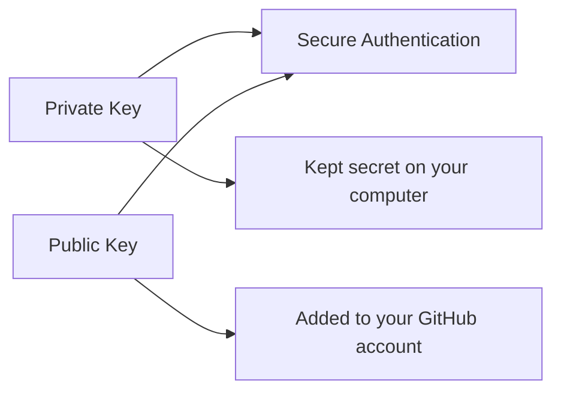

# `ssh-keygen -t ed25519 -C` — English Study Notes

## Command

```bash
ssh-keygen -t ed25519 -C "your-email@example.com"
```

This command creates a new **SSH key pair**. The key pair can be used to authenticate securely with GitHub and other SSH services.

---

## Learning Objectives

After completing these notes, you should be able to:

- Explain the purpose of the `ssh-keygen` command.
- Understand the `-t`, `ed25519`, and `-C` options.
- Differentiate between public and private keys.
- Add an SSH public key to a GitHub account.
- Test an SSH connection to GitHub.
- Handle SSH keys securely.

---

## What Is SSH?

**SSH** stands for **Secure Shell**. It is a secure protocol that provides encrypted communication over a network.

In the context of GitHub, SSH allows you to:

- Authenticate securely with GitHub.
- Avoid repeatedly entering a username and password.
- Clone, pull from, and push to repositories using SSH URLs.

---

## Command Breakdown

| Part | Meaning |
|---|---|
| `ssh-keygen` | The program used to generate SSH keys |
| `-t` | Specifies the type of key to create |
| `ed25519` | A modern and secure cryptographic algorithm |
| `-C` | Adds a comment or label to the key |
| `"your-email@example.com"` | An identification label, commonly your GitHub email |

### `ssh-keygen`

`ssh-keygen` means **SSH Key Generator**. It creates a related public and private key.

### `-t`

The `-t` option means **type**. The value following it tells `ssh-keygen` what type of key to generate.

```bash
-t ed25519
```

This means:

> Generate an Ed25519 SSH key.

### `ed25519`

Ed25519 is a modern cryptographic algorithm. It provides strong security with relatively small keys and is a recommended choice for GitHub authentication.

### `-C`

The `-C` option adds a **comment** to the key.

```bash
-C "your-email@example.com"
```

The email is not a password and does not perform the authentication. It is only a label that helps you identify the key.

Example:

```bash
ssh-keygen -t ed25519 -C "khalid@example.com"
```

> You can use the verified email address from your GitHub account as an organizational label, but SSH authentication does not depend on the email comment.

---

## What Happens After You Run the Command?

### Step 1: Choose the file location

The command displays a prompt similar to this:

```text
Enter file in which to save the key (/home/khalid/.ssh/id_ed25519):
```

Press **Enter** to accept the default location.

The default files on Linux or WSL are:

```text
~/.ssh/id_ed25519
~/.ssh/id_ed25519.pub
```

In Git Bash on Windows, `~` represents your Windows user home directory.

### Step 2: Choose a passphrase

The command then asks:

```text
Enter passphrase (empty for no passphrase):
```

A passphrase provides additional protection for the private key. Using a strong passphrase is recommended.

No characters or asterisks appear while you type the passphrase. This is normal security behavior.

You must then confirm it:

```text
Enter same passphrase again:
```

### Step 3: The key pair is created

Successful output may look like this:

```text
Your identification has been saved in /home/khalid/.ssh/id_ed25519
Your public key has been saved in /home/khalid/.ssh/id_ed25519.pub
```

---

## Public Key and Private Key



| File | Type | Location | Can it be shared? |
|---|---|---|---|
| `~/.ssh/id_ed25519` | Private key | Securely on your computer | **Never** |
| `~/.ssh/id_ed25519.pub` | Public key | Added to GitHub | Yes, when required |

### Private key

```text
~/.ssh/id_ed25519
```

The private key represents your secret identity. You must not:

- Upload it to GitHub.
- Share it through email or chat.
- Commit it to a public repository.
- Give it to another user.

### Public key

```text
~/.ssh/id_ed25519.pub
```

The public key is added to your GitHub account. Its filename has the `.pub` extension.

> Remember: The **public key may be shared; the private key must remain secret**.

---

## Checking the Generated Keys

List the files in your `.ssh` directory:

```bash
ls -la ~/.ssh
```

Expected files:

```text
id_ed25519
id_ed25519.pub
```

Display the public key:

```bash
cat ~/.ssh/id_ed25519.pub
```

The output will look similar to this:

```text
ssh-ed25519 AAAAC3NzaC1lZDI1NTE5AAAA... khalid@example.com
```

Copy the complete output line, including:

- The `ssh-ed25519` prefix
- The complete key data in the middle
- The comment or email at the end

---

## Adding the Key to the SSH Agent

The SSH agent manages private keys in memory.

### Step 1: Start the SSH agent

On Linux, WSL, or Git Bash:

```bash
eval "$(ssh-agent -s)"
```

Example output:

```text
Agent pid 1234
```

### Step 2: Add the private key to the agent

```bash
ssh-add ~/.ssh/id_ed25519
```

If the key is protected by a passphrase, you may be asked to enter it.

### Check the loaded keys

```bash
ssh-add -l
```

---

## Adding the Public Key to GitHub

### Step 1: Copy the public key

```bash
cat ~/.ssh/id_ed25519.pub
```

Copy the complete output line.

### Step 2: Open your GitHub settings

Navigate to:

```text
Profile picture → Settings → SSH and GPG keys
```

### Step 3: Add the new SSH key

1. Select **New SSH key**.
2. Enter a meaningful device name as the title, such as `Khalid Laptop`.
3. Select **Authentication Key** as the key type.
4. Paste the public key into the **Key** box.
5. Select **Add SSH key**.

> Add the contents of `id_ed25519.pub` to GitHub—not the contents of the private `id_ed25519` file.

---

## Testing the GitHub SSH Connection

Run:

```bash
ssh -T git@github.com
```

On the first connection, you may see this prompt:

```text
Are you sure you want to continue connecting (yes/no/[fingerprint])?
```

After verifying that the host fingerprint belongs to GitHub, enter:

```text
yes
```

Successful authentication produces a message similar to this:

```text
Hi USERNAME! You've successfully authenticated, but GitHub does not provide shell access.
```

“GitHub does not provide shell access” is not an error. It means the SSH authentication succeeded, but GitHub does not offer a general interactive server shell.

---

## Cloning a Repository with SSH

An SSH repository URL has this format:

```text
git@github.com:USERNAME/REPOSITORY.git
```

Clone command:

```bash
git clone git@github.com:USERNAME/REPOSITORY.git
```

Example:

```bash
git clone git@github.com:krmaryum/git-practice.git
```

Continue with the normal Git workflow:

```bash
cd git-practice
git status
git add .
git commit -m "Update project"
git pull
git push
```

---

## Changing an Existing Repository from HTTPS to SSH

Check the current remote:

```bash
git remote -v
```

If the output shows an HTTPS URL:

```text
https://github.com/USERNAME/REPOSITORY.git
```

Change the remote to an SSH URL:

```bash
git remote set-url origin git@github.com:USERNAME/REPOSITORY.git
```

Verify it again:

```bash
git remote -v
```

---

## Complete Workflow

```bash
# 1. Generate an Ed25519 SSH key pair
ssh-keygen -t ed25519 -C "your-email@example.com"

# 2. Start the SSH agent
eval "$(ssh-agent -s)"

# 3. Add the private key to the agent
ssh-add ~/.ssh/id_ed25519

# 4. Display and copy the public key
cat ~/.ssh/id_ed25519.pub

# 5. After adding the public key to GitHub, test the connection
ssh -T git@github.com

# 6. Clone a repository over SSH
git clone git@github.com:USERNAME/REPOSITORY.git
```

---

## What If the Key File Already Exists?

If `~/.ssh/id_ed25519` already exists, `ssh-keygen` may ask:

```text
/home/khalid/.ssh/id_ed25519 already exists.
Overwrite (y/n)?
```

Do not overwrite an existing key unless you understand where it is being used. Replacing it can break access to services that depend on the original key.

Create the new key with a different filename:

```bash
ssh-keygen -t ed25519 -C "your-email@example.com" -f ~/.ssh/id_ed25519_github
```

Generated files:

```text
~/.ssh/id_ed25519_github
~/.ssh/id_ed25519_github.pub
```

Add the new private key to the agent:

```bash
ssh-add ~/.ssh/id_ed25519_github
```

If you use multiple keys, you may also need an SSH configuration entry to associate a key with a particular host or account.

---

## Common Errors and Solutions

### Error: `Permission denied (publickey)`

Possible causes:

- The public key has not been added to GitHub.
- The wrong private key is loaded.
- The SSH agent is not running.
- The repository URL or GitHub account is incorrect.

Run these checks:

```bash
ssh-add -l
ssh -T git@github.com
git remote -v
```

### Error: `Could not open a connection to your authentication agent`

Start the SSH agent and add the key:

```bash
eval "$(ssh-agent -s)"
ssh-add ~/.ssh/id_ed25519
```

### Error: `No such file or directory`

Check the actual key filenames and their location:

```bash
ls -la ~/.ssh
```

### The wrong key was pasted into GitHub

Display and paste only the public key:

```bash
cat ~/.ssh/id_ed25519.pub
```

Never display or share the private file:

```text
~/.ssh/id_ed25519
```

---

## Security Best Practices

- Never share your private key.
- Never commit a private key to a Git repository.
- Protect the key with a strong passphrase.
- Consider using a separate key for each important device.
- Remove a key from GitHub if its device is lost or compromised.
- Use a meaningful title when adding a public key to GitHub.
- Do not overwrite an existing key without first identifying where it is used.
- Store private keys only on trusted computers.

Recommended Linux permissions:

```bash
chmod 700 ~/.ssh
chmod 600 ~/.ssh/id_ed25519
chmod 644 ~/.ssh/id_ed25519.pub
```

---

## HTTPS vs. SSH: Quick Comparison

| HTTPS | SSH |
|---|---|
| Uses an HTTPS repository URL | Uses an SSH repository URL |
| May use a credential manager or token | Uses a public/private key pair |
| Often simple for beginners | Convenient after the initial setup |
| URL: `https://github.com/...` | URL: `git@github.com:...` |

---

## Interview Questions

### 1. What does `ssh-keygen` do?

It generates a public and private SSH key pair.

### 2. What does `-t ed25519` mean?

It tells `ssh-keygen` to create the key using the Ed25519 algorithm.

### 3. What is the purpose of `-C`?

It adds an identification comment or label to the key.

### 4. What is the difference between a public and private key?

The public key is added to the server or GitHub account. The private key remains secret on the local computer.

### 5. Which key do you add to GitHub?

You add the public key—the file with the `.pub` extension.

### 6. How do you test GitHub SSH authentication?

```bash
ssh -T git@github.com
```

### 7. What is the purpose of the SSH agent?

The SSH agent manages private keys in memory and can reduce repeated passphrase prompts.

---

## Quick Revision

### Short meaning of the command

```bash
ssh-keygen -t ed25519 -C "your-email@example.com"
```

> `ssh-keygen` creates a public and private SSH key using the Ed25519 algorithm, while `-C` adds the email as an identification comment.

### Memory formula

```text
Generate → Add to Agent → Copy Public Key → Add to GitHub → Test
```

### Essential commands

```bash
ssh-keygen -t ed25519 -C "your-email@example.com"
eval "$(ssh-agent -s)"
ssh-add ~/.ssh/id_ed25519
cat ~/.ssh/id_ed25519.pub
ssh -T git@github.com
```

---

## Practice Lab

1. Check whether your `.ssh` directory already contains keys:

   ```bash
   ls -la ~/.ssh
   ```

2. Generate an Ed25519 key pair:

   ```bash
   ssh-keygen -t ed25519 -C "your-email@example.com"
   ```

3. Start the SSH agent:

   ```bash
   eval "$(ssh-agent -s)"
   ```

4. Add the private key to the agent:

   ```bash
   ssh-add ~/.ssh/id_ed25519
   ```

5. Display and copy the public key:

   ```bash
   cat ~/.ssh/id_ed25519.pub
   ```

6. Add the public key under GitHub's **SSH and GPG keys** settings.

7. Test the connection:

   ```bash
   ssh -T git@github.com
   ```

8. Copy the SSH URL of a test repository and clone it:

   ```bash
   git clone git@github.com:USERNAME/REPOSITORY.git
   ```

---

**Final Security Reminder:** `id_ed25519.pub` is the public key that you add to GitHub. `id_ed25519` is the private key—never share, upload, or commit it.
